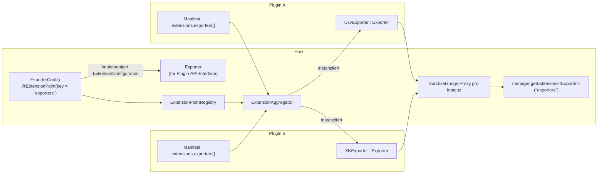

# Erweiterungspunkte definieren

Als Host-Anwendung definieren Sie die Erweiterungspunkte, zu denen Ihre Plugins beitragen können.
Ein Plugin-Entwickler sieht nur Ihr Plugin-API-Interface - niemals einen pluggiat-Typ.



Mit `exclusive = true` darf höchstens ein Plugin den Schlüssel belegen - würden beide Plugins oben
zu einem exklusiven Schlüssel beitragen, würden die Erweiterungen **beider** verworfen (siehe
[Konflikt an einem exklusiven Erweiterungspunkt](troubleshooting.de.md#konflikt-an-einem-exklusiven-erweiterungspunkt)).

## Einen Erweiterungspunkt definieren

1. Definieren Sie ein Plugin-API-Interface, gegen das Plugins implementieren, z. B. `Exporter`.
2. Definieren Sie eine Konfigurationsklasse, die `ExtensionConfiguration<T>` implementiert und mit
   `@ExtensionPoint` annotiert ist:

```kotlin
interface Exporter {
    fun export(data: List<Row>): ByteArray
}

@ExtensionPoint(key = "exporters", exclusive = false)
data class ExporterConfig(
    override val implementation: KClass<out Exporter>,
    val fileExtension: String,
    val displayName: String,
) : ExtensionConfiguration<Exporter>
```

`key` ist der Schlüssel `extensions.<key>[]`, unter dem Plugins ihren Beitrag deklarieren. Jede
weitere Konstruktoreigenschaft der Konfigurationsklasse (außer `implementation`) wird aus dem
passenden Feld des Erweiterungseintrags im Plugin-Manifest abgebildet.

Setzen Sie `exclusive = true`, wenn höchstens ein Plugin diesen Erweiterungspunkt jemals befüllen
darf; tun dies zwei Plugins, werden die Erweiterungen beider verworfen (siehe
[Erweiterungspunkte](../plugin-development/extension-points.de.md) für die Sicht des
Plugin-Entwicklers).

## Erweiterungspunkte registrieren

Registrieren Sie alle Ihre `ExtensionConfiguration`-Klassen einmalig beim Start des Hosts bei einer
`ExtensionPointRegistry`:

```kotlin
val registry = ExtensionPointRegistry(
    listOf(ExporterConfig::class /* , ... your other extension points */)
)
```

Die Registry validiert, dass jede registrierte Klasse eine `@ExtensionPoint`-Annotation trägt, dass
kein Schlüssel doppelt registriert wird und dass der aufgelöste Plugin-API-Typ `T` jedes
Erweiterungspunkts proxy-fähig ist (ein Interface oder eine nicht finale Klasse - siehe
[Fehlerbehandlung](../plugin-development/error-handling.de.md)), da Erweiterungsinstanzen dem Host
ausschließlich als Runtime-Enforcement-Proxy übergeben werden. Jeder dieser Verstöße wirft eine
`ExtensionRegistrationException` direkt aus dem Konstruktor der `ExtensionPointRegistry` - dies ist
ein host-seitiger Konfigurationsfehler in Ihren eigenen `ExtensionConfiguration`-Deklarationen, der
beim Start abgefangen wird, statt pro Erweiterungspunkt kontrolliert eingeschränkt weiterzulaufen.

## Erweiterungen über alle Plugins hinweg auflösen

Übergeben Sie die Registry zusammen mit den gescannten Plugin-Kandidaten (ID, `Path` auf der
Festplatte und geparstes Manifest) an einen `ExtensionAggregator`, um deren Erweiterungen
aufzulösen, zu instanziieren und zu aggregieren:

```kotlin
val aggregator = ExtensionAggregator(registry)
val result = aggregator.aggregate(candidates)

val exporters = result.extensionsByKey["exporters"] ?: emptyList()
for (extension in exporters) {
    val exporter = extension.instance as Exporter
    val config = extension.configuration as ExporterConfig
    // ...
}
```

`result.pluginResults` meldet pro Plugin dessen ID, dessen `Path` (unverändert vom Kandidaten
übernommen) und dessen Status:

* `LOADED` - die Erweiterungen des Plugins wurden aufgelöst und sind aktiv.
* `REJECTED_EXCLUSIVE_CONFLICT` - das Plugin hat zusammen mit mindestens einem anderen Plugin zu einem
  exklusiven Erweiterungspunkt-Schlüssel beigetragen; seine Erweiterungen sind nicht Teil von
  `extensionsByKey`.
* `DISABLED` - das Plugin ist als deaktiviert persistiert (es wurde überhaupt keine
  Erweiterungsklasse aufgelöst oder instanziiert), oder sein `onLoad`/`onEnable` hat beim Auflösen
  seiner Erweiterungen das Sandbox-Timeout überschritten (es wird dann ebenfalls als deaktiviert
  persistiert).
