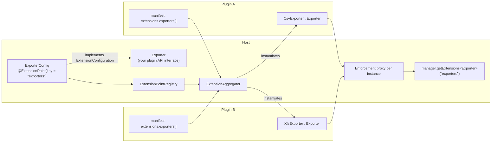

# Defining extension points

As a host application, you define the extension points your plugins can contribute to. A plugin
developer only ever sees your plugin API interface - never any pluggiat type.



With `exclusive = true`, at most one plugin may populate the key - if both plugins above
contributed to an exclusive key, the extensions of **both** would be dropped (see
[Exclusive extension point conflict](troubleshooting.md#exclusive-extension-point-conflict)).

## Defining an extension point

1. Define a plugin API interface plugins implement against, e.g. `Exporter`.
2. Define a configuration class implementing `ExtensionConfiguration<T>`, annotated with
   `@ExtensionPoint`:

```kotlin
interface Exporter {
    fun export(data: List<Row>): ByteArray
}

@ExtensionPoint(key = "exporters", exclusive = false)
data class ExporterConfig(
    override val implementation: KClass<out Exporter>,
    val fileExtension: String,
    val displayName: String,
) : ExtensionConfiguration<Exporter>
```

`key` is the `extensions.<key>[]` key plugins declare their contribution under. Every additional
constructor property of the configuration class (besides `implementation`) is mapped from the
matching field of the plugin manifest's extension entry.

Set `exclusive = true` if at most one plugin may ever populate this extension point; if two
plugins do, the extensions of both are dropped (see [Extension points](../plugin-development/extension-points.md)
for the plugin developer's perspective).

## Registering extension points

Register all your `ExtensionConfiguration` classes with an `ExtensionPointRegistry` once, at host
startup:

```kotlin
val registry = ExtensionPointRegistry(
    listOf(ExporterConfig::class /* , ... your other extension points */)
)
```

The registry validates that every registered class carries an `@ExtensionPoint` annotation, that no
key is registered twice, and that each extension point's resolved plugin API type `T` is
proxy-eligible (an interface, or a non-final class - see [Error handling](../plugin-development/error-handling.md)),
since extension instances are only ever handed to the host as a runtime enforcement proxy. Any of
these violations throws `ExtensionRegistrationException` directly out of the `ExtensionPointRegistry`
constructor - this is a host-side configuration error in your own `ExtensionConfiguration`
declarations, caught at startup rather than degrading gracefully per extension point.

## Resolving extensions across all plugins

Pass the registry to an `ExtensionAggregator` together with the scanned plugin candidates
(id, on-disk `Path`, and parsed manifest) to resolve, instantiate and aggregate their extensions:

```kotlin
val aggregator = ExtensionAggregator(registry)
val result = aggregator.aggregate(candidates)

val exporters = result.extensionsByKey["exporters"] ?: emptyList()
for (extension in exporters) {
    val exporter = extension.instance as Exporter
    val config = extension.configuration as ExporterConfig
    // ...
}
```

`result.pluginResults` reports, per plugin, its id, its `Path` (passed through unchanged from the
candidate) and its status:

* `LOADED` - the plugin's extensions were resolved and are active.
* `REJECTED_EXCLUSIVE_CONFLICT` - the plugin contributed to an exclusive extension point key together
  with at least one other plugin; its extensions are not part of `extensionsByKey`.
* `DISABLED` - the plugin is persisted as disabled (no extension class was resolved or instantiated at
  all), or its `onLoad`/`onEnable` exceeded the sandbox timeout while its extensions were resolved (it
  is then persisted as disabled as well).
