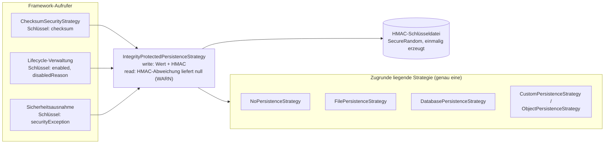

# Persistenz

`PluginPersistenceStrategy` ist der einzige, generische Schlüssel-Wert-Persistenzmechanismus, den
das gesamte Framework für alles verwendet, was einen Host-Neustart überdauern muss - die
akzeptierten Prüfsummen der Checksum-Sicherheitsstrategie sowie den
aktiviert/deaktiviert-Status jedes Plugins:

```kotlin
interface PluginPersistenceStrategy {
    fun read(pluginId: String, key: String): String?
    fun write(pluginId: String, key: String, value: String)
}
```

Für das gesamte Framework wird genau eine Instanz konfiguriert, über
`PluginManagerConfiguration.persistenceStrategy` (siehe [PluginManager](plugin-manager.de.md)).

!!! tip "Sicherheitsempfehlungen"

    * `NoPersistenceStrategy` in Produktion für ein `EXTERNAL`-Verzeichnis nie verwenden - jede
      genehmigte Prüfsumme und jede Sicherheits-Überschreibung geht bei jedem Neustart verloren, was
      faktisch zuvor abgelehnte Plugins wieder öffnet, ohne dass dies jemand bewusst entschieden hat.
    * Die gewählte Strategie mit [`IntegrityProtectedPersistenceStrategy`](#integritatsschutz)
      umschließen, sobald Plugins mit irgendeinem Dateisystemzugriff laufen können (eine
      `UNRESTRICTED`-Sandbox-Policy oder eine, die `FILESYSTEM` erlaubt) - sonst ist der persistierte
      Checksum-/Enabled-Status trivial durch genau den Code fälschbar, den er kontrollieren soll.
    * Die HMAC-Schlüsseldatei (`keyPath`) außerhalb jedes Verzeichnisses halten, in das ein Plugin
      schreiben kann; in Kombination mit der [Laufzeit-Sandbox](sandbox.de.md) den
      `FILESYSTEM`-Zugriff auf ihr Verzeichnis vollständig sperren.

## Mitgelieferte Implementierungen

### `NoPersistenceStrategy` (Standard)

`read` liefert immer `null`, `write` ist ein No-op. **Für Produktivsoftware nicht empfohlen** -
jeder auf Persistenz angewiesene Zustand (akzeptierte Prüfsummen, aktiviert/deaktiviert-Status)
setzt sich bei jedem Host-Neustart zurück. Protokolliert einmalig bei erster Verwendung eine
`WARN`.

### `CustomPersistenceStrategy`

Delegiert an host-bereitgestellte Funktionsinterfaces, für Hosts, die bereits eine eigene
Speicherung besitzen:

```kotlin
val strategy = CustomPersistenceStrategy(
    readCallback = { pluginId, key -> myStorage.read(pluginId, key) },
    writeCallback = { pluginId, key, value -> myStorage.write(pluginId, key, value) },
)
```

### `FilePersistenceStrategy`

Wird von einer einzelnen Datei getragen, in einem von vier Formaten
(`PersistenceFileFormat.PROPERTIES` (Standard), `JSON`, `YAML`, `XML`) - für keines davon ist eine
neue Abhängigkeit erforderlich:

```kotlin
val strategy = FilePersistenceStrategy(Paths.get("/var/lib/myapp/plugin-state.properties"))
```

Die gesamte Datei wird beim ersten Zugriff in den Speicher eingelesen und bei jedem `write`
vollständig neu geschrieben - angemessen für die geringe Menge an Plugin-Zustand, die das Framework
selbst speichert, nicht für große oder hochfrequente Daten.

### `DatabasePersistenceStrategy`

Wird von einer JDBC-`javax.sql.DataSource` getragen, nur reines JDBC (kein ORM). Erstellt automatisch
eine eigene Tabelle `plugin_state(plugin_id, plugin_key, plugin_value)`, falls sie noch nicht
existiert - und zwar sobald die Strategie instanziiert wird, sodass bereits der Konstruktor eine
funktionierende Datenbankverbindung benötigt (Spaltennamen vermeiden bewusst die reservierten
SQL-Wörter `key`/`value`):

```kotlin
val strategy = DatabasePersistenceStrategy(myDataSource)
```

### `ObjectPersistenceStrategy`

Delegiert jedes Lesen/Schreiben an ein Paar einfacher, host-bereitgestellter Funktionen, ohne
vorzuschreiben, wie oder wo der Wert tatsächlich gespeichert wird - z. B. gegen ein eigenes
Settings-Objekt des Hosts, eine In-Memory-Map oder jeden anderen Speicher, den der Host bereits
besitzt:

```kotlin
val strategy = ObjectPersistenceStrategy(
    getter = { pluginId, key -> myHostSettings.read(pluginId, key) },
    setter = { pluginId, key, value -> myHostSettings.write(pluginId, key, value) },
)
```

Anders als `CustomPersistenceStrategy`, die an host-bereitgestellte Funktionsinterfaces delegiert,
nimmt `ObjectPersistenceStrategy` einfache Kotlin-Lambdas entgegen - nützlich, wenn der Host bereits
ein kleines, inline definiertes Lese-/Schreibpaar besitzt, statt einer eigenen
Funktionsinterface-Implementierung.

## Integritätsschutz



`IntegrityProtectedPersistenceStrategy` umschließt eine beliebige `PluginPersistenceStrategy` und
schützt jeden gespeicherten Wert mit einem HMAC, sodass ein Plugin (oder ein Dritter), das die
zugrunde liegende Speicherung direkt bearbeitet - z. B. seinen eigenen `checksum`- oder
`enabled`-Eintrag -, keinen gefälschten Wert mehr als legitim geschrieben erscheinen lassen kann:

```kotlin
val strategy = IntegrityProtectedPersistenceStrategy(
    delegate = FilePersistenceStrategy(Paths.get("/var/lib/myapp/plugin-state.properties")),
    keyPath = Paths.get("/var/lib/myapp/plugin-state.properties.key"),
)
```

Der Schlüssel unter `keyPath` wird beim ersten Zugriff einmalig per `SecureRandom` erzeugt (nie Teil
einer JAR, nie hartkodiert) und bei jedem weiteren Start wiederverwendet. Die Schlüsseldatei wird nur
für ihren Eigentümer les- und schreibbar angelegt (POSIX `600` bzw. eine ACL nur für den Eigentümer
unter Windows), und eine bestehende Schlüsseldatei, die über ihren Eigentümer hinaus zugänglich ist,
wird als `WARN` gemeldet - wer sie lesen kann, kann jeden gespeicherten HMAC fälschen. Ein
gespeicherter Wert, dessen HMAC nicht mehr passt, wird bei `read` als `null` zurückgegeben, so als
wäre er nie gesetzt worden, begleitet von einem `WARN`-Log-Eintrag - dies ist eine
Erschwerung/Erkennung innerhalb desselben Prozesses und OS-Benutzers, keine Garantie gegen Code, der
in genau diesem Prozess und unter demselben Benutzer läuft.

Der MAC deckt `(pluginId, key, value)` ab, wobei jedes Feld mit einem Längenpräfix versehen wird -
ein gespeicherter MAC ist also für genau dieses Tripel gültig: Verschiebt man ihn auf eine andere
Plugin-ID oder einen anderen Schlüssel, verifiziert er dort nicht. Gespeicherte MACs werden
laufzeitkonstant verglichen, und ein fehlender MAC-Eintrag zählt als Abweichung, nicht als
"ungeschützt" - ihn zu löschen führt nicht dazu, dass ein gefälschter Wert akzeptiert wird.

!!! warning "Zustand, der von einer früheren Version geschrieben wurde, wird nicht akzeptiert"

    Die Eingabekodierung des MAC hat sich mit dieser Härtung geändert, sodass Werte, die von einer
    früheren pluggiat-Version gespeichert wurden, als nicht gesetzt zurückgelesen werden (als `WARN`
    protokolliert, genau wie ein manipulierter Wert). Für den eigenen Zustand von pluggiat bedeutet
    das, dass ein Enabled-Flag oder eine akzeptierte Prüfsumme noch einmal bestätigt wird; es gehen
    keine Daten verloren, die nicht erneut hergeleitet werden können.

`FilePersistenceStrategy` schreibt ihre Datei zusätzlich atomar (eine temporäre Datei im selben
Verzeichnis plus ein Rename) und nur für den Eigentümer zugänglich, sodass ein Leser nie einen halb
geschriebenen Zustand sieht und ein anderer lokaler Benutzer nicht bearbeiten kann, welches Plugin
aktiviert ist oder welche Prüfsumme akzeptiert wurde. In den Formaten `PROPERTIES`/`XML` werden
Plugin-ID und Schlüssel mit `|` statt mit `.` verbunden, da `.` innerhalb einer Plugin-ID zulässig
ist und die Abflachung dadurch mehrdeutig wurde - von einer früheren Version geschriebene Einträge
werden mit einem `WARN` ignoriert (`JSON`/`YAML` sind nicht betroffen).
`DatabasePersistenceStrategy` schreibt jeden Wert in einer einzigen Transaktion.

## Eine eigene Implementierung schreiben

Jede Klasse, die `PluginPersistenceStrategy` implementiert, funktioniert, ohne Framework-Änderungen
- z. B. um sie mit einem Cloud-Schlüssel-Wert-Speicher, einer Cache-Schicht oder einem bestehenden
Host-Konfigurationssystem zu unterlegen.
