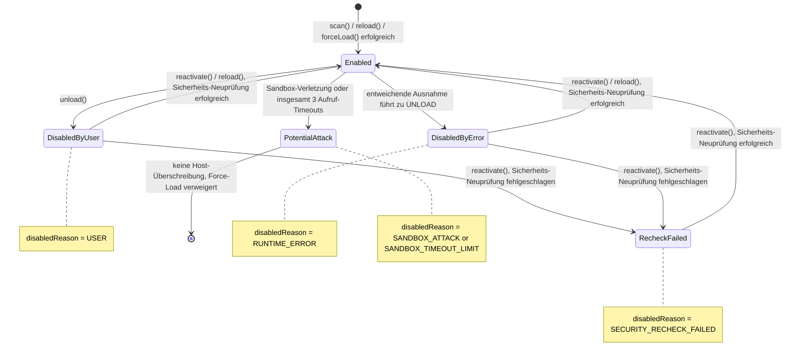
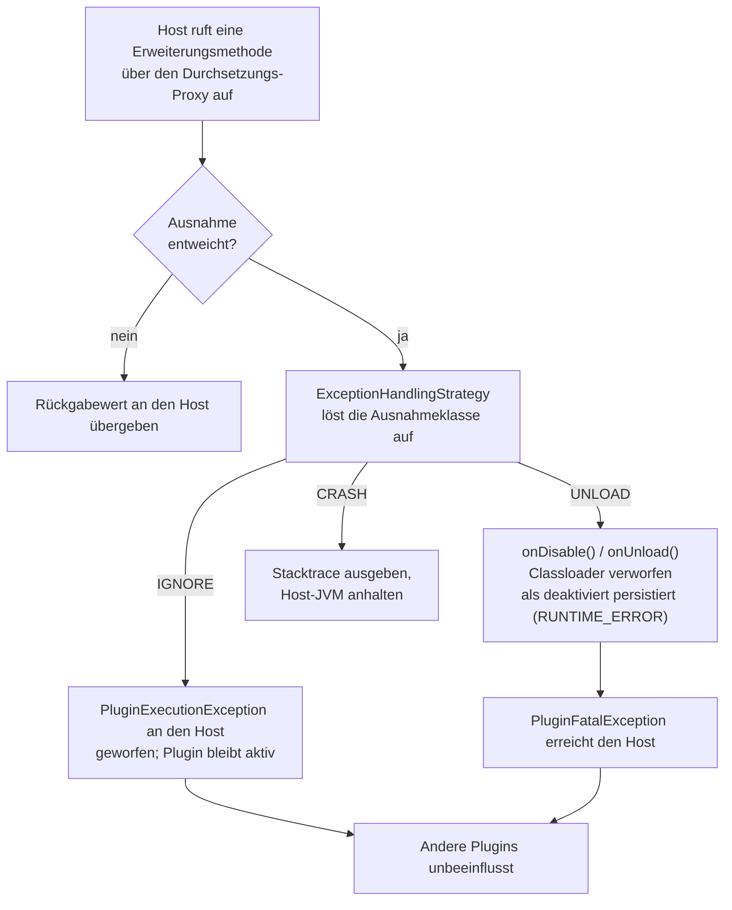

# Plugin-Lifecycle-Verwaltung

Diese Seite behandelt die host-seitige Sicht auf den Lifecycle eines Plugins: das Aktivieren/
Deaktivieren sowie das Verhalten, wenn sich ein Plugin zur Laufzeit fehlerhaft verhält. Für die
Sicht des Plugin-Entwicklers siehe [Lifecycle-Hooks](../plugin-development/lifecycle.de.md) und
[Fehlerbehandlung](../plugin-development/error-handling.de.md).



Jeder Übergang aus `Enabled` heraus verwirft den isolierten Classloader des Plugins, sodass jeder
Übergang zurück in diesen Zustand ein vollständiger Reload ist und nie nur ein umgelegtes Flag.

## Aktiviert/deaktiviert-Status

Der Aktiviert/deaktiviert-Status eines Plugins wird über die konfigurierte
`PluginPersistenceStrategy` unter dem Schlüssel `"enabled"` gespeichert (`"true"`/`"false"`;
Fehlen bedeutet aktiviert). Dies wird geprüft, **bevor** überhaupt ein Erweiterungseintrag eines
deaktivierten Plugins gemappt wird - die Implementierungsklasse der Erweiterung wird nie per
Reflection aufgelöst, sodass die Klassen eines deaktivierten Plugins nie geladen werden, nicht
einmal transitiv (Oberklassen, Interfaces, Feldtypen dessen, was ansonsten aufgelöst worden wäre).

Das Framework hält nirgendwo ein separates, losgelöstes Aktiviert/deaktiviert-Flag -
`PluginPersistenceStrategy.read` ist die einzige Quelle der Wahrheit. Jede Statusänderung wird
sofort über `PluginPersistenceStrategy.write` durchgeschrieben.

## Deaktivierungsgrund

Neben `"enabled"` zeichnet der Schlüssel `"disabledReason"` auf, warum ein Plugin deaktiviert
wurde, mit folgenden Unterscheidungen:

* `USER` - `PluginManager.unload` zeichnet dies selbst für eine bewusste, vom Host initiierte
  Deaktivierung auf (`ExtensionAggregator.USER_REASON`).
* `RUNTIME_ERROR` - das Framework zeichnet dies automatisch auf, wenn eine `UNLOAD`-Aktion (siehe
  unten) ein Plugin zwangsweise deaktiviert, sowie wenn `onLoad`/`onEnable` eines Plugins beim
  Auflösen seiner Erweiterungen sein Sandbox-Timeout überschreitet (das Plugin wird dann ebenfalls
  als deaktiviert persistiert).
* `SECURITY_RECHECK_FAILED` - `PluginManager.reactivate` zeichnet dies auf, wenn die
  Sicherheits-Neuprüfung bei der Reaktivierung fehlschlägt.
* `SANDBOX_ATTACK` - das Framework zeichnet dies auf, wenn ein kategoriezugeordneter Sandbox-Verstoß
  das Plugin zwangsweise entlädt und als `POTENTIAL_ATTACK` markiert, siehe
  [Laufzeit-Sandbox](sandbox.de.md).
* `SANDBOX_TIMEOUT_LIMIT` - das Framework zeichnet dies auf, wenn die Aufruf-Timeouts des Plugins das
  Limit erreichen (insgesamt drei) und es auf dieselbe Weise zwangsweise entladen und als
  `POTENTIAL_ATTACK` markiert wird, siehe
  [Eskalation bei wiederholten Timeouts](sandbox.de.md#eskalation-bei-wiederholten-timeouts).

## Deaktivierung verwirft immer den Classloader

Wird ein Plugin deaktiviert - benutzerinitiiert oder erzwungen -, wird sein isolierter Classloader
als fester letzter Schritt verworfen/geschlossen. Es gibt kein "sanftes Deaktivieren", das Klassen
geladen lässt. Eine anschließende Reaktivierung des Plugins erfordert daher immer einen
vollständigen Reload über `PluginLoader`, niemals nur das Zurücksetzen des Aktiviert-Flags.

## Reaktivierung: zuerst die Sicherheits-Neuprüfung

Die Reaktivierung eines deaktivierten Plugins prüft immer zuerst die Sicherheitskette erneut -
siehe [`PluginManager.reactivate`](plugin-manager.de.md#reaktivierung-reactivate). Eine
fehlgeschlagene Neuprüfung hält das Plugin deaktiviert und fällt nicht auf ein automatisches
Force-Load zurück.

## Erweiterungen werden nach jeder Änderung neu aufgelöst

`scan()`, `reload()`, `unload()` und `forceLoad()` (sowie das erzwungene Entladen nach einem
Sandbox-Verstoß) schließen jeweils damit ab, die Erweiterungen **aller** geladenen Plugins neu
aufzulösen, nicht nur die des Plugins, für das sie aufgerufen wurden:

* `onDisable` und danach `onUnload` werden auf den echten Erweiterungsinstanzen der vorherigen
  Auflösung aufgerufen, unter der Governance der Sandbox. Ein Hook, der eine Ausnahme wirft, wird
  protokolliert und übersprungen, sodass eine fehlschlagende Instanz nie die anderen blockiert.
* Die Implementierungsklassen der Erweiterungen jedes geladenen, aktivierten Plugins werden
  anschließend neu instanziiert und erhalten erneut `onLoad` und `onEnable`.

Die Lifecycle-Hooks eines Plugins laufen daher erneut, sobald irgendein anderes Plugin gescannt,
neu geladen, entladen oder per Force-Load geladen wird, und eine zuvor über
`getExtensions`/`getFirstExtension` erhaltene Erweiterungsinstanz gehört zur vorherigen Auflösung -
holen Sie sie nach einem solchen Aufruf erneut, statt sie festzuhalten.

## Laufzeitfehlerisolation

Jeder Aufruf in die Erweiterungsimplementierung eines Plugins wird über einen Runtime-Proxy
durchgesetzt, der entweichende Ausnahmen über die konfigurierte `ExceptionHandlingStrategy` in eine
von drei Aktionen auflöst - `IGNORE`, `UNLOAD`, `CRASH`. Siehe
[Fehlerbehandlung](../plugin-development/error-handling.de.md) für die plugin-seitige Sicht dieses
Mechanismus (empfohlene Ausnahmetypen, die Standard-Auflösungsmatrix und was Sie beim Debuggen
sehen).



Konfiguration der Strategie:

```kotlin
val strategy = DefaultExceptionHandlingStrategy(
    matrix = mapOf(
        MyDomainException::class to ExceptionHandlingAction.IGNORE,
    ),
    parent = null, // optionally chain to another ExceptionHandlingStrategy
)
```

Es gibt genau eine host-weite Strategie, konfiguriert über
`PluginManagerConfiguration.exceptionHandlingStrategy` - es gibt keine Möglichkeit, eine
Strategie pro Plugin zu registrieren. Ein Plugin beeinflusst das Ergebnis nur indirekt, über die
Klasse der Ausnahme, die es entweichen lässt.

* **`IGNORE`** - das Plugin bleibt aktiv, der Aufruf selbst schlägt aber trotzdem fehl: Der Proxy
  wirft eine `PluginExecutionException` (die die ursprüngliche Ausnahme umhüllt) an den Host. Der
  Proxy protokolliert dafür nichts; die Strategie protokolliert ihre Auflösung nur auf `TRACE`.
* **`UNLOAD`** - das Plugin wird zwangsweise deaktiviert: die `PluginLifecycle.onDisable`/`onUnload`-
  Hooks der Erweiterungsinstanz, deren Aufruf die Ausnahme ausgelöst hat, laufen (sofern
  implementiert), der Classloader des Plugins wird verworfen, und es wird mit dem Grund
  `RUNTIME_ERROR` als deaktiviert persistiert - alles synchron, bevor die resultierende
  `PluginFatalException` den Host erreicht.
* **`CRASH`** - der Stacktrace der Ausnahme wird ausgegeben und die gesamte Host-JVM wird angehalten
  (`Runtime.getRuntime().halt(...)`). Bewusst kein empfohlener Standard für irgendeinen
  Ausnahmetyp.

Nur das Plugin, das die Ausnahme ausgelöst hat, ist betroffen; andere Plugins laufen unbeeinflusst
von der `UNLOAD`-Behandlung eines anderen Plugins weiter.
