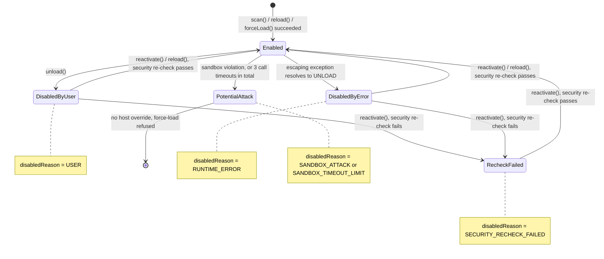
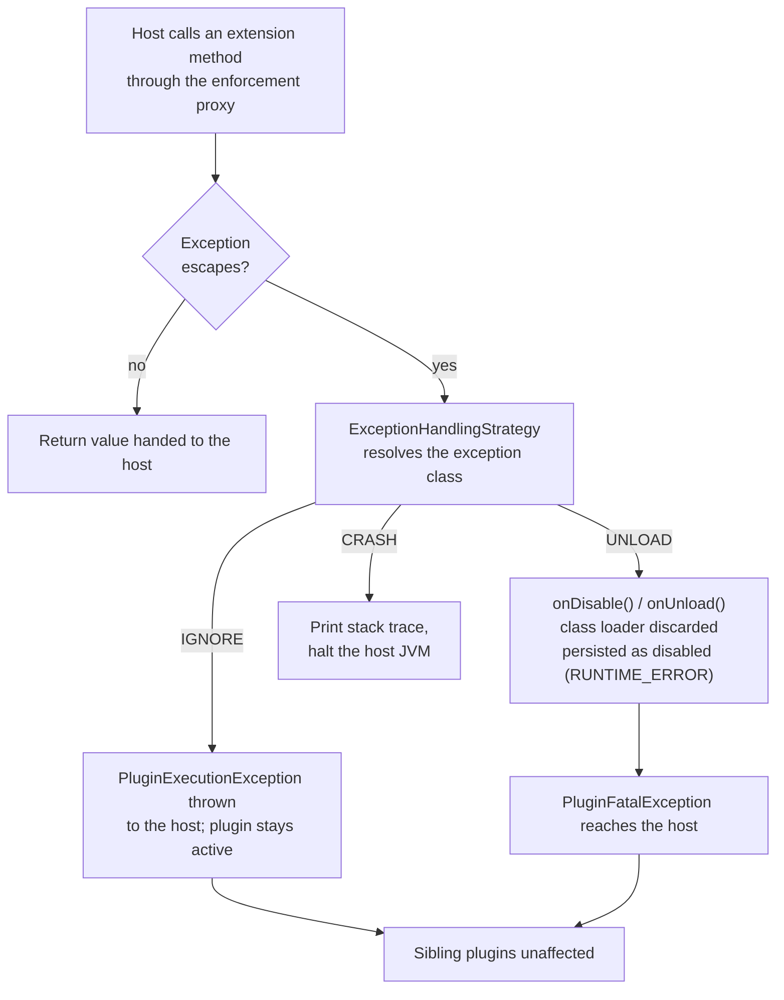

# Plugin lifecycle management

This page covers the host's side of a plugin's lifecycle: enabling/disabling it, and what happens
when a plugin misbehaves at runtime. For the plugin developer's side, see
[Lifecycle hooks](../plugin-development/lifecycle.md) and [Error handling](../plugin-development/error-handling.md).



Every transition out of `Enabled` discards the plugin's isolated class loader, so every transition
back into it is a full reload, never just a flag being flipped.

## Enabled/disabled status

A plugin's enabled/disabled status is stored via the configured `PluginPersistenceStrategy`, under
the key `"enabled"` (`"true"`/`"false"`; absent means enabled). This is checked **before** any
extension entry of a disabled plugin is even mapped - the extension implementation class is never
resolved via reflection, so a disabled plugin's classes are never loaded at all, not even
transitively (parent classes, interfaces, field types of what would have been resolved).

The framework holds no separate, detached enabled/disabled flag anywhere - `PluginPersistenceStrategy.read`
is the single source of truth. Every status change is written through immediately via
`PluginPersistenceStrategy.write`.

## Disable reason

Alongside `"enabled"`, the key `"disabledReason"` records why a plugin was disabled, distinguishing:

* `USER` - `PluginManager.unload` records this itself for a deliberate, host-initiated disable
  (`ExtensionAggregator.USER_REASON`).
* `RUNTIME_ERROR` - the framework records this automatically when an `UNLOAD` action (see below)
  force-disables a plugin, and when a plugin's `onLoad`/`onEnable` exceeds its sandbox timeout while
  its extensions are being resolved (the plugin is then persisted as disabled as well).
* `SECURITY_RECHECK_FAILED` - `PluginManager.reactivate` records this when the security re-check on
  reactivation fails.
* `SANDBOX_ATTACK` - the framework records this when a category-attributed sandbox violation forcibly
  unloads the plugin and marks it `POTENTIAL_ATTACK`, see [Runtime sandbox](sandbox.md).
* `SANDBOX_TIMEOUT_LIMIT` - the framework records this when the plugin's call timeouts reach the limit
  (three in total) and it is forcibly unloaded and marked `POTENTIAL_ATTACK` the same way, see
  [Escalation on repeated timeouts](sandbox.md#escalation-on-repeated-timeouts).

## Deactivation always discards the class loader

Whenever a plugin is deactivated - user-initiated or forced - its isolated class loader is
discarded/closed as the fixed final step. There is no "soft disable" that keeps classes loaded.
Reactivating the plugin afterward therefore always requires a full reload through `PluginLoader`,
never just flipping the enabled flag back on.

## Reactivation: security re-check first

Reactivating a disabled plugin always re-checks the security chain **before** reloading it - see
[`PluginManager.reactivate`](plugin-manager.md#reactivation-reactivate). A failed re-check keeps the plugin
disabled and does not fall back to an automatic force-load.

## Extensions are re-resolved after every change

`scan()`, `reload()`, `unload()` and `forceLoad()` (and the forced unload that follows a sandbox
violation) each finish by re-resolving the extensions of **all** loaded plugins, not only of the plugin
they were called for:

* `onDisable` and then `onUnload` are invoked on the real extension instances of the previous
  resolution, under the sandbox's governance. A hook that throws is logged and skipped, so one failing
  instance never blocks the others.
* The extension implementation classes of every loaded, enabled plugin are then instantiated anew and
  receive `onLoad` and `onEnable` again.

A plugin's lifecycle hooks therefore run again whenever any other plugin is scanned, reloaded,
unloaded or force-loaded, and an extension instance obtained earlier through
`getExtensions`/`getFirstExtension` belongs to the previous resolution - fetch it again after such a
call instead of holding on to it.

## Runtime error isolation

Every call into a plugin's extension implementation is enforced through a runtime proxy that
resolves escaping exceptions via the configured `ExceptionHandlingStrategy` into one of three
actions - `IGNORE`, `UNLOAD`, `CRASH`. See [Error handling](../plugin-development/error-handling.md)
for the plugin-facing view of this mechanism (recommended exception types, the standard resolution
matrix, and what you see when debugging).



Configuring the strategy:

```kotlin
val strategy = DefaultExceptionHandlingStrategy(
    matrix = mapOf(
        MyDomainException::class to ExceptionHandlingAction.IGNORE,
    ),
    parent = null, // optionally chain to another ExceptionHandlingStrategy
)
```

There is exactly one host-wide strategy, configured via `PluginManagerConfiguration.exceptionHandlingStrategy`
- there is no way to register a per-plugin strategy. A plugin only influences the outcome
indirectly, through the class of the exception it lets escape.

* **`IGNORE`** - the plugin stays active, but the call itself still fails: the proxy throws a
  `PluginExecutionException` (wrapping the original exception) to the host. The proxy logs nothing for
  it; the strategy only logs its resolution at `TRACE`.
* **`UNLOAD`** - the plugin is forcibly disabled: the `PluginLifecycle.onDisable`/`onUnload` hooks of
  the extension instance whose call raised the exception run (if implemented), the plugin's class
  loader is discarded, and it is persisted as disabled with reason `RUNTIME_ERROR` - all
  synchronously, before the resulting `PluginFatalException` reaches the host.
* **`CRASH`** - the exception's stack trace is printed and the whole host JVM is halted
  (`Runtime.getRuntime().halt(...)`). Deliberately not a recommended default for any exception type.

Only the plugin that raised the exception is affected; sibling plugins keep running unaffected by
another plugin's `UNLOAD`.
