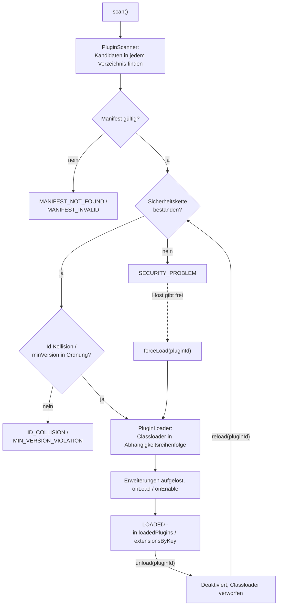

# PluginManager

`PluginManager` ist der zentrale, host-weite Einstiegspunkt des Frameworks. Er wird über eine
Kotlin-Builder-DSL erstellt:

```kotlin
val manager = pluginManager {
    location {
        path = Paths.get("/opt/myapp/plugins")
        type = PluginLocationType.EXTERNAL
        securityOverride {
            addStrategy(SignatureSecurityStrategy(publicKeyProvider))
        }
    }
    defaultSecurityChain {
        type = PluginLocationType.EXTERNAL
        addStrategy(InsecureSecurityStrategy())
    }
    dependencyStrategy = UnrestrictedPluginDependencyStrategy()
    persistenceStrategy = FilePersistenceStrategy(Paths.get("/var/lib/myapp/plugin-state.properties"))
    exceptionHandlingStrategy = DefaultExceptionHandlingStrategy()
    sdkWhitelistEntry {
        packageName = "com.myapp.sdk"
    }
    extensionPoint(ExporterExtensionConfig::class)
    hostVersion = "2.3.0"
}
```

## Was er konfiguriert

`PluginManagerConfiguration` (der Empfänger des Builders) bündelt jede host-weite Einstellung, die
das Framework benötigt, an einer Stelle, jeweils über einen verschachtelten Builder-Block befüllt:

* `pluginLocations` - die zu scannenden Verzeichnisse, über `location { path = ...; type = ...; ... }`.
  Neben `path` und `type` akzeptiert ein Verzeichnis:
    * `scanStrategy` - wie Kandidaten im Verzeichnis gefunden werden (`SingleJarScanStrategy` oder
      `ZipJarScanStrategy`, der Standard);
    * `securityOverride { addStrategy(...) }` - die eigene Sicherheitskette des Verzeichnisses, die
      gegenüber der Standardkette für seinen `type` gewinnt;
    * `dependencyStrategyOverride` - eine `PluginDependencyStrategy` für dieses Verzeichnis anstelle
      der globalen `dependencyStrategy`;
    * `sandboxOverride` - eine `PluginSandboxPolicy` für dieses Verzeichnis anstelle des Standards für
      seinen `type`, siehe [Laufzeit-Sandbox](sandbox.de.md).
* `defaultSecurityChains` - Standard-Sicherheitskette pro `PluginLocationType`, über
  `defaultSecurityChain { type = ...; addStrategy(...) }`, siehe [Sicherheit](security.de.md).
* `sandboxPolicies` - Standard-Sandbox-Policy pro `PluginLocationType`, über
  `defaultSandboxPolicy { type = ...; policy = ... }`, siehe [Laufzeit-Sandbox](sandbox.de.md).
* `dependencyStrategy` - die globale `PluginDependencyStrategy`.
* `persistenceStrategy` - die einzelne `PluginPersistenceStrategy`-Instanz, siehe
  [Persistenz](persistence.de.md).
* `exceptionHandlingStrategy` - die einzelne, host-weite `ExceptionHandlingStrategy`, siehe
  [Plugin-Lifecycle-Verwaltung](plugin-lifecycle-management.de.md).
* `sdkWhitelist` - Pakete Ihres eigenen SDK, die Plugins zugänglich gemacht werden, über
  `sdkWhitelistEntry { packageName = ...; recursive = ... }`.
* `hostVersion` - die Version Ihrer eigenen Anwendung, abgeglichen gegen das `minVersion` eines
  Plugins.
* `extensionPointClasses` - Ihre `ExtensionConfiguration`-Klassen, über
  `extensionPoint(MyConfig::class)`.

## Was er bereitstellt

```kotlin
manager.scanner  // PluginScanner, pre-wired with defaultSecurityChains
manager.security // PluginSecurity, also used to pre-wire scanner
manager.sandbox  // PluginSandbox, the host-wide runtime sandbox facade, see Runtime sandbox
manager.loader   // PluginLoader, pre-wired with sdkWhitelist
manager.registry // ExtensionPointRegistry, built once from extensionPointClasses
```

Diese vorverdrahteten Instanzen sind nur eine Annehmlichkeit - die zugrunde liegenden
`PluginScanner`/`PluginLoader`-Konstruktorparameter bleiben direkt nutzbar, falls Sie lieber selbst
verdrahten möchten.

## Zustand

`PluginManager` ist zustandsbehaftet - er hält den aktuellen Orchestrierungszustand selbst, statt bei
jedem Aufruf ein kombiniertes Ergebnisobjekt zurückzugeben, sodass jeder Teil Ihres Hosts denselben
aktuellen Zustand direkt von der Instanz lesen kann.

Die Orchestrierungsmethoden `scan()`, `reload()`, `unload()` und `forceLoad()` (ebenso wie die
framework-eigene Behandlung eines Sandbox-Verstoßes) sind intern über eine gemeinsame Sperre
synchronisiert und können von jedem Thread aus sicher aufgerufen werden: Ein Aufruf blockiert, bis
jeder andere dieser Aufrufe auf derselben Instanz abgeschlossen ist.

`reactivate`, `write`, `getExtensions` und `getFirstExtension` nehmen diese Sperre **nicht**. Sie
warten nicht auf ein laufendes `scan()`, und die von ihnen gelesenen Zustandsfelder sind einfache,
nicht-`volatile` Properties, sodass ein anderer Thread als derjenige, der
`scan()`/`reload()`/`unload()`/`forceLoad()` aufgerufen hat, den neuesten Zustand nicht garantiert
sofort sieht. Lesen Sie Erweiterungen von einem anderen Thread als dem, der die Plugins orchestriert,
übergeben Sie den Zustand mit Ihrer eigenen Synchronisation.

Der Zustand wird bereitgestellt über:

* `scanResults: List<PluginScanResult>` - jeder vom letzten `scan()` gefundene Plugin-Kandidat, mit
  seinem endgültigen Status (einschließlich der Orchestrierungsebenen-Status unten).
* `loadedPlugins: Map<String, LoadedPlugin>` - aktuell geladene Plugins, nach Plugin-ID indiziert.
* `extensionsByKey: Map<String, List<ResolvedExtension>>` - aktuell aktive Erweiterungen, gruppiert
  nach Erweiterungspunkt-Schlüssel; verwenden Sie `getExtensions<T>(key)`/`getFirstExtension<T>(key)`
  für typisierten Zugriff, statt dies direkt zu lesen.

## Orchestrierung: scan, reload, unload, force-load



```kotlin
// 1. Scan every configured location, resolve id collisions and minVersion, load and activate
//    everything that passes.
manager.scan()

// 2. Inspect scanResults for anything that was not loaded.
val failed = manager.scanResults.filter { it.status != PluginScanStatus.LOADED }

// 3. Regular reload after a transient issue is resolved (re-checks security first).
manager.reload(pluginId)

// Deliberate deactivation (the counterpart to reload).
manager.unload(pluginId)

// Force-load a candidate despite a failed security check.
manager.forceLoad(pluginId)

// 4. Typed access to loaded implementations.
val exporters: List<ExporterExtension> = manager.getExtensions("exporters")
val renderer: RendererExtension? = manager.getFirstExtension("renderer") // exclusive extension point
```

`scan()` löst Plugin-ID-Kollisionen (siehe unten) und `minVersion`-Verstöße auf, bevor überhaupt ein
Classloader erstellt wird, lädt dann jeden verbleibenden Kandidaten in Abhängigkeitsreihenfolge und
aktiviert seine Erweiterungen - alles in einem einzigen Aufruf. Ein zuvor geladenes Plugin, das im
neuen Ergebnis nicht mehr vorhanden ist, wird automatisch geschlossen.

`reload(pluginId)` ist der reguläre, sichere Weg, ein einzelnes Plugin (erneut) zu aktivieren: Es
prüft zuerst die Sicherheitskette erneut (über denselben Ablauf, den bereits `reactivate` verwendet,
siehe unten) und ersetzt den Eintrag des Plugins in `loadedPlugins` nur bei Erfolg. Bevor es
irgendetwas anderes tut - noch vor der erneuten Sicherheitsprüfung - weist es ein Plugin, dessen
`scanResults`-Status `POTENTIAL_ATTACK` ist (ein Verstoß gegen die Laufzeit-Sandbox), mit einer
`IllegalStateException` ab: Ein solches Plugin kann weder neu geladen noch per Force-Load geladen
werden, und der Host hat keine Überschreibung dafür.

`unload(pluginId)` ist das Gegenstück zu `reload`: eine bewusste, host-initiierte Deaktivierung. Es
ruft `onDisable`/`onUnload` auf den echten Erweiterungsinstanzen des Plugins auf, persistiert es als
deaktiviert (Grund `ExtensionAggregator.USER_REASON`), schließt seinen Classloader und entfernt es
aus `loadedPlugins`/`extensionsByKey`.

### Force-Load

```kotlin
val result = manager.forceLoad(pluginId)
```

Lädt den Kandidaten bedingungslos, unter vollständiger Umgehung seines aktuellen
`scanResults`-Status - die Entscheidung, *ob* dies gerechtfertigt ist (z. B. nach Rückfrage beim
Benutzer des Hosts), liegt vollständig beim Aufrufer. Der `scanResults`-Eintrag selbst bleibt
unverändert; nur `loadedPlugins`/`extensionsByKey` zeigen das Plugin danach als geladen an. Der
einzige Status, den es nicht umgehen kann, ist `POTENTIAL_ATTACK`: Für ein so markiertes Plugin wirft
`forceLoad` eine `IllegalStateException`.

Für sich genommen ist `forceLoad` eine einmalige Überschreibung: Ein späteres `reload`/`scan` prüft
die Sicherheitskette von Grund auf erneut und schlägt aus demselben Grund erneut fehl. Es gibt zwei
Wege, eine Überschreibung dauerhaft zu machen:

* Für eine [`PersistableSecurityStrategy`](security.de.md) wie die Checksum-Strategie rufen Sie
  danach `manager.write<ChecksumSecurityStrategy>(pluginId)` auf - die Strategie persistiert ihren
  eigenen akzeptierten Zustand (z. B. die tatsächliche Prüfsumme des Kandidaten als neue erwartete
  Prüfsumme), sodass die nächste reguläre Prüfung erfolgreich verläuft.
* Für jede andere Strategie (z. B. eine Signaturstrategie ohne persistierbaren Zustand) übergeben
  Sie stattdessen `forceLoad(pluginId, persistException = true)`. Dies persistiert eine generische,
  dauerhafte Sicherheitsausnahme für die Plugin-ID; jede zukünftige Sicherheitsprüfung für sie wird
  vollständig übersprungen (jedes Mal als WARN protokolliert), bis der Host die Ausnahme selbst
  aufhebt.

### Reaktivierung (`reactivate`)

```kotlin
val result = manager.reactivate(location, path, manifest, dependencies)
```

Der grundlegendere Baustein, auf dem `reload` aufbaut: prüft zuerst die Sicherheitskette gegen den
Kandidaten unter `path` erneut, über `manager.security`, und lädt ihn nur bei Erfolg über
`manager.loader` neu - persistiert ihn dabei über
`PluginManagerConfiguration.persistenceStrategy` wieder als aktiviert. Schlägt die erneute Prüfung
fehl, bleibt das Plugin deaktiviert (sein Deaktivierungsgrund wird aktualisiert), und es findet kein
automatisches Force-Load statt. Wie `reload` wirft es - vor jeder erneuten Sicherheitsprüfung und
ohne etwas zu persistieren - eine `IllegalStateException` für ein Plugin (anhand von `manifest.id`),
dessen `scanResults`-Status `POTENTIAL_ATTACK` ist, sodass ein direkter Aufruf diese Sperre nicht
umgeht. Siehe [Plugin-Lifecycle-Verwaltung](plugin-lifecycle-management.de.md) für das Gesamtbild.

## ID-Kollisionen und minVersion

Tragen zwei Verzeichnisse einen Kandidaten mit derselben Plugin-ID bei, wird dies rein anhand der
Version aufgelöst (Maven-Versionsschema), und zwar nur unter den Kandidaten, die ihre
Sicherheitskette bereits erfolgreich durchlaufen haben (`LOADED`): Die strikt höhere Version
gewinnt, der Rest wird in `scanResults` als `ID_COLLISION` markiert. Ist die höchste Version
zwischen zwei oder mehr davon gleich, wird die gesamte Gruppe sofort abgelehnt (`ID_COLLISION`, als
Sicherheitswarnung protokolliert) - es gibt keine weitere Konfliktauflösung. Ein Kandidat, dessen
Sicherheitskette fehlgeschlagen ist (z. B. `SECURITY_PROBLEM`), konkurriert nie um die Version und
kann einen `LOADED`-Kandidaten derselben ID nicht verdrängen, unabhängig davon, welche Version er
deklariert.

Ein Kandidat, dessen Manifest ein `minVersion` deklariert, das neuer als die konfigurierte
`hostVersion` ist, wird als `MIN_VERSION_VIOLATION` markiert und nie geladen. `hostVersion = null`
(der Standard) überspringt diese Prüfung vollständig.

Siehe [Fehlersuche](troubleshooting.de.md) für die vollständige Liste der `PluginScanStatus`-Werte und
ihre Bedeutung.
