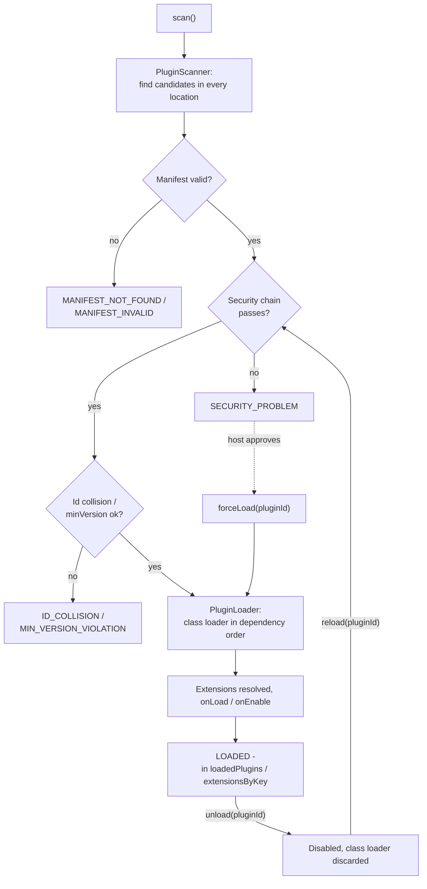

# PluginManager

`PluginManager` is the central, host-wide entry point of the framework. It is built through a
Kotlin builder DSL:

```kotlin
val manager = pluginManager {
    location {
        path = Paths.get("/opt/myapp/plugins")
        type = PluginLocationType.EXTERNAL
        securityOverride {
            addStrategy(SignatureSecurityStrategy(publicKeyProvider))
        }
    }
    defaultSecurityChain {
        type = PluginLocationType.EXTERNAL
        addStrategy(InsecureSecurityStrategy())
    }
    dependencyStrategy = UnrestrictedPluginDependencyStrategy()
    persistenceStrategy = FilePersistenceStrategy(Paths.get("/var/lib/myapp/plugin-state.properties"))
    exceptionHandlingStrategy = DefaultExceptionHandlingStrategy()
    sdkWhitelistEntry {
        packageName = "com.myapp.sdk"
    }
    extensionPoint(ExporterExtensionConfig::class)
    hostVersion = "2.3.0"
}
```

## What it configures

`PluginManagerConfiguration` (the builder's receiver) bundles every host-wide setting the framework
needs in one place, each filled in via a nested builder block:

* `pluginLocations` - the locations to scan, via `location { path = ...; type = ...; ... }`. Besides
  `path` and `type`, a location accepts:
    * `scanStrategy` - how candidates are found in the location (`SingleJarScanStrategy` or
      `ZipJarScanStrategy`, the default);
    * `securityOverride { addStrategy(...) }` - the location's own security chain, which wins over the
      default chain for its `type`;
    * `dependencyStrategyOverride` - a `PluginDependencyStrategy` for this location instead of the
      global `dependencyStrategy`;
    * `sandboxOverride` - a `PluginSandboxPolicy` for this location instead of the default for its
      `type`, see [Runtime sandbox](sandbox.md).
* `defaultSecurityChains` - per-`PluginLocationType` default security chain, via
  `defaultSecurityChain { type = ...; addStrategy(...) }`, see [Security](security.md).
* `sandboxPolicies` - per-`PluginLocationType` default sandbox policy, via
  `defaultSandboxPolicy { type = ...; policy = ... }`, see [Runtime sandbox](sandbox.md).
* `dependencyStrategy` - the global `PluginDependencyStrategy`.
* `persistenceStrategy` - the single `PluginPersistenceStrategy` instance, see
  [Persistence](persistence.md).
* `exceptionHandlingStrategy` - the single, host-wide `ExceptionHandlingStrategy`, see
  [Plugin lifecycle management](plugin-lifecycle-management.md).
* `sdkWhitelist` - packages of your own SDK exposed to plugins, via
  `sdkWhitelistEntry { packageName = ...; recursive = ... }`.
* `hostVersion` - your application's own version, matched against a plugin's `minVersion`.
* `extensionPointClasses` - your `ExtensionConfiguration` classes, via `extensionPoint(MyConfig::class)`.

## What it provides

```kotlin
manager.scanner  // PluginScanner, pre-wired with defaultSecurityChains
manager.security // PluginSecurity, also used to pre-wire scanner
manager.sandbox  // PluginSandbox, the host-wide runtime sandbox facade, see Runtime sandbox
manager.loader   // PluginLoader, pre-wired with sdkWhitelist
manager.registry // ExtensionPointRegistry, built once from extensionPointClasses
```

These pre-wired instances are a convenience only - the underlying `PluginScanner`/`PluginLoader`
constructor parameters remain directly usable if you prefer to wire things yourself.

## State

`PluginManager` is stateful - it holds the current orchestration state itself rather than returning a
combined result object from every call, so every part of your host can read the same current state
directly off the instance.

The orchestration methods `scan()`, `reload()`, `unload()` and `forceLoad()` (as well as the
framework's own handling of a sandbox violation) are internally synchronized on one lock and safe to
call from any thread: a call blocks until any other of these calls on the same instance finishes.

`reactivate`, `write`, `getExtensions` and `getFirstExtension` do **not** take that lock. They do not
wait for a running `scan()`, and the state fields they read are plain, non-`volatile` properties, so a
thread other than the one that called `scan()`/`reload()`/`unload()`/`forceLoad()` is not guaranteed to
see the newest state immediately. If you read extensions from a different thread than the one
orchestrating the plugins, hand the state over with your own synchronization.

The state is exposed through:

* `scanResults: List<PluginScanResult>` - every plugin candidate found by the last `scan()`, with
  its final status (including the orchestration-level ones below).
* `loadedPlugins: Map<String, LoadedPlugin>` - currently loaded plugins, keyed by plugin id.
* `extensionsByKey: Map<String, List<ResolvedExtension>>` - currently active extensions, grouped by
  extension point key; use `getExtensions<T>(key)`/`getFirstExtension<T>(key)` for typed access
  instead of reading this directly.

## Orchestration: scan, reload, unload, force-load



```kotlin
// 1. Scan every configured location, resolve id collisions and minVersion, load and activate
//    everything that passes.
manager.scan()

// 2. Inspect scanResults for anything that was not loaded.
val failed = manager.scanResults.filter { it.status != PluginScanStatus.LOADED }

// 3. Regular reload after a transient issue is resolved (re-checks security first).
manager.reload(pluginId)

// Deliberate deactivation (the counterpart to reload).
manager.unload(pluginId)

// Force-load a candidate despite a failed security check.
manager.forceLoad(pluginId)

// 4. Typed access to loaded implementations.
val exporters: List<ExporterExtension> = manager.getExtensions("exporters")
val renderer: RendererExtension? = manager.getFirstExtension("renderer") // exclusive extension point
```

`scan()` resolves plugin id collisions (see below) and `minVersion` violations before creating any
class loader, then loads every remaining candidate in dependency order and activates its extensions
- all in one call. A previously loaded plugin that is no longer present in the new result is closed
automatically.

`reload(pluginId)` is the regular, secure way to (re-)activate a single plugin: it re-checks the
security chain first (via the same flow `reactivate` already used, see below) and only replaces the
plugin's entry in `loadedPlugins` on success. Before it does anything else - before the security
re-check - it refuses a plugin whose `scanResults` status is `POTENTIAL_ATTACK` (a runtime sandbox
violation) with an `IllegalStateException`: such a plugin can neither be reloaded nor force-loaded, and
the host has no override for it.

`unload(pluginId)` is `reload`'s counterpart: a deliberate, host-initiated deactivation. It invokes
`onDisable`/`onUnload` on the plugin's real extension instances, persists it as disabled (reason
`ExtensionAggregator.USER_REASON`), closes its class loader and removes it from
`loadedPlugins`/`extensionsByKey`.

### Force-load

```kotlin
val result = manager.forceLoad(pluginId)
```

Loads the candidate unconditionally, bypassing its current `scanResults` status entirely - deciding
*whether* this is warranted (e.g. after asking the host's user) is entirely up to the caller. The
`scanResults` entry itself is left unchanged; only `loadedPlugins`/`extensionsByKey` show the plugin
as loaded afterward. The one status it cannot bypass is `POTENTIAL_ATTACK`: for a plugin marked that
way, `forceLoad` throws an `IllegalStateException`.

By itself, `forceLoad` is a one-time override: a later `reload`/`scan` re-checks the security chain
from scratch and fails again for the same reason. Two ways to make an override stick:

* For a [`PersistableSecurityStrategy`](security.md) like the checksum strategy, call
  `manager.write<ChecksumSecurityStrategy>(pluginId)` afterward - the strategy persists its own
  accepted state (e.g. the candidate's actual checksum as the new expected checksum), so the next
  regular check succeeds.
* For any other strategy (e.g. a signature strategy with no persistable state), pass
  `forceLoad(pluginId, persistException = true)` instead. This persists a generic, permanent
  security exception for the plugin id; every future security check for it is skipped entirely
  (logged as a WARN every time) until the host clears the exception itself.

### Reactivation (`reactivate`)

```kotlin
val result = manager.reactivate(location, path, manifest, dependencies)
```

The lower-level building block `reload` is built on: re-checks the security chain against the
candidate at `path` first, via `manager.security`, and only reloads it via `manager.loader` on
success - persisting it as enabled again through `PluginManagerConfiguration.persistenceStrategy`.
On a failed re-check, the plugin stays disabled (its disable reason is updated) and no automatic
force-load happens. Like `reload`, it throws an `IllegalStateException` - before any security re-check
and without persisting anything - for a plugin (by `manifest.id`) whose `scanResults` status is
`POTENTIAL_ATTACK`, so calling it directly does not bypass that block. See
[Plugin lifecycle management](plugin-lifecycle-management.md) for the full picture.

## Id collisions and minVersion

Two locations contributing a candidate with the same plugin id are resolved purely by version
(Maven version scheme) among the candidates that already passed their security chain (`LOADED`):
the strictly higher version wins, the rest is marked `ID_COLLISION` in `scanResults`. If the highest
version is tied between two or more of them, the whole group is rejected immediately
(`ID_COLLISION`, logged as a security warning) - there is no further tie-breaking. A candidate that
failed its security chain (e.g. `SECURITY_PROBLEM`) never competes on version and cannot displace a
`LOADED` candidate of the same id, no matter which version it declares.

A candidate whose manifest declares a `minVersion` newer than the configured `hostVersion` is marked
`MIN_VERSION_VIOLATION` and never loaded. Setting `hostVersion = null` (the default) skips this check
entirely.

See [Troubleshooting](troubleshooting.md) for the full list of `PluginScanStatus` values and what
they mean.
