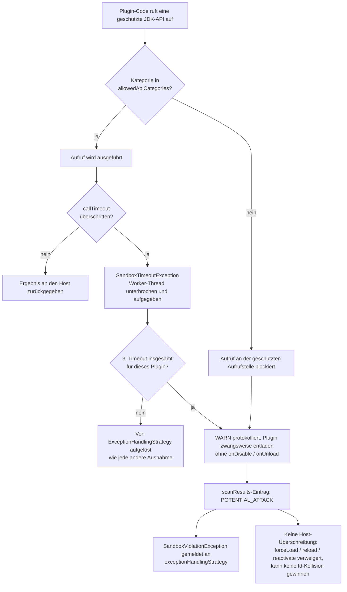
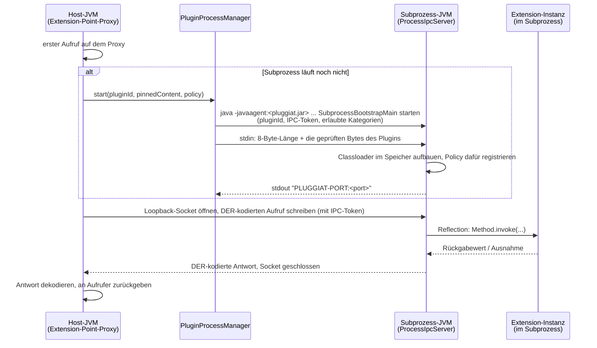

# Laufzeit-Sandbox

`PluginSandbox` ist die host-weite Fassade für die *Laufzeit*-Sandbox eines Plugins - eine Schicht
oberhalb der [Sicherheitskette](security.de.md) vor dem Laden, die steuert, was ein bereits
geladenes Plugin zur Laufzeit tun darf.

!!! warning "Benötigt den JVM-Start-Parameter `-javaagent`"

    Sobald eine konfigurierte `PluginSandboxPolicy` mindestens eine API-Kategorie einschränkt,
    **muss** die Host-JVM mit dem eigenen JAR dieses Moduls als Java-Agent gestartet werden -
    andernfalls bricht der Host in dem Moment, in dem eine solche Policy aktiviert wird, mit einer
    `SandboxAgentNotActiveException` ab:

    ```text
    java -javaagent:pluggiat-<version>.jar -jar my-host-app.jar
    ```

    Details siehe [API-Mediation aktivieren](#api-mediation-aktivieren-javaagent) unten.

## Eine Policy konfigurieren

```kotlin
val manager = pluginManager {
    defaultSandboxPolicy {
        type = PluginLocationType.EXTERNAL
        policy = PluginSandboxPolicy(
            allowedApiCategories = setOf(SandboxApiCategory.THREAD_CREATION),
        )
    }
    location {
        path = Paths.get("/opt/myapp/plugins")
        type = PluginLocationType.EXTERNAL
        sandboxOverride = PluginSandboxPolicy.UNRESTRICTED // opts this one location back out
    }
}
```

* `sandboxPolicies` (über `defaultSandboxPolicy { type = ...; policy = ... }`) - die Standard-Policy
  je `PluginLocationType`.
* Der eigene `sandboxOverride` eines Verzeichnisses gewinnt immer gegenüber dem Standard für seinen
  `type`.
* Ganz ohne Konfiguration (Standard) gilt `PluginSandboxPolicy.UNRESTRICTED` - vollständig
  freigegeben, kein Java-Agent nötig.

`PluginSandboxPolicy.allowedApiCategories` listet die `SandboxApiCategory`-Werte, die ein Plugin
unter dieser Policy direkt nutzen darf. Jede Kategorie, die *nicht* in dieser Menge enthalten ist,
wird an der abgesicherten Aufrufstelle blockiert.

## Was jede Kategorie abdeckt

| Kategorie | Abgesicherte APIs |
|-----------|-------------------|
| `FILESYSTEM` | `java.io`-Dateitypen (`File` bei *jedem* Member, `FileInputStream`/`FileOutputStream`/`FileReader`/`FileWriter`/`RandomAccessFile`, `FileDescriptor`); das vollständige `java.nio.file`-Gegenstück (`Files`, `Paths`, `FileSystem`/`FileSystems`, `DirectoryStream`, `WatchService`) samt der darunterliegenden SPI `java.nio.file.spi.FileSystemProvider`; `FileChannel`/`AsynchronousFileChannel`; die dateisystemberührenden `Path`-Member (`toRealPath`, `register`, `toFile`); dateiöffnende Konstruktoren von `PrintStream`/`PrintWriter`/`Scanner`/`Formatter`; `ZipFile`, `JarFile`, `ImageIO`, `FileHandler` |
| `NETWORK` | `Socket`, `ServerSocket`, `DatagramSocket`, `MulticastSocket` (je bei *jedem* Member), `URLConnection`/`HttpURLConnection`/`JarURLConnection`, `URL.openConnection`/`openStream`/`getContent`, `java.net.http.HttpClient`, die `java.nio.channels`-Netzwerkkanäle samt des darunterliegenden Selector-Providers aus `java.nio.channels.spi`, die Socket-Factories aus `javax.net`/`javax.net.ssl`, das JDK-eigene HTTP-*Server*-Paket `com.sun.net.httpserver` (eingehende Verbindungen), DNS-Auflösung über `InetAddress`, `NetworkInterface`, `java.rmi` und `javax.naming` (JNDI) |
| `REFLECTION` | die vollständigen Pakete `java.lang.reflect` und `java.lang.invoke` (`Field.get`/`set`/`setAccessible`, `Constructor.newInstance`, `Proxy`, `MethodHandle.invoke`, `VarHandle`, `MethodHandles.privateLookupIn`), die reflektiven `java.lang.Class`-Member (`forName`, `getDeclared*`, `getClassLoader`, …), `ClassLoader.defineClass`/`loadClass`, `URLClassLoader` und `ModuleLayer` (bei *jedem* Member - beide laden Code, den das Framework nie gescannt, geprüft oder instrumentiert hat), `ServiceLoader` (instanziiert per Daten benannte Provider), `ObjectInputStream` (Deserialisierung), `sun.misc.Unsafe`/`jdk.internal.misc.Unsafe` |
| `PROCESS_START` | `ProcessBuilder`, `Process`, `ProcessHandle`, `Runtime.exec`/`halt`/`addShutdownHook`, `System.exit` sowie das Laden nativen Codes (`System.load`/`loadLibrary`) |
| `THREAD_CREATION` | Erzeugen/Starten von `Thread` (auch virtuelle Threads), `ThreadGroup`, `Executors`, Konstruktion von `ThreadPoolExecutor`/`ScheduledThreadPoolExecutor`/`ForkJoinPool`/`Timer`, `ForkJoinPool.commonPool`, `ForkJoinTask` (bei *jedem* Member), implizite Parallelität über `Stream.parallel()` und `Collection.parallelStream()`, die asynchronen `CompletableFuture`-Stufen |

Die Absicherung beschränkt sich nicht auf die wörtlich genannten Typen:

* **Subklassen sind erfasst.** Definiert ein Plugin `class MyFile extends File` und ruft
  `myFile.delete()` auf, greift der Guard ebenfalls - der Agent löst die Typhierarchie der
  Aufrufstelle auf und wendet den Guard des Basistyps an, inklusive dessen Member-Unterscheidungen
  (eine `Thread`-Subklasse wird bei `start()` blockiert, darf aber weiter `currentThread()` aufrufen).
  Eine `URLClassLoader`-Subklasse erbt den Ganztyp-Guard dieses Typs und nicht die engeren
  Member-Regeln von `ClassLoader`.
* **Die eigenen Klassen des Frameworks sind unerreichbar.** Ein Plugin kann keine eigene Kopie einer
  `org.pcsoft.framework.pluggiat`-Klasse oder -Ressource mitbringen: diese werden immer vom Host
  aufgelöst, vor der SDK-Whitelist und vor den eigenen JARs des Plugins (siehe
  [SDK-Whitelist](sdk-whitelist.de.md)). Ohne das würden bei einem Plugin, das eine eigene
  Guard-Registry-Klasse mitliefert, seine Guard-Aufrufe in eine von ihm kontrollierte Registry
  auflösen.
* **Reflektive und indirekte Zugriffe sind erfasst.** Sowohl Reflection à la `Method.invoke` als auch
  Methoden*referenzen* (`Files::readAllBytes`, die keine direkte Aufrufinstruktion erzeugen) werden
  abgesichert.
* **Harmlose Member bleiben bewusst frei**, damit ein eingeschränktes Plugin normal arbeiten kann:
  `System.out.println`, In-Memory-`java.io`-Streams, Pfadarithmetik (`resolve`, `getFileName`),
  `URI`/`URLEncoder`, `Class.getName`, `ClassLoader.getResourceAsStream` (Lesen einer Ressource aus dem
  eigenen JAR des Plugins), `Thread.currentThread`/`sleep`, `Runtime.availableProcessors`. Da ein
  blockierter Aufruf das Plugin dauerhaft als `POTENTIAL_ATTACK` markiert (siehe unten), wäre ein
  Fehlalarm nicht rückholbar - deshalb werden ganze Pakete nur dort abgesichert, wo es keinen
  harmlosen Member gibt.

## API-Mediation aktivieren (`-javaagent`)

Die Bytecode-API-Mediation ist als Java-Agent (`PluginSandboxAgent`) umgesetzt, da JDK 25
`SecurityManager`/`AccessController` entfernt hat (JEP 486) - es gibt keinen In-VM-Berechtigungs-
mechanismus mehr, auf dem aufgebaut werden könnte. Der Agent instrumentiert jede Klasse, die über den
`PluginClassLoader` eines Plugins geladen wird, und fügt vor jedem riskanten JDK-Aufruf einen
Guard-Check ein.

Das eigene Build-Artefakt dieses Moduls **ist** der Agent - sein Manifest deklariert bereits
`Premain-Class`/`Agent-Class`. `-javaagent` muss auf das JAR zeigen, zu dem Ihr Build es auflöst
(z. B. das Fat/Shadow-JAR Ihrer Host-Anwendung oder direkt das aufgelöste Abhängigkeits-JAR):

```text
java -javaagent:/path/to/pluggiat-<version>.jar -jar my-host-app.jar
```

Diese Manifest-Attribute (`Premain-Class` und `Agent-Class`, beide
`org.pcsoft.framework.pluggiat.sandbox.agent.PluginSandboxAgent`, plus `Can-Retransform-Classes: true`)
gehören nur zum Manifest *des eigenen JARs dieses Moduls*. Ein Fat/Shadow-JAR Ihrer Host-Anwendung
trägt sie nur, wenn Ihr Build sie in das Manifest dieses JARs schreibt - andernfalls verweigert die
JVM den Start mit diesem JAR als Agent, und `-javaagent` muss stattdessen auf das aufgelöste
pluggiat-Abhängigkeits-JAR zeigen.

Dynamisches Nachladen nach dem JVM-Start (Attach-API) wird bewusst **nicht** unterstützt - JDK 21+
schränkt dies standardmäßig ein (JEP 451) und würde vom Host zusätzlich
`-XX:+EnableDynamicAgentLoading` verlangen, was einen erforderlichen Parameter nur gegen einen
anderen mit weniger Garantien tauscht (siehe [Einschränkungen](#einschrankungen) unten).

Wird eine `PluginSandboxPolicy`, die Mediation verlangt, ohne installierten Agenten aktiviert, wirft
der Plugin-Manager sofort eine `SandboxAgentNotActiveException` und bricht den Start ab - das ist
gewollt: Ein Host, der eine restriktive Policy konfiguriert hat, muss das sofort erfahren, statt
später festzustellen, dass Plugins völlig ohne Mediation liefen.

## Sandbox-Verstöße und `POTENTIAL_ATTACK`



Ein blockierter Aufruf schlägt nicht einfach nur stillschweigend fehl:

1. Er wird als `WARN` protokolliert ("SECURITY WARNING - potential attack: ...").
2. Das betroffene Plugin wird sofort zwangsweise entladen, ohne dass seine `onDisable`/
   `onUnload`-Hooks aufgerufen werden (einem Plugin, das gerade die Sandbox angegriffen hat, wird
   nicht mehr zugetraut, weiteren eigenen Code auszuführen).
3. Sein Eintrag in `PluginManager.scanResults` wird als `PluginScanStatus.POTENTIAL_ATTACK` markiert -
   bewusst getrennt von `SECURITY_PROBLEM`: Letzteres ist ein Befund vor dem Laden zu einem
   Kandidaten, der nie lief, dies hier ist ein Laufzeitbefund nach dem Laden zu einem Plugin, das
   bereits ausgeführt wurde.
4. Der Verstoß wird als `SandboxViolationException` an
   `PluginManagerConfiguration.exceptionHandlingStrategy` weitergereicht, damit der Host informiert
   ist.

Ein `POTENTIAL_ATTACK`-Kandidat kann **nie** erneut geladen werden: `PluginManager.forceLoad`,
`reload` und `reactivate` werfen dafür alle eine `IllegalStateException` - `reload` und `reactivate`
noch vor jeder erneuten Sicherheitsprüfung - und er kann nie einen `LOADED`-Kandidaten derselben
Plugin-ID über den `IdCollisionResolver` verdrängen. Anders als bei jedem anderen
Nicht-`LOADED`-Status gibt es dafür keine Host-Überschreibung.

Das Entladen eines Plugins vergisst dessen Policy nicht nur, es **widerruft** sie: Bei einem Thread,
den das Plugin weiterlaufen ließ, wird von da an jeder abgesicherte Aufruf blockiert, und der Verstoß
wird weiterhin markiert, persistiert und gemeldet, obwohl das Plugin bereits weg ist. Ein Plugin kann
sich also keinen abgesicherten Zugriff verschaffen, indem es erst *nach* dem Entladen angreift.

## Thread- und Zeitlimit-Governance

`PluginSandboxPolicy.callTimeout` begrenzt, wie lange ein einzelner `PluginLifecycle`-Hook
(`onLoad`/`onEnable`/`onDisable`/`onUnload`) oder ein per Proxy vermittelter Aufruf einer
Erweiterungspunkt-Methode laufen darf:

```kotlin
policy = PluginSandboxPolicy(
    callTimeout = Duration.ofSeconds(5),
)
```

* Bleibt `callTimeout` ungesetzt (`null`, der Standard), läuft jeder betroffene Aufruf direkt auf dem
  aufrufenden Thread, ohne jeden Zusatzaufwand - genau wie vor diesem Feature.
* Einmal gesetzt, läuft ein betroffener Aufruf eines Plugins auf dem eigenen, dedizierten
  Single-Thread-Executor dieses Plugins. Gleichzeitige Aufrufe *desselben* Plugins werden dadurch
  serialisiert statt parallel ausgeführt; ein reentranter Aufruf (aus einem bereits betroffenen
  Aufruf desselben Plugins heraus) läuft direkt, statt erneut eingereiht zu werden, damit dieser eine
  Worker-Thread sich nicht selbst blockiert.
* Ein Aufruf, der `callTimeout` überschreitet, wirft eine `SandboxTimeoutException` an seinen Aufrufer
  und meldet einen Sandbox-Verstoß (als `WARN` protokolliert, ohne zugeordnete `SandboxApiCategory` -
  ein Timeout allein ist kein Beleg für einen Angriff, er markiert das Plugin also **nicht** von sich
  aus als `POTENTIAL_ATTACK`; siehe
  [Eskalation bei wiederholten Timeouts](#eskalation-bei-wiederholten-timeouts) unten). Was danach
  geschieht, entscheidet die umschließende Aufrufstelle: Ein per Proxy vermittelter
  Erweiterungsaufruf löst die Ausnahme wie jede andere über die konfigurierte
  `ExceptionHandlingStrategy` auf (standardmäßig: zwangsweises Entladen, siehe
  [Einschränkungen](#einschrankungen)), während `PluginManager.unload()` sie protokolliert und das
  Entladen trotzdem vollständig abschließt - ein Plugin kann sein eigenes Entladen nie blockieren,
  indem es in `onDisable`/`onUnload` hängt.
* Der Worker-Thread des betroffenen Aufrufs wird *nicht* zwangsweise gestoppt - die JVM bietet dafür
  keinen sicheren Weg. Er wird bestmöglich unterbrochen und dann aufgegeben; der Executor des Plugins
  wird sofort heruntergefahren und ersetzt, damit ein späterer Aufruf nicht dahinter festhängt. Ein
  aufgegebener Thread ist immer ein Daemon-Thread und kann die Host-JVM daher nie von sich aus am
  Leben halten, er kann aber unbegrenzt im Hintergrund weiterlaufen (und die von ihm gehaltenen
  Ressourcen weiter belegen).
* Ein rekursiv umhüllter, verschachtelter Rückgabewert (z. B. das Ergebnis einer Factory-Methode oder
  ein Element einer Collection/Map/eines Arrays) unterliegt derselben Policy wie der Aufruf, der ihn
  erzeugt hat - ein zwei Ebenen tief hängender Aufruf wird ebenfalls über `callTimeout` aufgelöst,
  nicht nur der äußerste Aufruf.
* Wird ein Plugin deaktiviert (Entladen/Neuladen oder zwangsweises Entladen nach einem
  Sandbox-Verstoß), schlägt jeder betroffene Aufruf, der noch gegen diese Deaktivierung läuft, mit
  einer `SandboxDeactivatedException` fehl, statt stillschweigend einen neuen Executor für Code zu
  starten, der nicht mehr laufen sollte.

### Eskalation bei wiederholten Timeouts

Ein einzelner Timeout gilt als Performance-Problem, nicht als Angriff. Drei
(`PluginManager.MAX_TIMEOUT_VIOLATIONS`) Timeouts derselben Plugin-ID werden anders behandelt: Das
Plugin wird über denselben Weg wie bei einem kategoriezugeordneten Verstoß zwangsweise entladen - als
`POTENTIAL_ATTACK` markiert, mit dem Grund `SANDBOX_TIMEOUT_LIMIT` persistiert und an
`exceptionHandlingStrategy` gemeldet -, sodass ein Plugin, das sein Timeout dauerhaft überschreitet,
nicht dazu genutzt werden kann, unbegrenzt viele aufgegebene Worker-Threads anzusammeln, selbst unter
einer Host-`ExceptionHandlingStrategy`, die auf eine `RuntimeException` sonst nie reagieren würde.

Die Zählung ist kumulativ, keine Serie unmittelbar aufeinanderfolgender Timeouts: Ein erfolgreicher
Aufruf dazwischen, `PluginManager.unload()` oder `PluginManager.reload()` setzen sie nicht zurück, drei
Timeouts über einen beliebig langen Zeitraum genügen also. Nur ein kategoriezugeordneter Verstoß oder
das Erreichen des Limits selbst (das das Plugin zwangsweise entlädt) setzt die Zählung zurück.

## Sicherheitsempfehlungen

!!! tip "Sicherheitsempfehlungen"

    * Mit den restriktivsten `allowedApiCategories` beginnen, die die eigenen Plugins tatsächlich
      benötigen, und bewusst erweitern - nicht umgekehrt.
    * Für `EXTERNAL`-Verzeichnisse immer eine Policy konfigurieren; der unkonfigurierte Standard
      (`PluginSandboxPolicy.UNRESTRICTED`) gewährt vollen Zugriff und benötigt keinen Agenten.
    * Dies mit einer signaturbasierten [Sicherheitskette](security.de.md) kombinieren - die Sandbox
      schränkt ein, was ein bereits geladenes Plugin tun kann, sie prüft nicht, wer es erzeugt hat.
    * Einen `POTENTIAL_ATTACK`-Status als Vorfall behandeln, nicht als Routineablehnung: anders als
      bei `SECURITY_PROBLEM` gibt es bewusst keine Überschreibung - vor einer erneuten Verteilung
      dieses Plugin-Builds erst untersuchen - gleich ob er durch einen kategoriezugeordneten Verstoß
      oder durch wiederholte Timeouts ausgelöst wurde.
    * Für jedes Verzeichnis, das nicht vertrauenswürdige Plugins ausführt, ein `callTimeout` setzen -
      ohne dieses blockiert ein Plugin, das in einem Lifecycle-Hook oder Erweiterungsaufruf ewig
      hängt, auch den aufrufenden Host-Thread ewig.
    * Die Lücke bei sehr früher Klasseninitialisierung unten im Blick behalten - die Mediation ist
      stark, aber nicht absolut.

## Einschränkungen

* **Nur der eigene Code des Plugins wird instrumentiert.** Der Agent transformiert Klassen, die über
  den `PluginClassLoader` eines Plugins geladen werden. Code, den das Plugin lediglich *aufruft* - die
  eigenen SDK-Klassen des Hosts, alles über die [SDK-Whitelist](sdk-whitelist.de.md) Freigegebene -,
  wird nicht instrumentiert; eine Host-Methode, die eine riskante Operation im Auftrag des Plugins
  ausführt, ist also nicht abgesichert. Halten Sie die freigegebene Oberfläche frei von Methoden,
  die einen beliebigen Pfad, eine URL oder einen Klassennamen vom Aufrufer übernehmen.
* **Sehr frühe Klasseninitialisierung**: Bytecode, der eine riskante JDK-Klasse referenziert, bevor
  der Agent registriert ist (z. B. in einem `<clinit>`, das während des Klassenladens selbst läuft),
  kann nicht rückwirkend instrumentiert werden.
* **Nativer Code liegt vollständig außerhalb der Reichweite** einer Bytecode-Instrumentierung. Sein
  Laden ist deshalb als `PROCESS_START` abgesichert - ein Plugin, dem das Laden nativen Codes erlaubt
  ist, ist faktisch nicht mehr durch die Sandbox eingeschränkt.
* **`callTimeout` kann einen laufenden Aufruf nicht zwangsweise stoppen**, sondern ihn nur aufgeben
  (siehe oben) - ein Plugin, das die Unterbrechung ignoriert, belegt die von ihm gehaltenen Ressourcen
  weiter, solange es läuft.
* **Prozessisolation** ist eine eigene Isolationsstufe der Laufzeit-Sandbox (siehe
  [Prozessisolation](#prozessisolation-sandboxisolationlevelprocess) unten) und gibt dem Code eines
  Plugins keine Möglichkeit, eine harte Grenze auf Betriebssystemebene zu überdauern, wie es ein
  aufgegebener Thread innerhalb der VM kann.

## Prozessisolation (`SandboxIsolationLevel.PROCESS`)

```kotlin
policy = PluginSandboxPolicy(
    isolationLevel = SandboxIsolationLevel.PROCESS,
    callTimeout = Duration.ofSeconds(5),
)
```

Ein Plugin unter einer Policy mit `isolationLevel = SandboxIsolationLevel.PROCESS` führt seine
Extension-Implementierungen in einem **separaten JVM-Subprozess** aus statt in der eigenen JVM des
Hosts. Der Host sieht weiterhin gewöhnliche Extension-Instanzen über
`PluginManager.getExtensions`/`getFirstExtension` - jeder Aufruf wird transparent über die
Prozessgrenze hinweg weitergereicht, kodiert als ASN.1 DER (`org.bouncycastle:bcprov-jdk18on` - reines
ASN.1, kein TLS/Crypto-Funktionsumfang) und über einen Loopback-TCP-Socket übertragen. Ein
Subprozessabsturz oder -hänger kann den Host-Prozess dadurch nie mit sich reißen - anders als ein im
selben Prozess laufendes, aufgegebenes Thread eines In-VM-Plugins (`callTimeout`, siehe oben) oder ein
nicht mediierter nativer Aufruf.

Der Subprozess wird träge gestartet, beim ersten Aufruf in die Extensions eines prozessisolierten
Plugins, als schlichte `java`-JVM (aufgelöst aus dem eigenen `java.home` des Hosts). Sein
Arbeitsverzeichnis ist das temporäre Verzeichnis des Systems (`java.io.tmpdir`) - er sieht das aktuelle
Arbeitsverzeichnis des Hosts nie. Beide Plugin-Layouts funktionieren, ein einzelnes JAR und ein ZIP aus
JARs (`ZipJarScanStrategy`): Die sicherheitsgeprüften Bytes des Plugins werden dem Subprozess über seine
stdin-Pipe übergeben (siehe Schritt 2 unten), sodass nichts vom Plugin je auf die Platte geschrieben
wird. Der Subprozess wird bei Unload/Reload geordnet beendet (`destroy()`, mit Eskalation zu
`destroyForcibly()` nach einer kurzen Karenzzeit), und sein unerwartetes Beenden wird als
Sandbox-Verstoß gemeldet, genau wie ein `callTimeout`-Timeout (ohne zugeordnete `SandboxApiCategory` -
siehe [Eskalation bei wiederholten Timeouts](#eskalation-bei-wiederholten-timeouts) oben, das gilt
auch hier).

### Funktionsweise



1. **Das Laden bleibt in der VM.** Ein prozessisoliertes Plugin durchläuft für Manifest-Parsing,
   Abhängigkeitsauflösung und Extension-Point-/Konfigurationszuordnung weiterhin den regulären
   `PluginLoader`-Pfad in der Host-JVM - nur seine Extension-*Implementierungsklassen* werden dort
   nie instanziiert. Statt einer echten Instanz erhält der Host einen
   `java.lang.reflect.Proxy` des Extension-Point-Interfaces.
2. **Der Subprozess startet träge, beim ersten Aufruf.** Der allererste Aufruf auf diesem Proxy
   (sobald seine Argument- und Rückgabetypen die
   [Prüfung auf unterstützte Typen](#unterstutzte-extension-signaturen) unten bestehen) veranlasst
   den `PluginProcessManager`, eine schlichte `java`-JVM (aufgelöst aus dem eigenen `java.home` des
   Hosts, mit dem eigenen `java.class.path` des Hosts als Classpath, damit pluggiat selbst dort
   verfügbar ist) mit `SubprocessBootstrapMain` als Hauptklasse zu starten. Sie erhält drei
   Programmargumente in dieser Reihenfolge: die Plugin-Id, das IPC-Token und die kommagetrennten Namen
   der erlaubten `SandboxApiCategory`-Werte des Plugins. Das Plugin selbst wird nicht als Argument
   übergeben: Der Host schreibt die sicherheitsgeprüften Bytes des Plugins - ein einzelnes JAR oder ein
   ZIP aus JARs, genau so, wie von der Sicherheitskette gepinnt - in das stdin des Subprozesses, als
   8-Byte-Länge gefolgt von den Bytes, höchstens
   `PluginResourceLimits.MAX_CANDIDATE_FILE_SIZE_BYTES` (256 MiB). Der Subprozess liest sie, bevor er
   seinen IPC-Server öffnet; eine fehlende oder außerhalb des zulässigen Bereichs liegende Länge lässt
   ihn beenden, und der Start schlägt dann mit einer `ProcessIsolationStartupException` fehl. Der Host
   schreibt auf einem separaten Daemon-Thread, sodass ein Subprozess, der sein stdin nie liest, den Host
   nicht über das Start-Timeout hinaus blockieren kann. Nur ein Kandidat, der nie gepinnt wurde, wird
   stattdessen (einmalig) von seinem Pfad gelesen, was als `WARN` protokolliert wird. Jeder spätere
   Aufruf für dieselbe Plugin-Id verwendet denselben Subprozess wieder.
3. **Der Subprozess setzt dieselbe Policy durch wie der Host.** Er wird mit dem eigenen JAR von
   pluggiat als `-javaagent` und mit der effektiven Menge der erlaubten `SandboxApiCategory`-Werte des
   Plugins als drittem Programmargument gestartet, die er für den Classloader des Plugins registriert -
   ein abgesicherter Aufruf innerhalb des Subprozesses wird also genau nach den Regeln blockiert, die
   auch in der VM gelten würden. Das übergebene Agent-JAR ist das JAR, aus dem die Agent-Klasse des
   Frameworks selbst geladen wurde: Das Aktivieren einer *eingeschränkten*, prozessisolierten Policy
   schlägt mit `SandboxAgentNotActiveException` fehl, wenn es kein solches JAR gibt (z. B. wenn das
   Framework selbst aus einem entpackten Klassenverzeichnis läuft), statt das Plugin ohne Mediation
   auszuführen; und wird pluggiat in ein Fat/Shadow-JAR umverpackt, benötigt dieses JAR die unter
   [API-Mediation aktivieren](#api-mediation-aktivieren-javaagent) beschriebenen
   Agent-Manifest-Attribute - andernfalls beendet sich der Subprozess während des Starts, und der
   Aufruf schlägt mit einer `ProcessIsolationStartupException` fehl.
4. **Jeder Aufruf wird authentifiziert.** Der Subprozess lauscht auf einem Loopback-Port, den jeder
   Prozess auf der Maschine erreichen kann - ein Port ist kein Berechtigungsnachweis. Jeder Aufruf
   führt daher ein je Subprozess erzeugtes Token mit sich, erzeugt mit `SecureRandom` und
   laufzeitkonstant verglichen; ein Aufruf ohne dieses Token wird abgewiesen und nie weitergeleitet.
   Eine dekodierte Nachricht ist zusätzlich auf 16 MiB begrenzt.
5. **Der Subprozess baut seinen eigenen, ausschließlich plugin-bezogenen Classloader.**
   `SubprocessBootstrapMain` baut einen `PinnedPluginClassLoader` über die empfangenen Bytes auf -
   im Speicher aufgelöst, die JARs eines ZIPs genau wie im Host, sodass der Agent die Klassen des
   Plugins dort instrumentiert und die eigenen Klassen des Frameworks immer aus der eigenen Kopie des
   Subprozesses kommen - und zwar ganz ohne SDK-Whitelist, sodass der Subprozess immer nur die eigenen
   Klassen des Plugins, das JDK und die eigenen Klassen von pluggiat sehen kann, analog zu dem, was
   `PluginClassLoader` bereits in der VM durchsetzt. Keiner der eigenen SDK-Typen des Hosts ist dort
   sichtbar (siehe [Bekannte Einschränkungen](#bekannte-einschrankungen)).
6. **Ein einzeiliger Handshake liefert den Port zurück.** Der Subprozess öffnet einen
   `ProcessIpcServer` auf einem vom Betriebssystem vergebenen Loopback-Port und gibt genau eine
   Zeile `PLUGGIAT-PORT:<port>` auf stdout aus; der `PluginProcessManager` liest diese Zeile zurück
   (begrenzt durch ein Start-Timeout), um den Verbindungsport zu erfahren, und leitet den restlichen
   stdout-Ausgabestrom des Subprozesses in ein Debug-Log ab.
7. **Jeder Aufruf öffnet einen frischen Loopback-Socket.** Der `ProcessIpcClient` hält bewusst keine
   dauerhafte Verbindung offen - jeder einzelne Extension-Aufruf öffnet seinen eigenen
   Loopback-`Socket`, kodiert den Aufruf (Name der Implementierungsklasse, Methodenname,
   ASN.1-DER-kodierte Argumente) über `DerCodec`, schreibt ihn und liest genau eine DER-kodierte
   Antwort auf demselben Socket zurück. Ein Socket pro Aufruf hält die Zuordnung von Anfrage und
   Antwort trivial (kein Multiplexing, keine Aufruf-Ids), zum Preis eines TCP-Handshakes pro Aufruf
   - vernachlässigbar neben einem JVM-Roundtrip.
8. **Der Subprozess verteilt die Aufrufe per einfacher Reflection.** Der `ProcessIpcServer`
   dekodiert den eingehenden Aufruf, ermittelt die Zielinstanz der Extension-Implementierung anhand
   des Klassennamens (instanziiert sie träge und hält sie im Cache), findet die passende Methode
   über Name und Parameteranzahl, dekodiert die Argumente, ruft sie über `Method.invoke` auf und
   kodiert das Ergebnis (oder die Meldung der geworfenen Ausnahme) als `ProcessResponse` zurück.
   Durch das Cachen der Instanz behält eine zustandsbehaftete Extension-Implementierung ihren
   Zustand über Aufrufe hinweg für die Lebensdauer des Subprozesses - genau wie eine
   In-VM-Singleton-Extension-Instanz.
9. **`callTimeout` begrenzt, sofern konfiguriert, das Lesen auf dem Socket** auf Host-Seite
   (`Socket.soTimeout`): Ein Subprozess, der nie antwortet, lässt den Aufruf mit
   `SandboxTimeoutException` fehlschlagen, statt den Host-Thread dauerhaft zu blockieren - genau wie
   bei einem in der VM gesteuerten Aufruf (siehe
   [Thread- und Zeitlimit-Governance](#thread-und-zeitlimit-governance) oben).
10. **Der Abbau erfolgt geordnet, dann erzwungen.** Das Entladen/Neuladen des Plugins ruft `destroy()`
   auf dem Subprozess auf, mit Eskalation zu `destroyForcibly()`, falls er nicht innerhalb einer
   kurzen Karenzzeit beendet ist; die Bytes des Plugins lebten ausschließlich im Speicher des
   Subprozesses, auf der Platte gibt es also nichts aufzuräumen. Ein *unerwartetes* Beenden (der
   Subprozess stirbt von selbst) wird über `Process.onExit()` erkannt und als Sandbox-Verstoß
   gemeldet, genau wie ein `callTimeout`-Timeout (siehe
   [Eskalation bei wiederholten Timeouts](#eskalation-bei-wiederholten-timeouts) oben).

### Unterstützte Extension-Signaturen

Die IPC der Prozessisolation versteht nur eine **minimale, geschlossene Menge an ASN.1-Typen**:
`Int`, `Long`, `Boolean`, `ByteArray`, `String`, `Unit`/`void`, eine `List<T>` aus einem dieser Typen
(nicht verschachtelt, keine `Map`, kein anderer `Collection`-Typ), sowie eine Kotlin-Data-Class, deren
Parameter des primären Konstruktors jeweils - rekursiv - einem der vorherigen Fälle entsprechen
(einschließlich einer weiteren Data-Class) - ein **komplexes Objekt**. Eine Extension-Point-Methode,
deren Parameter- oder Rückgabetyp nicht in diese Menge passt, wirft `UnsupportedSandboxTypeException`
**sofort am Aufrufort**, bevor der Subprozess überhaupt kontaktiert wird - dies ist eine
**dauerhafte, bewusste Einschränkung** der Prozessisolation, keine vorübergehende Lücke, die später
geschlossen wird. Ein Host, der eine solche Signatur benötigt, muss entweder seine
Extension-Point-API auf den unterstützten Typumfang eingrenzen oder dieses Plugin bei
`SandboxIsolationLevel.IN_VM` belassen.

#### Wire-Format (ASN.1 DER)

Jeder Wert auf der Leitung ist eine mit einem Diskriminator getaggte `SEQUENCE`, sodass der
konkrete `SandboxValue`-Fall einer Nachricht selbst dort eindeutig ist, wo zwei Fälle denselben
zugrundeliegenden ASN.1-Typ teilen (`Int` vs. `Long`, beide eine `INTEGER`):

```text
Value ::= SEQUENCE {
    tag      INTEGER,     -- 0=Int, 1=Long, 2=Boolean, 3=Bytes, 4=String, 5=List, 6=Unit, 7=Object
    payload  ANY DEFINED BY tag
}
```

Ein komplexes Objekt (eine Data-Class) wird als `SET` seiner Felder übertragen - passend zum
Kotlin-Data-Class-Fall, bei dem die Feldreihenfolge keine eigene Bedeutung trägt; jedes Feld ist
selbst eine `SEQUENCE` aus seinem Namen und seinem (rekursiv kodierten) `Value`:

```text
ObjectValue ::= SET OF Field

Field ::= SEQUENCE {
    fieldName   UTF8String,
    fieldValue  Value
}
```

Der `fieldValue` eines Feldes kann rekursiv wieder ein `ObjectValue` (eine verschachtelte Data-Class)
oder eine `List` sein (Tag 5, selbst eine `SEQUENCE OF Value`), sodass ein beliebig tiefer - aber
weiterhin statisch typisierter - Objektgraph übertragen werden kann, solange jedes Blatt einer der
Basisfälle oben ist.

Ein Aufruf und seine Antwort sind jeweils eine einzelne, selbstbegrenzende DER-`SEQUENCE` (kein
separates Längenpräfix; eine dekodierte Nachricht ist auf 16 MiB begrenzt). Das IPC-Token ist bewusst
das erste Feld eines Aufrufs, damit der Subprozess den Absender authentifizieren kann, bevor er einen
Klassen- oder Methodennamen interpretiert:

```text
ProcessCall ::= SEQUENCE {
    token                UTF8String,   -- per-subprocess IPC token
    implementationClass  UTF8String,   -- fully qualified name of the extension implementation
    methodName           UTF8String,
    arguments            SEQUENCE OF Value
}

ProcessResponse ::= SEQUENCE {
    outcome  INTEGER,                  -- 0=success, 1=failure
    payload  ANY DEFINED BY outcome    -- success: Value, failure: UTF8String (the exception's message)
}
```

### Bekannte Einschränkungen

* **Keine OS-seitige Benutzer-/Prozesstrennung.** Der Subprozess läuft unter *demselben* OS-Benutzer
  wie der Host, ohne zusätzliche Rechtetrennung - er isoliert einen Absturz/Hänger/Mediation-Bypass vom
  Host-Prozess, er isoliert kein bösartiges Plugin von den übrigen OS-seitigen Ressourcen des Hosts
  (Dateien, Netzwerk) so, wie es ein sandboxter OS-Benutzer oder Container täte. Falls diese
  zusätzliche Isolation benötigt wird, mit einer restriktiven `allowedApiCategories`-/`-javaagent`-Policy
  und/oder OS-seitigem Sandboxing des gesamten Host-Prozesses kombinieren.
* **Die Bytes des Plugins liegen im Speicher des Subprozesses.** Da nichts auf die Platte geschrieben
  wird, hält der Subprozess den gesamten Kandidaten (ein einzelnes JAR oder ein ZIP aus JARs, höchstens
  256 MiB) und, träge, dessen entpackte Einträge auf seinem eigenen Heap.
* **Ein prozessisoliertes Plugin muss in sich abgeschlossen sein.** Der Subprozess stellt keines der
  SDK-Pakete des Hosts bereit (seine SDK-Whitelist ist leer), daher müssen das Plugin-API-Interface
  des Extension-Points und jeder andere Typ, auf den eine Implementierungsklasse oder eine
  Extension-Methodensignatur verweist, in den eigenen Bytes des Plugins enthalten sein - der
  Subprozess sieht nur diese, das JDK und die eigenen Klassen von pluggiat. Das schließt bei einem
  Kotlin-Plugin die Kotlin-Standardbibliothek ein: Bündeln Sie sie im JAR des Plugins oder als
  weiteres JAR innerhalb des ZIPs des Plugins.
* Das IPC-Token wird dem Subprozess als Programmargument übergeben, das andere Prozesse *desselben
  OS-Benutzers* lesen können (z. B. über `ps`). Es trennt die Aufrufe des Hosts von unbeteiligten
  lokalen Prozessen, nicht von einem lokalen Angreifer, der die Prozessargumente dieses Benutzers
  bereits auflisten kann.
* Bei einem Kandidaten, der von der Sicherheitskette nie gepinnt wurde (also außerhalb des regulären
  Scan-Pfads geladen wurde), wird seine Datei für die an den Subprozess übergebenen Bytes weiterhin
  einmal erneut von der Platte gelesen, was für diesen Fall das Check-to-Load-Fenster wieder öffnet;
  ein regulär gescannter Kandidat wird aus seinen sicherheitsgeprüften Bytes gestartet.

### Sicherheitsempfehlungen

!!! tip "Sicherheitsempfehlungen"

    * `SandboxIsolationLevel.PROCESS` Plugins vorbehalten, die selbst mit restriktiver
      `allowedApiCategories`-Policy und `callTimeout` als zu risikoreich für In-VM-Ausführung gelten.
    * Für ein prozessisoliertes Verzeichnis immer ein `callTimeout` setzen - es begrenzt einen
      hängenden Subprozessaufruf genau wie einen In-VM-Aufruf.
    * Extension-Point-APIs für prozessisolierte Plugins von Anfang an auf den unterstützten
      ASN.1-Typumfang hin entwerfen, statt `UnsupportedSandboxTypeException` erst spät zu entdecken.
    * Daran denken, dass Prozessisolation kein Ersatz für OS-seitige Benutzer-/Prozesstrennung ist -
      siehe Bekannte Einschränkungen oben.
