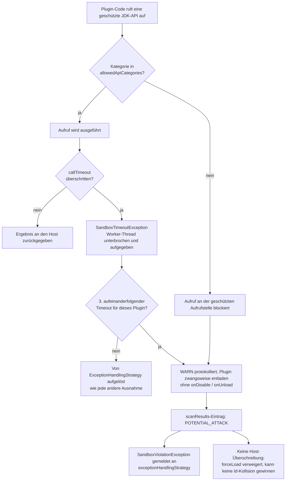
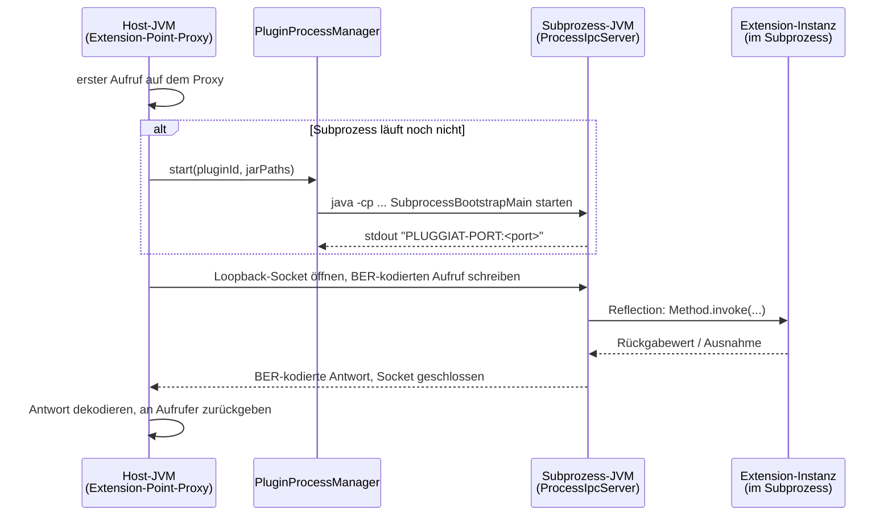

# Laufzeit-Sandbox

`PluginSandbox` ist die host-weite Fassade für die *Laufzeit*-Sandbox eines Plugins - eine Schicht
oberhalb der [Sicherheitskette](security.de.md) vor dem Laden, die steuert, was ein bereits
geladenes Plugin zur Laufzeit tun darf.

!!! warning "Benötigt den JVM-Start-Parameter `-javaagent`"

    Sobald eine konfigurierte `PluginSandboxPolicy` mindestens eine API-Kategorie einschränkt,
    **muss** die Host-JVM mit dem eigenen JAR dieses Moduls als Java-Agent gestartet werden -
    andernfalls bricht der Host in dem Moment, in dem eine solche Policy aktiviert wird, mit einer
    `SandboxAgentNotActiveException` ab:

    ```text
    java -javaagent:pluggiat-<version>.jar -jar my-host-app.jar
    ```

    Details siehe [API-Mediation aktivieren](#api-mediation-aktivieren-javaagent) unten.

## Eine Policy konfigurieren

```kotlin
val manager = pluginManager {
    defaultSandboxPolicy {
        type = PluginLocationType.EXTERNAL
        policy = PluginSandboxPolicy(
            allowedApiCategories = setOf(SandboxApiCategory.THREAD_CREATION),
        )
    }
    location {
        path = Paths.get("/opt/myapp/plugins")
        type = PluginLocationType.EXTERNAL
        sandboxOverride = PluginSandboxPolicy.UNRESTRICTED // opts this one location back out
    }
}
```

* `sandboxPolicies` (über `defaultSandboxPolicy { type = ...; policy = ... }`) - die Standard-Policy
  je `PluginLocationType`.
* Der eigene `sandboxOverride` eines Verzeichnisses gewinnt immer gegenüber dem Standard für seinen
  `type`.
* Ganz ohne Konfiguration (Standard) gilt `PluginSandboxPolicy.UNRESTRICTED` - vollständig
  freigegeben, kein Java-Agent nötig.

`PluginSandboxPolicy.allowedApiCategories` listet die `SandboxApiCategory`-Werte, die ein Plugin
unter dieser Policy direkt nutzen darf. Jede Kategorie, die *nicht* in dieser Menge enthalten ist,
wird an der abgesicherten Aufrufstelle blockiert.

## Was jede Kategorie abdeckt

| Kategorie | Abgesicherte APIs |
|-----------|-------------------|
| `FILESYSTEM` | `java.io`-Dateitypen (`File` bei *jedem* Member, `FileInputStream`/`FileOutputStream`/`FileReader`/`FileWriter`/`RandomAccessFile`, `FileDescriptor`); das vollständige `java.nio.file`-Gegenstück (`Files`, `Paths`, `FileSystem`/`FileSystems`, `DirectoryStream`, `WatchService`) samt der darunterliegenden SPI `java.nio.file.spi.FileSystemProvider`; `FileChannel`/`AsynchronousFileChannel`; die dateisystemberührenden `Path`-Member (`toRealPath`, `register`, `toFile`); dateiöffnende Konstruktoren von `PrintStream`/`PrintWriter`/`Scanner`/`Formatter`; `ZipFile`, `JarFile`, `ImageIO`, `FileHandler` |
| `NETWORK` | `Socket`, `ServerSocket`, `DatagramSocket`, `MulticastSocket` (je bei *jedem* Member), `URLConnection`/`HttpURLConnection`/`JarURLConnection`, `URL.openConnection`/`openStream`/`getContent`, `java.net.http.HttpClient`, die `java.nio.channels`-Netzwerkkanäle samt des darunterliegenden Selector-Providers aus `java.nio.channels.spi`, die Socket-Factories aus `javax.net`/`javax.net.ssl`, DNS-Auflösung über `InetAddress`, `NetworkInterface`, `java.rmi` und `javax.naming` (JNDI) |
| `REFLECTION` | die vollständigen Pakete `java.lang.reflect` und `java.lang.invoke` (`Field.get`/`set`/`setAccessible`, `Constructor.newInstance`, `Proxy`, `MethodHandle.invoke`, `VarHandle`, `MethodHandles.privateLookupIn`), die reflektiven `java.lang.Class`-Member (`forName`, `getDeclared*`, `getClassLoader`, …), `ClassLoader.defineClass`/`loadClass`, `ObjectInputStream` (Deserialisierung), `sun.misc.Unsafe`/`jdk.internal.misc.Unsafe` |
| `PROCESS_START` | `ProcessBuilder`, `Process`, `ProcessHandle`, `Runtime.exec`/`halt`/`addShutdownHook`, `System.exit` sowie das Laden nativen Codes (`System.load`/`loadLibrary`) |
| `THREAD_CREATION` | Erzeugen/Starten von `Thread` (auch virtuelle Threads), `ThreadGroup`, `Executors`, Konstruktion von `ThreadPoolExecutor`/`ScheduledThreadPoolExecutor`/`ForkJoinPool`/`Timer`, `ForkJoinPool.commonPool`, die asynchronen `CompletableFuture`-Stufen |

Die Absicherung beschränkt sich nicht auf die wörtlich genannten Typen:

* **Subklassen sind erfasst.** Definiert ein Plugin `class MyFile : File` und ruft `myFile.delete()`
  auf, greift der Guard ebenfalls - der Agent löst die Typhierarchie der Aufrufstelle auf und wendet
  den Guard des Basistyps an, inklusive dessen Member-Unterscheidungen (eine `Thread`-Subklasse wird
  bei `start()` blockiert, darf aber weiter `currentThread()` aufrufen).
* **Reflektive und indirekte Zugriffe sind erfasst.** Sowohl Reflection à la `Method.invoke` als auch
  Methoden*referenzen* (`Files::readAllBytes`, die keine direkte Aufrufinstruktion erzeugen) werden
  abgesichert.
* **Harmlose Member bleiben bewusst frei**, damit ein eingeschränktes Plugin normal arbeiten kann:
  `System.out.println`, In-Memory-`java.io`-Streams, Pfadarithmetik (`resolve`, `getFileName`),
  `URI`/`URLEncoder`, `Class.getName`, `ClassLoader.getResourceAsStream` (Lesen einer Ressource aus dem
  eigenen JAR des Plugins), `Thread.currentThread`/`sleep`, `Runtime.availableProcessors`. Da ein
  blockierter Aufruf das Plugin dauerhaft als `POTENTIAL_ATTACK` markiert (siehe unten), wäre ein
  Fehlalarm nicht rückholbar - deshalb werden ganze Pakete nur dort abgesichert, wo es keinen
  harmlosen Member gibt.

## API-Mediation aktivieren (`-javaagent`)

Die Bytecode-API-Mediation ist als Java-Agent (`PluginSandboxAgent`) umgesetzt, da JDK 25
`SecurityManager`/`AccessController` entfernt hat (JEP 486) - es gibt keinen In-VM-Berechtigungs-
mechanismus mehr, auf dem aufgebaut werden könnte. Der Agent instrumentiert jede Klasse, die über den
`PluginClassLoader` eines Plugins geladen wird, und fügt vor jedem riskanten JDK-Aufruf einen
Guard-Check ein.

Das eigene Build-Artefakt dieses Moduls **ist** der Agent - sein Manifest deklariert bereits
`Premain-Class`/`Agent-Class`. `-javaagent` muss auf das JAR zeigen, zu dem Ihr Build es auflöst
(z. B. das Fat/Shadow-JAR Ihrer Host-Anwendung oder direkt das aufgelöste Abhängigkeits-JAR):

```text
java -javaagent:/path/to/pluggiat-<version>.jar -jar my-host-app.jar
```

Dynamisches Nachladen nach dem JVM-Start (Attach-API) wird bewusst **nicht** unterstützt - JDK 21+
schränkt dies standardmäßig ein (JEP 451) und würde vom Host zusätzlich
`-XX:+EnableDynamicAgentLoading` verlangen, was einen erforderlichen Parameter nur gegen einen
anderen mit weniger Garantien tauscht (siehe [Einschränkungen](#einschrankungen) unten).

Wird eine `PluginSandboxPolicy`, die Mediation verlangt, ohne installierten Agenten aktiviert, wirft
der Plugin-Manager sofort eine `SandboxAgentNotActiveException` und bricht den Start ab - das ist
gewollt: Ein Host, der eine restriktive Policy konfiguriert hat, muss das sofort erfahren, statt
später festzustellen, dass Plugins völlig ohne Mediation liefen.

## Sandbox-Verstöße und `POTENTIAL_ATTACK`



Ein blockierter Aufruf schlägt nicht einfach nur stillschweigend fehl:

1. Er wird als `WARN` protokolliert ("SECURITY WARNING - potential attack: ...").
2. Das betroffene Plugin wird sofort zwangsweise entladen, ohne dass seine `onDisable`/
   `onUnload`-Hooks aufgerufen werden (einem Plugin, das gerade die Sandbox angegriffen hat, wird
   nicht mehr zugetraut, weiteren eigenen Code auszuführen).
3. Sein Eintrag in `PluginManager.scanResults` wird als `PluginScanStatus.POTENTIAL_ATTACK` markiert -
   bewusst getrennt von `SECURITY_PROBLEM`: Letzteres ist ein Befund vor dem Laden zu einem
   Kandidaten, der nie lief, dies hier ist ein Laufzeitbefund nach dem Laden zu einem Plugin, das
   bereits ausgeführt wurde.
4. Der Verstoß wird als `SandboxViolationException` an
   `PluginManagerConfiguration.exceptionHandlingStrategy` weitergereicht, damit der Host informiert
   ist.

Ein `POTENTIAL_ATTACK`-Kandidat kann **nie** erneut per Force-Load geladen werden
(`PluginManager.forceLoad` wirft `IllegalStateException`) und kann nie einen `LOADED`-Kandidaten
derselben Plugin-ID über den `IdCollisionResolver` verdrängen - anders als jeder andere
Nicht-`LOADED`-Status gibt es dafür keine Host-Überschreibung.

## Thread- und Zeitlimit-Governance

`PluginSandboxPolicy.callTimeout` begrenzt, wie lange ein einzelner `PluginLifecycle`-Hook
(`onLoad`/`onEnable`/`onDisable`/`onUnload`) oder ein per Proxy vermittelter Aufruf einer
Erweiterungspunkt-Methode laufen darf:

```kotlin
policy = PluginSandboxPolicy(
    callTimeout = Duration.ofSeconds(5),
)
```

* Bleibt `callTimeout` ungesetzt (`null`, der Standard), läuft jeder betroffene Aufruf direkt auf dem
  aufrufenden Thread, ohne jeden Zusatzaufwand - genau wie vor diesem Feature.
* Einmal gesetzt, läuft ein betroffener Aufruf eines Plugins auf dem eigenen, dedizierten
  Single-Thread-Executor dieses Plugins. Gleichzeitige Aufrufe *desselben* Plugins werden dadurch
  serialisiert statt parallel ausgeführt; ein reentranter Aufruf (aus einem bereits betroffenen
  Aufruf desselben Plugins heraus) läuft direkt, statt erneut eingereiht zu werden, damit dieser eine
  Worker-Thread sich nicht selbst blockiert.
* Ein Aufruf, der `callTimeout` überschreitet, wirft eine `SandboxTimeoutException` an seinen Aufrufer
  und meldet einen Sandbox-Verstoß (als `WARN` protokolliert, ohne zugeordnete `SandboxApiCategory` -
  ein Timeout allein ist kein Beleg für einen Angriff, er markiert das Plugin also **nicht** von sich
  aus als `POTENTIAL_ATTACK`; siehe
  [Eskalation bei wiederholten Timeouts](#eskalation-bei-wiederholten-timeouts) unten). Was danach
  geschieht, entscheidet die umschließende Aufrufstelle: Ein per Proxy vermittelter
  Erweiterungsaufruf löst die Ausnahme wie jede andere über die konfigurierte
  `ExceptionHandlingStrategy` auf (standardmäßig: zwangsweises Entladen, siehe
  [Einschränkungen](#einschrankungen)), während `PluginManager.unload()` sie protokolliert und das
  Entladen trotzdem vollständig abschließt - ein Plugin kann sein eigenes Entladen nie blockieren,
  indem es in `onDisable`/`onUnload` hängt.
* Der Worker-Thread des betroffenen Aufrufs wird *nicht* zwangsweise gestoppt - die JVM bietet dafür
  keinen sicheren Weg. Er wird bestmöglich unterbrochen und dann aufgegeben; der Executor des Plugins
  wird verworfen und ersetzt, damit ein späterer Aufruf nicht dahinter festhängt. Ein aufgegebener
  Thread ist immer ein Daemon-Thread und kann die Host-JVM daher nie von sich aus am Leben halten, er
  kann aber unbegrenzt im Hintergrund weiterlaufen (und die von ihm gehaltenen Ressourcen weiter
  belegen).
* Ein rekursiv umhüllter, verschachtelter Rückgabewert (z. B. das Ergebnis einer Factory-Methode oder
  ein Element einer Collection/Map/eines Arrays) unterliegt derselben Policy wie der Aufruf, der ihn
  erzeugt hat - ein zwei Ebenen tief hängender Aufruf wird ebenfalls über `callTimeout` aufgelöst,
  nicht nur der äußerste Aufruf.
* Wird ein Plugin deaktiviert (Entladen/Neuladen oder zwangsweises Entladen nach einem
  Sandbox-Verstoß), schlägt jeder betroffene Aufruf, der noch gegen diese Deaktivierung läuft, mit
  einer `SandboxDeactivatedException` fehl, statt stillschweigend einen neuen Executor für Code zu
  starten, der nicht mehr laufen sollte.

### Eskalation bei wiederholten Timeouts

Ein einzelner Timeout gilt als Performance-Problem, nicht als Angriff. Drei
(`PluginManager.MAX_TIMEOUT_VIOLATIONS`) *aufeinanderfolgende* Timeouts derselben Plugin-ID werden
anders behandelt: Das Plugin wird über denselben Weg wie bei einem kategoriezugeordneten Verstoß
zwangsweise entladen - als `POTENTIAL_ATTACK` markiert, mit dem Grund `SANDBOX_TIMEOUT_LIMIT`
persistiert und an `exceptionHandlingStrategy` gemeldet -, sodass ein Plugin, das sein Timeout
dauerhaft überschreitet, nicht dazu genutzt werden kann, unbegrenzt viele aufgegebene Worker-Threads
anzusammeln, selbst unter einer Host-`ExceptionHandlingStrategy`, die auf eine `RuntimeException`
sonst nie reagieren würde.

## Sicherheitsempfehlungen

!!! tip "Sicherheitsempfehlungen"

    * Mit den restriktivsten `allowedApiCategories` beginnen, die die eigenen Plugins tatsächlich
      benötigen, und bewusst erweitern - nicht umgekehrt.
    * Für `EXTERNAL`-Verzeichnisse immer eine Policy konfigurieren; der unkonfigurierte Standard
      (`PluginSandboxPolicy.UNRESTRICTED`) gewährt vollen Zugriff und benötigt keinen Agenten.
    * Dies mit einer signaturbasierten [Sicherheitskette](security.de.md) kombinieren - die Sandbox
      schränkt ein, was ein bereits geladenes Plugin tun kann, sie prüft nicht, wer es erzeugt hat.
    * Einen `POTENTIAL_ATTACK`-Status als Vorfall behandeln, nicht als Routineablehnung: anders als
      bei `SECURITY_PROBLEM` gibt es bewusst keine Überschreibung - vor einer erneuten Verteilung
      dieses Plugin-Builds erst untersuchen - gleich ob er durch einen kategoriezugeordneten Verstoß
      oder durch wiederholte Timeouts ausgelöst wurde.
    * Für jedes Verzeichnis, das nicht vertrauenswürdige Plugins ausführt, ein `callTimeout` setzen -
      ohne dieses blockiert ein Plugin, das in einem Lifecycle-Hook oder Erweiterungsaufruf ewig
      hängt, auch den aufrufenden Host-Thread ewig.
    * Die Lücke bei sehr früher Klasseninitialisierung unten im Blick behalten - die Mediation ist
      stark, aber nicht absolut.

## Prozessisolation (`SandboxIsolationLevel.PROCESS`)

```kotlin
policy = PluginSandboxPolicy(
    isolationLevel = SandboxIsolationLevel.PROCESS,
    callTimeout = Duration.ofSeconds(5),
)
```

Ein Plugin unter einer Policy mit `isolationLevel = SandboxIsolationLevel.PROCESS` führt seine
Extension-Implementierungen in einem **separaten JVM-Subprozess** aus statt in der eigenen JVM des
Hosts. Der Host sieht weiterhin gewöhnliche Extension-Instanzen über
`PluginManager.getExtensions`/`getFirstExtension` - jeder Aufruf wird transparent über die
Prozessgrenze hinweg weitergereicht, kodiert als ASN.1 BER (`org.bouncycastle:bcprov-jdk18on` - reines
ASN.1, kein TLS/Crypto-Funktionsumfang) und über einen Loopback-TCP-Socket übertragen. Ein
Subprozessabsturz oder -hänger kann den Host-Prozess dadurch nie mit sich reißen - anders als ein im
selben Prozess laufendes, aufgegebenes Thread eines In-VM-Plugins (`callTimeout`, siehe oben) oder ein
nicht mediierter nativer Aufruf.

Der Subprozess wird träge gestartet, beim ersten Aufruf in die Extensions eines prozessisolierten
Plugins, als schlichte `java`-JVM (aufgelöst aus dem eigenen `java.home` des Hosts) mit einem eigenen,
frischen, leeren Arbeitsverzeichnis - er sieht das aktuelle Arbeitsverzeichnis des Hosts nie. Er wird
bei Unload/Reload geordnet beendet (`destroy()`, mit Eskalation zu `destroyForcibly()` nach einer
kurzen Karenzzeit), und sein unerwartetes Beenden wird als Sandbox-Verstoß gemeldet, genau wie ein
IP-03-Timeout (ohne zugeordnete `SandboxApiCategory` - siehe
[Eskalation bei wiederholten Timeouts](#eskalation-bei-wiederholten-timeouts) oben, das gilt auch
hier).

### Funktionsweise



1. **Das Laden bleibt in der VM.** Ein prozessisoliertes Plugin durchläuft für Manifest-Parsing,
   Abhängigkeitsauflösung und Extension-Point-/Konfigurationszuordnung weiterhin den regulären
   `PluginLoader`-Pfad in der Host-JVM - nur seine Extension-*Implementierungsklassen* werden dort
   nie instanziiert. Statt einer echten Instanz erhält der Host einen
   `java.lang.reflect.Proxy` des Extension-Point-Interfaces.
2. **Der Subprozess startet träge, beim ersten Aufruf.** Der allererste Aufruf auf diesem Proxy
   (sobald seine Argument- und Rückgabetypen die
   [Prüfung auf unterstützte Typen](#unterstutzte-extension-signaturen) unten bestehen) veranlasst
   den `PluginProcessManager`, eine schlichte `java`-JVM (aufgelöst aus dem eigenen `java.home` des
   Hosts) mit `SubprocessBootstrapMain` als Hauptklasse zu starten - mit den JAR-Pfaden des Plugins
   als einzigem Programmargument und einem frischen, leeren temporären Arbeitsverzeichnis. Jeder
   spätere Aufruf für dieselbe Plugin-Id verwendet denselben Subprozess wieder.
3. **Der Subprozess baut seinen eigenen, ausschließlich plugin-bezogenen Classloader.**
   `SubprocessBootstrapMain` öffnet einen schlichten `URLClassLoader` über die JAR(s) des Plugins,
   direkt dem Platform-Classloader des JDK untergeordnet - bewusst *nicht* dem
   Application-Classloader der startenden JVM - sodass der Subprozess immer nur die eigenen Klassen
   des Plugins plus das JDK sehen kann, analog zu dem, was `PluginClassLoader` bereits in der VM
   durchsetzt.
4. **Ein einzeiliger Handshake liefert den Port zurück.** Der Subprozess öffnet einen
   `ProcessIpcServer` auf einem vom Betriebssystem vergebenen Loopback-Port und gibt genau eine
   Zeile `PLUGGIAT-PORT:<port>` auf stdout aus; der `PluginProcessManager` liest diese Zeile zurück
   (begrenzt durch ein Start-Timeout), um den Verbindungsport zu erfahren, und leitet den restlichen
   stdout-Ausgabestrom des Subprozesses in ein Debug-Log ab.
5. **Jeder Aufruf öffnet einen frischen Loopback-Socket.** Der `ProcessIpcClient` hält bewusst keine
   dauerhafte Verbindung offen - jeder einzelne Extension-Aufruf öffnet seinen eigenen
   Loopback-`Socket`, kodiert den Aufruf (Name der Implementierungsklasse, Methodenname,
   ASN.1-BER-kodierte Argumente) über `BerCodec`, schreibt ihn und liest genau eine BER-kodierte
   Antwort auf demselben Socket zurück. Ein Socket pro Aufruf hält die Zuordnung von Anfrage und
   Antwort trivial (kein Multiplexing, keine Aufruf-Ids), zum Preis eines TCP-Handshakes pro Aufruf
   - vernachlässigbar neben einem JVM-Roundtrip.
6. **Der Subprozess verteilt die Aufrufe per einfacher Reflection.** Der `ProcessIpcServer`
   dekodiert den eingehenden Aufruf, ermittelt die Zielinstanz der Extension-Implementierung anhand
   des Klassennamens (instanziiert sie träge und hält sie im Cache), findet die passende Methode
   über Name und Parameteranzahl, dekodiert die Argumente, ruft sie über `Method.invoke` auf und
   kodiert das Ergebnis (oder die Meldung der geworfenen Ausnahme) als `ProcessResponse` zurück.
   Durch das Cachen der Instanz behält eine zustandsbehaftete Extension-Implementierung ihren
   Zustand über Aufrufe hinweg für die Lebensdauer des Subprozesses - genau wie eine
   In-VM-Singleton-Extension-Instanz.
7. **`callTimeout` begrenzt, sofern konfiguriert, das Lesen auf dem Socket** auf Host-Seite
   (`Socket.soTimeout`): Ein Subprozess, der nie antwortet, lässt den Aufruf mit
   `SandboxTimeoutException` fehlschlagen, statt den Host-Thread dauerhaft zu blockieren - genau wie
   bei einem in der VM gesteuerten Aufruf (siehe
   [Thread- und Zeitlimit-Governance](#thread--und-zeitlimit-governance) oben).
8. **Der Abbau erfolgt geordnet, dann erzwungen.** Das Entladen/Neuladen des Plugins ruft `destroy()`
   auf dem Subprozess auf, mit Eskalation zu `destroyForcibly()`, falls er nicht innerhalb einer
   kurzen Karenzzeit beendet ist; sein temporäres Arbeitsverzeichnis wird danach gelöscht. Ein
   *unerwartetes* Beenden (der Subprozess stirbt von selbst) wird über `Process.onExit()` erkannt und
   als Sandbox-Verstoß gemeldet, genau wie ein IP-03-Timeout (siehe
   [Eskalation bei wiederholten Timeouts](#eskalation-bei-wiederholten-timeouts) oben).

### Unterstützte Extension-Signaturen

Die IPC der Prozessisolation versteht nur eine **minimale, geschlossene Menge an ASN.1-Typen**:
`Int`, `Long`, `Boolean`, `ByteArray`, `String`, `Unit`/`void`, sowie eine `List<T>` aus einem dieser
Typen (nicht verschachtelt, keine `Map`, kein anderer `Collection`-Typ). Eine
Extension-Point-Methode, deren Parameter- oder Rückgabetyp nicht in diese Menge passt, wirft
`UnsupportedSandboxTypeException` **sofort am Aufrufort**, bevor der Subprozess überhaupt kontaktiert
wird - dies ist eine **dauerhafte, bewusste Einschränkung** der Prozessisolation, keine vorübergehende
Lücke, die später geschlossen wird. Ein Host, der eine solche Signatur benötigt, muss entweder seine
Extension-Point-API auf den unterstützten Typumfang eingrenzen oder dieses Plugin bei
`SandboxIsolationLevel.IN_VM` belassen.

### Bekannte Einschränkungen

* **Keine OS-seitige Benutzer-/Prozesstrennung.** Der Subprozess läuft unter demselben OS-Benutzer wie
  der Host, ohne zusätzliche Rechtetrennung - er isoliert einen Absturz/Hänger/Mediation-Bypass vom
  Host-Prozess, er isoliert kein bösartiges Plugin von den übrigen OS-seitigen Ressourcen des Hosts
  (Dateien, Netzwerk) so, wie es ein sandboxter OS-Benutzer oder Container täte. Falls diese
  zusätzliche Isolation benötigt wird, mit einer restriktiven `allowedApiCategories`-/`-javaagent`-Policy
  und/oder OS-seitigem Sandboxing des gesamten Host-Prozesses kombinieren.
* Ein prozessisoliertes Plugin muss aus einem einfachen JAR oder Ordner-Verzeichnis geladen werden -
  nicht aus einem `ZIP_JAR`-Verzeichnis, da der Subprozess einen echten Dateisystempfad für den
  eigenen Klassenpfad benötigt.
* Die JAR(s) des Plugins werden für den Klassenpfad des Subprozesses direkt erneut von der Platte
  gelesen, nicht aus der gepinnten Im-Speicher-Kopie der Sicherheitskette - anders als beim
  In-VM-Laden öffnet dies für prozessisolierte Plugins gezielt wieder ein schmales
  Check-to-Load-TOCTOU-Fenster.

### Sicherheitsempfehlungen

!!! tip "Sicherheitsempfehlungen"

    * `SandboxIsolationLevel.PROCESS` Plugins vorbehalten, die selbst mit restriktiver
      `allowedApiCategories`-Policy und `callTimeout` als zu risikoreich für In-VM-Ausführung gelten.
    * Für ein prozessisoliertes Verzeichnis immer ein `callTimeout` setzen - es begrenzt einen
      hängenden Subprozessaufruf genau wie einen In-VM-Aufruf.
    * Extension-Point-APIs für prozessisolierte Plugins von Anfang an auf den unterstützten
      ASN.1-Typumfang hin entwerfen, statt `UnsupportedSandboxTypeException` erst spät zu entdecken.
    * Daran denken, dass Prozessisolation kein Ersatz für OS-seitige Benutzer-/Prozesstrennung ist -
      siehe Bekannte Einschränkungen oben.

## Einschränkungen

* **Nur der eigene Code des Plugins wird instrumentiert.** Der Agent transformiert Klassen, die über
  den `PluginClassLoader` eines Plugins geladen werden. Code, den das Plugin lediglich *aufruft* - die
  eigenen SDK-Klassen des Hosts, alles über die [SDK-Whitelist](sdk-whitelist.de.md) Freigegebene -,
  wird nicht instrumentiert; eine Host-Methode, die eine riskante Operation im Auftrag des Plugins
  ausführt, ist also nicht abgesichert. Halten Sie die freigegebene Oberfläche frei von Methoden,
  die einen beliebigen Pfad, eine URL oder einen Klassennamen vom Aufrufer übernehmen.
* **Sehr frühe Klasseninitialisierung**: Bytecode, der eine riskante JDK-Klasse referenziert, bevor
  der Agent registriert ist (z. B. in einem `<clinit>`, das während des Klassenladens selbst läuft),
  kann nicht rückwirkend instrumentiert werden.
* **Nativer Code liegt vollständig außerhalb der Reichweite** einer Bytecode-Instrumentierung. Sein
  Laden ist deshalb als `PROCESS_START` abgesichert - ein Plugin, dem das Laden nativen Codes erlaubt
  ist, ist faktisch nicht mehr durch die Sandbox eingeschränkt.
* **`callTimeout` kann einen laufenden Aufruf nicht zwangsweise stoppen**, sondern ihn nur aufgeben
  (siehe oben) - ein Plugin, das die Unterbrechung ignoriert, belegt die von ihm gehaltenen Ressourcen
  weiter, solange es läuft.
* **Prozessisolation** ist ein eigener, späterer Teil der Laufzeit-Sandbox und gibt dem Code eines
  Plugins keine Möglichkeit, eine harte Grenze auf Betriebssystemebene zu überdauern, wie es ein
  aufgegebener Thread innerhalb der VM kann.
