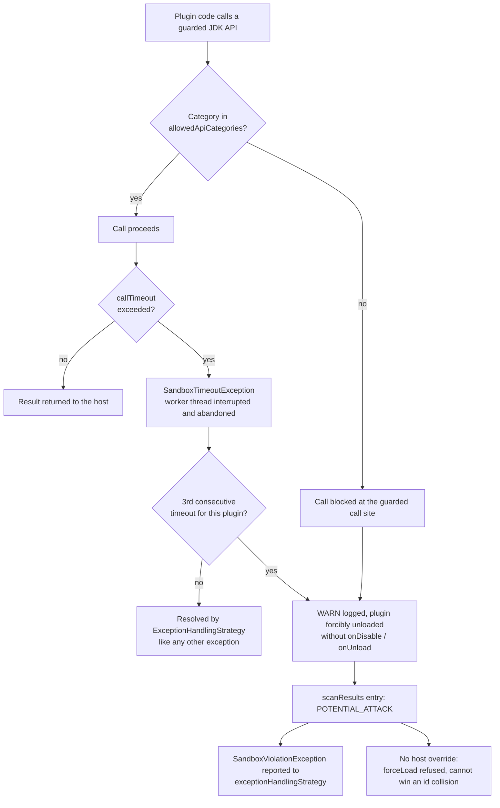
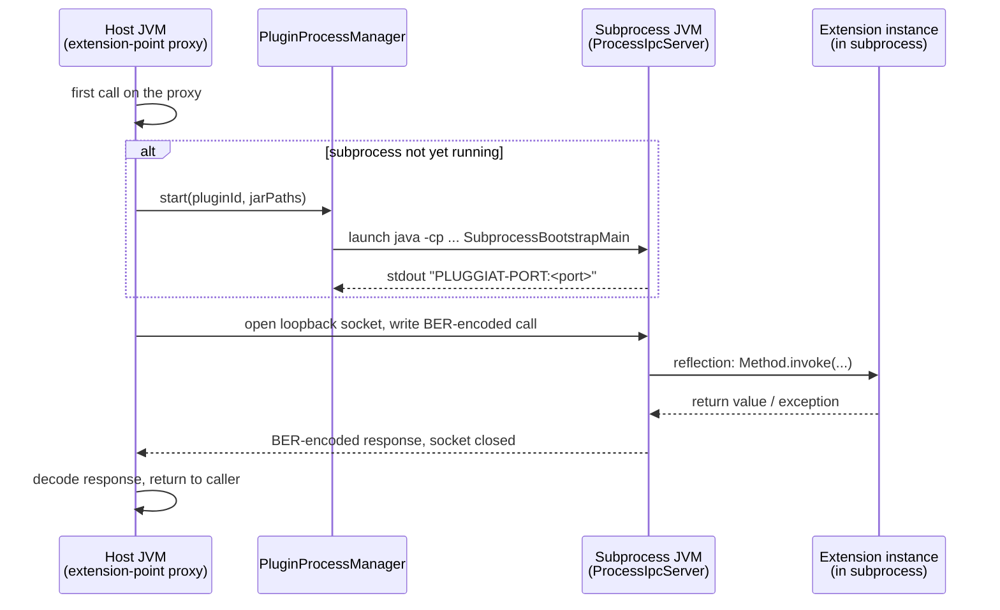

# Runtime sandbox

`PluginSandbox` is the host-wide facade for a plugin's *runtime* sandbox - a layer on top of the
pre-load [security chain](security.md) that mediates what an already-loaded plugin is allowed to do
while it runs.

!!! warning "Requires a `-javaagent` JVM start parameter"

    As soon as any configured `PluginSandboxPolicy` restricts at least one API category, the host
    JVM **must** be started with this module's own JAR as a Java agent, or the host aborts with a
    `SandboxAgentNotActiveException` the moment such a policy is activated:

    ```text
    java -javaagent:pluggiat-<version>.jar -jar my-host-app.jar
    ```

    See [Enabling API mediation](#enabling-api-mediation-javaagent) below for details.

## Configuring a policy

```kotlin
val manager = pluginManager {
    defaultSandboxPolicy {
        type = PluginLocationType.EXTERNAL
        policy = PluginSandboxPolicy(
            allowedApiCategories = setOf(SandboxApiCategory.THREAD_CREATION),
        )
    }
    location {
        path = Paths.get("/opt/myapp/plugins")
        type = PluginLocationType.EXTERNAL
        sandboxOverride = PluginSandboxPolicy.UNRESTRICTED // opts this one location back out
    }
}
```

* `sandboxPolicies` (via `defaultSandboxPolicy { type = ...; policy = ... }`) - the default policy
  per `PluginLocationType`.
* A location's own `sandboxOverride` always wins over the default for its `type`.
* No configuration at all (the default) resolves to `PluginSandboxPolicy.UNRESTRICTED` - fully
  permissive, no Java agent required.

`PluginSandboxPolicy.allowedApiCategories` lists the `SandboxApiCategory` values a plugin under this
policy may use directly. Any category *not* in this set is blocked at the guarded call site.

## What each category covers

| Category | Guarded APIs |
|----------|--------------|
| `FILESYSTEM` | `java.io` file types (`File` on *every* member, `FileInputStream`/`FileOutputStream`/`FileReader`/`FileWriter`/`RandomAccessFile`, `FileDescriptor`); the whole `java.nio.file` equivalent (`Files`, `Paths`, `FileSystem`/`FileSystems`, `DirectoryStream`, `WatchService`) plus the `java.nio.file.spi.FileSystemProvider` SPI beneath it; `FileChannel`/`AsynchronousFileChannel`; the filesystem-touching `Path` members (`toRealPath`, `register`, `toFile`); file-opening constructors of `PrintStream`/`PrintWriter`/`Scanner`/`Formatter`; `ZipFile`, `JarFile`, `ImageIO`, `FileHandler` |
| `NETWORK` | `Socket`, `ServerSocket`, `DatagramSocket`, `MulticastSocket` (each on *every* member), `URLConnection`/`HttpURLConnection`/`JarURLConnection`, `URL.openConnection`/`openStream`/`getContent`, `java.net.http.HttpClient`, the `java.nio.channels` network channels and the `java.nio.channels.spi` selector provider beneath them, the `javax.net`/`javax.net.ssl` socket factories, DNS resolution via `InetAddress`, `NetworkInterface`, `java.rmi` and `javax.naming` (JNDI) |
| `REFLECTION` | the entire `java.lang.reflect` and `java.lang.invoke` packages (`Field.get`/`set`/`setAccessible`, `Constructor.newInstance`, `Proxy`, `MethodHandle.invoke`, `VarHandle`, `MethodHandles.privateLookupIn`), the reflective `java.lang.Class` members (`forName`, `getDeclared*`, `getClassLoader`, …), `ClassLoader.defineClass`/`loadClass`, `ObjectInputStream` (deserialization), `sun.misc.Unsafe`/`jdk.internal.misc.Unsafe` |
| `PROCESS_START` | `ProcessBuilder`, `Process`, `ProcessHandle`, `Runtime.exec`/`halt`/`addShutdownHook`, `System.exit`, and native code loading (`System.load`/`loadLibrary`) |
| `THREAD_CREATION` | `Thread` creation/start (including virtual threads), `ThreadGroup`, `Executors`, `ThreadPoolExecutor`/`ScheduledThreadPoolExecutor`/`ForkJoinPool`/`Timer` construction, `ForkJoinPool.commonPool`, the async `CompletableFuture` stages |

Guarding is not limited to the literal types above:

* **Subclasses are covered.** A plugin defining `class MyFile extends File` and calling
  `myFile.delete()` is guarded too - the agent resolves the call site's type hierarchy and applies the
  base type's guard, keeping its member-level distinctions intact (a `Thread` subclass is blocked on
  `start()`, still free to call `currentThread()`).
* **Reflective and indirect reaches are covered.** Both `Method.invoke`-style reflection and method
  *references* (`Files::readAllBytes`, which produce no direct call instruction) are guarded.
* **Harmless members are deliberately left alone**, so a restricted plugin can still do ordinary work:
  `System.out.println`, in-memory `java.io` streams, `Path` arithmetic (`resolve`, `getFileName`),
  `URI`/`URLEncoder`, `Class.getName`, `ClassLoader.getResourceAsStream` (reading a resource from the
  plugin's own JAR), `Thread.currentThread`/`sleep`, `Runtime.availableProcessors`. Because a blocked
  call permanently marks the plugin as `POTENTIAL_ATTACK` (see below), a false positive would be
  unrecoverable - which is why whole packages are only guarded where no harmless member exists.

## Enabling API mediation (`-javaagent`)

Bytecode API mediation is implemented as a Java agent (`PluginSandboxAgent`), because JDK 25 removed
`SecurityManager`/`AccessController` (JEP 486) - there is no in-VM permission mechanism left to build
on. The agent instruments every class loaded by a plugin's own `PluginClassLoader`, inserting a guard
check in front of each risk-bearing JDK call.

This module's own build artifact **is** the agent - its manifest already declares `Premain-Class`/
`Agent-Class`. Point `-javaagent` at whichever JAR your build resolves it to (e.g. the fat/shadow JAR
of your host application, or the resolved dependency JAR directly):

```text
java -javaagent:/path/to/pluggiat-<version>.jar -jar my-host-app.jar
```

Dynamic attachment after JVM start (the Attach API) is deliberately **not** supported - JDK 21+
restricts it by default (JEP 451) and would require the host to additionally accept
`-XX:+EnableDynamicAgentLoading`, trading one required flag for another with fewer guarantees (see
[Restrictions](#restrictions) below).

If a `PluginSandboxPolicy` requiring mediation is activated without the agent installed, the plugin
manager throws `SandboxAgentNotActiveException` right away, aborting startup - this is deliberate: a
host that configured a restrictive policy must find out immediately, not learn later that plugins
ran completely unmediated.

## Sandbox violations and `POTENTIAL_ATTACK`



A blocked call does not just fail silently:

1. It is logged as a `WARN` ("SECURITY WARNING - potential attack: ...").
2. The offending plugin is forcibly unloaded immediately, without its `onDisable`/`onUnload` hooks
   being invoked (a plugin that just attacked the sandbox is not trusted to run any more of its own
   code).
3. Its `PluginManager.scanResults` entry is marked `PluginScanStatus.POTENTIAL_ATTACK` - deliberately
   distinct from `SECURITY_PROBLEM`: the latter is a pre-load finding about a candidate that never
   ran, this one is a post-load, runtime finding about a plugin that already executed.
4. The violation is forwarded to `PluginManagerConfiguration.exceptionHandlingStrategy` as a
   `SandboxViolationException`, so the host is notified.

A `POTENTIAL_ATTACK` candidate can **never** be force-loaded again (`PluginManager.forceLoad` throws
`IllegalStateException`) and can never displace a `LOADED` candidate of the same plugin id via
`IdCollisionResolver` - unlike every other non-`LOADED` status, there is no host override for it.

## Thread and time-limit governance

`PluginSandboxPolicy.callTimeout` bounds how long a single `PluginLifecycle` hook
(`onLoad`/`onEnable`/`onDisable`/`onUnload`) or proxied extension-point method call may run:

```kotlin
policy = PluginSandboxPolicy(
    callTimeout = Duration.ofSeconds(5),
)
```

* Leaving `callTimeout` unset (`null`, the default) runs every governed call directly on the calling
  thread, at zero overhead - the same as before this feature existed.
* Once set, a governed call for a plugin runs on that plugin's own, dedicated single-thread executor.
  Concurrent calls for the *same* plugin are therefore serialized rather than running in parallel; a
  reentrant call (from within an already-governed call for the same plugin) runs directly instead of
  being submitted again, to avoid deadlocking that single worker thread against itself.
* A call exceeding `callTimeout` throws `SandboxTimeoutException` to its caller and reports a sandbox
  violation (logged as a `WARN`, with no `SandboxApiCategory` attached - a single timeout alone is not
  evidence of an attack, so it does not by itself mark the plugin `POTENTIAL_ATTACK`; see
  [Escalation on repeated timeouts](#escalation-on-repeated-timeouts) below). The wrapping call site
  decides what happens next: a proxied extension-point call resolves the exception through the
  configured `ExceptionHandlingStrategy` like any other (by default: forced unload, see
  [Restrictions](#restrictions)), while `PluginManager.unload()` logs it and still fully completes the
  unload regardless - a plugin can never block its own unload by hanging in `onDisable`/`onUnload`.
* The offending call's worker thread is *not* forcibly stopped - the JVM has no safe way to do that.
  It is interrupted best-effort and then abandoned; the plugin's executor is shut down immediately and
  replaced so a later call is not stuck behind it. An abandoned thread is always a daemon thread, so it
  can never keep the host JVM alive on its own, but it may keep running (and holding whatever resources
  it held) in the background indefinitely.
* A recursively wrapped, nested return value (e.g. a factory method's result, or a collection/map/array
  element) is governed by the same policy as the call that produced it - a hanging call two levels deep
  still resolves via `callTimeout`, not just the outermost call.
* Deactivating a plugin (unload/reload, or a forced unload after a sandbox violation) fails any
  governed call still racing against that deactivation with `SandboxDeactivatedException` instead of
  silently starting a fresh executor for code that should no longer be running.

### Escalation on repeated timeouts

A single timeout is treated as a performance problem, not an attack. Three (`PluginManager.MAX_TIMEOUT_VIOLATIONS`)
*consecutive* timeouts for the same plugin id are treated differently: the plugin is forcibly unloaded
through the same path as a category-attributed violation - marked `POTENTIAL_ATTACK`, persisted with
reason `SANDBOX_TIMEOUT_LIMIT`, and reported to `exceptionHandlingStrategy` - so a plugin that keeps
exceeding its timeout cannot be used to accumulate an unbounded number of abandoned worker threads, even
under a host `ExceptionHandlingStrategy` that would otherwise never react to a `RuntimeException`.

## Security recommendations

!!! tip "Security recommendations"

    * Start with the most restrictive `allowedApiCategories` your plugins actually need, and widen
      deliberately - not the other way round.
    * Always configure a policy for `EXTERNAL` locations; the unconfigured default
      (`PluginSandboxPolicy.UNRESTRICTED`) grants full access and needs no agent at all.
    * Combine this with a signature-based [security chain](security.md) - the sandbox limits what an
      already-loaded plugin can do, it does not vet who produced it.
    * Treat a `POTENTIAL_ATTACK` status as an incident, not a routine rejection: unlike
      `SECURITY_PROBLEM`, there is deliberately no override - investigate before considering
      re-distribution of that plugin build, whether it was triggered by a category-attributed violation
      or by repeated timeouts.
    * Set a `callTimeout` for any location running untrusted plugins - without it, a plugin blocking
      forever in a lifecycle hook or extension call blocks the calling host thread forever too.
    * Remember the very-early-class-initialization gap below - mediation is strong but not absolute.

## Restrictions

* **Only the plugin's own code is instrumented.** The agent transforms classes loaded by a plugin's
  `PluginClassLoader`. Code the plugin merely *calls* - your host's own SDK classes, anything exposed
  through the [SDK whitelist](sdk-whitelist.md) - is not instrumented, so a host method that performs
  a risky operation on the plugin's behalf is not mediated. Keep the whitelisted surface free of
  methods that take an arbitrary path, URL or class name from the caller.
* **Very early class initialization**: bytecode referencing a risk-bearing JDK class before the agent
  is registered (e.g. in a `<clinit>` that runs during class loading itself) cannot be instrumented
  retroactively.
* **Native code is outside the reach of bytecode instrumentation** entirely. Loading it is therefore
  guarded as `PROCESS_START`, but a plugin permitted to load native code is effectively unsandboxed.
* **`callTimeout` cannot forcibly stop a running call**, only abandon it (see above) - a plugin that
  ignores interruption keeps consuming whatever resources it held for as long as it keeps running.
* **Process isolation** is a separate, later part of the runtime sandbox, giving a plugin's code no
  way to outlive a hard OS-level boundary the way an abandoned in-VM thread can.

## Process isolation (`SandboxIsolationLevel.PROCESS`)

```kotlin
policy = PluginSandboxPolicy(
    isolationLevel = SandboxIsolationLevel.PROCESS,
    callTimeout = Duration.ofSeconds(5),
)
```

A plugin under a policy with `isolationLevel = SandboxIsolationLevel.PROCESS` runs its extension
implementations in a **separate JVM subprocess** instead of the host's own JVM. The host still sees
ordinary extension instances through `PluginManager.getExtensions`/`getFirstExtension` - every call
is transparently proxied across the process boundary, encoded as ASN.1 BER
(`org.bouncycastle:bcprov-jdk18on` - pure ASN.1, no TLS/crypto) and sent over a loopback TCP socket.
A subprocess crash or hang can therefore never take down the host process, unlike an in-VM plugin's
abandoned thread (`callTimeout`, see above) or an unmediated native call.

The subprocess is started lazily, on the first call into a process-isolated plugin's extensions, as
a plain `java` JVM (resolved from the host's own `java.home`) with its own, fresh, empty working
directory - it never sees the host's current working directory. It is torn down on unload/reload
(`destroy()`, escalating to `destroyForcibly()` after a short grace period) and its unexpected exit
is reported as a sandbox violation exactly like an IP-03 timeout (no `SandboxApiCategory` attached -
see [Escalation on repeated timeouts](#escalation-on-repeated-timeouts) above, which applies here
too).

### How it works



1. **Loading stays in-VM.** A process-isolated plugin still goes through the regular
   `PluginLoader` path in the host JVM for manifest parsing, dependency resolution and
   extension-point/configuration mapping - only its extension *implementation* classes are never
   instantiated there. Instead of a real instance, the host gets a `java.lang.reflect.Proxy` of the
   extension-point interface.
2. **The subprocess starts lazily, on the first call.** The very first invocation on that proxy (once
   its argument/return types pass the [supported-type check](#supported-extension-signatures) below)
   triggers `PluginProcessManager` to launch a plain `java` JVM (resolved from the host's own
   `java.home`) running `SubprocessBootstrapMain` as its main class, with the plugin's JAR path(s)
   passed as its single program argument and a fresh, empty temporary working directory. Every later
   call for the same plugin id reuses this same subprocess.
3. **The subprocess builds its own, plugin-only classloader.** `SubprocessBootstrapMain` opens a plain
   `URLClassLoader` over the plugin's JAR(s), parented directly to the JDK's platform classloader -
   deliberately *not* to the launching JVM's own application classloader - so the subprocess can only
   ever see the plugin's own classes plus the JDK, mirroring what `PluginClassLoader` already
   enforces in-VM.
4. **A one-line handshake hands back the port.** The subprocess opens a `ProcessIpcServer` on an
   OS-assigned loopback port and prints exactly one `PLUGGIAT-PORT:<port>` line to stdout;
   `PluginProcessManager` reads that line back (bounded by a startup timeout) to learn which port to
   connect to, then discards the rest of the subprocess's stdout into a debug log.
5. **Each call opens a fresh loopback socket.** `ProcessIpcClient` deliberately does not keep one
   long-lived connection open - every single extension call opens its own loopback `Socket`, encodes
   the call (implementation class name, method name, ASN.1-BER-encoded arguments) via `BerCodec`,
   writes it, and reads back exactly one BER-encoded response on the same socket. One socket per call
   keeps request/response correlation trivial (no multiplexing, no call ids), at the cost of a TCP
   handshake per call - negligible next to a JVM round trip.
6. **The subprocess dispatches via plain reflection.** `ProcessIpcServer` decodes the incoming call,
   resolves (and lazily instantiates, then caches) the target extension implementation instance by
   class name, locates the matching method by name and parameter count, decodes the arguments,
   invokes it via `Method.invoke`, and encodes the result (or the raised exception's message) back as
   a `ProcessResponse`. Caching the instance means a stateful extension implementation keeps its
   state across calls for the lifetime of the subprocess, exactly like an in-VM singleton extension
   instance would.
7. **`callTimeout`, if configured, bounds the socket read** on the host side (`Socket.soTimeout`): a
   subprocess that never answers fails the call with `SandboxTimeoutException` instead of blocking the
   host thread forever, exactly like an in-VM governed call (see
   [Thread and time-limit governance](#thread-and-time-limit-governance) above).
8. **Teardown is orderly, then forced.** Unloading/reloading the plugin calls `destroy()` on the
   subprocess, escalating to `destroyForcibly()` if it has not exited within a short grace period; its
   temporary working directory is deleted afterwards. An *unexpected* exit (the subprocess dies on its
   own) is detected via `Process.onExit()` and reported as a sandbox violation exactly like a IP-03
   timeout (see [Escalation on repeated timeouts](#escalation-on-repeated-timeouts) above).

### Supported extension signatures

Process isolation's IPC only understands a **minimal, closed set of ASN.1 types**: `Int`, `Long`,
`Boolean`, `ByteArray`, `String`, `Unit`/`void`, and a `List<T>` of any of those (not nested, not a
`Map`, no other `Collection` type). An extension-point method whose parameter or return type does
not fit this set throws `UnsupportedSandboxTypeException` **immediately at the call site**, before
the subprocess is ever contacted - this is a **permanent, deliberate limitation** of process
isolation, not a temporary gap to be closed later. A host that needs such a signature must either
narrow its extension point API to the supported type set, or keep that plugin at
`SandboxIsolationLevel.IN_VM`.

### Known limitations

* **No OS-level user/process separation.** The subprocess runs as the *same* OS user as the host,
  with no additional privilege separation - it isolates a crash/hang/mediation-bypass from the host
  process, it does not isolate a malicious plugin from the host's other OS-level resources (files,
  network) the way a sandboxed OS user/container would. Combine this with a restrictive
  `allowedApiCategories`/`-javaagent` policy and/or OS-level sandboxing of the whole host process if
  that additional isolation is required.
* A process-isolated plugin must be loaded from a plain JAR or folder location - not a `ZIP_JAR`
  location, since the subprocess needs a real file system path for its own classpath.
* The plugin's JAR(s) are re-read directly from disk for the subprocess's classpath, not from the
  security chain's pinned in-memory copy - unlike in-VM loading, this reopens a narrow
  check-to-load TOCTOU window for process-isolated plugins specifically.

### Security recommendations

!!! tip "Security recommendations"

    * Reserve `SandboxIsolationLevel.PROCESS` for plugins you consider too high-risk for in-VM
      execution even with a restrictive `allowedApiCategories` policy and a `callTimeout`.
    * Always set a `callTimeout` for a process-isolated location - it bounds a hanging subprocess
      call exactly like it bounds an in-VM call.
    * Design extension point APIs for process-isolated plugins around the supported ASN.1 type set
      from the start, rather than discovering `UnsupportedSandboxTypeException` late.
    * Remember process isolation is not a substitute for OS-level user/process separation - see
      Known limitations above.
