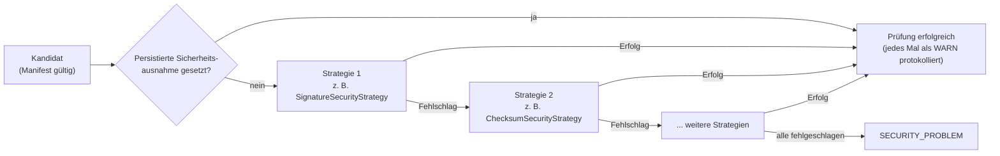
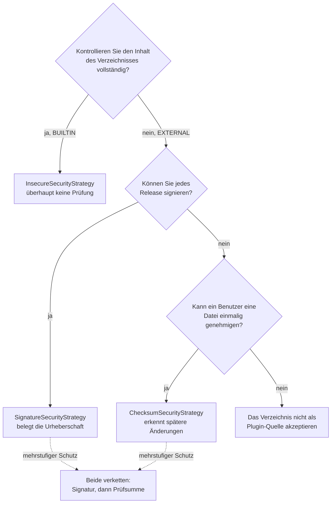
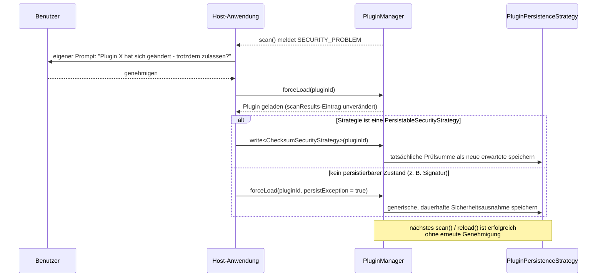

# Sicherheit

Jedes `PluginLocation` ist durch eine geordnete, frei erweiterbare Fallback-Kette von
`PluginSecurityStrategy`-Implementierungen geschützt. Jeder gescannte Kandidat (sobald sein Manifest
gültig ist) wird gegen die Kette geprüft: Die erste erfolgreiche Strategie beendet die Prüfung
positiv; ein `SECURITY_PROBLEM` wird erst gemeldet, wenn **jede** Strategie der Kette
fehlgeschlagen ist.



!!! tip "Sicherheitsempfehlungen"

    * Ein `EXTERNAL`-Verzeichnis in Produktion nie auf `InsecureSecurityStrategy` stehen lassen - sie
      akzeptiert jeden Kandidaten bedingungslos.
    * `SignatureSecurityStrategy` gegenüber `ChecksumSecurityStrategy` bevorzugen, wo der
      Signierschlüssel selbst kontrolliert wird: sie belegt die Urheberschaft, eine Prüfsumme allein
      erkennt nur eine spätere Änderung an einer bereits einmal vertrauten Datei.
    * Einen Checksum-Algorithmus mit mindestens 256 Bit Ausgabe verwenden (`SHA-256`/`SHA-512`, der
      Standard); `MD5` vermeiden.
    * Jedes `forceLoad(pluginId, persistException = true)` als dauerhafte, protokollierte Ausnahme
      behandeln (wer hat wann warum genehmigt) - es überspringt die gesamte Kette, einschließlich
      jeder eigenen Strategie, für diese Plugin-ID dauerhaft, bis der Host sie selbst löscht.
    * Das Bestehen der Sicherheitskette bürgt nur für Herkunft/Integrität eines Plugins vor dem
      Laden - kombinieren Sie dies mit der [Laufzeit-Sandbox](sandbox.de.md), um auch einzuschränken,
      was der Code nach dem Laden tut.

## Welche Strategie sollte ich verwenden?



* **Kein Schutz erforderlich** (z. B. ein `BUILTIN`-Verzeichnis, das Sie vollständig
  kontrollieren) - `InsecureSecurityStrategy`.
* **Sie kontrollieren den Signierschlüssel und können bei jedem Release neu signieren** -
  `SignatureSecurityStrategy`. Stärkste Garantie: bestätigt, dass der Kandidat von jemandem
  erzeugt wurde, der den privaten Schlüssel besitzt, nicht nur, dass er unverändert ist.
* **Sie können Releases nicht signieren, möchten aber unerwartete Änderungen an einer sonst
  vertrauenswürdigen Datei erkennen** (z. B. ein Plugin, das ein Benutzer einmal manuell
  genehmigt hat) - `ChecksumSecurityStrategy`.
* **Mehrstufiger Schutz (Defense in Depth)** - mehrere Strategien für dasselbe Verzeichnis
  verketten; die erste, die erfolgreich ist, gewinnt, sodass z. B. `SignatureSecurityStrategy`
  gefolgt von `ChecksumSecurityStrategy` entweder einen korrekt signierten Kandidaten oder einen
  akzeptiert, dessen Prüfsumme zuvor genehmigt wurde.

## Kein impliziter Standard

Es gibt keinen impliziten "keine Prüfung"-Standard. Die effektive Kette eines Verzeichnisses ist:

1. Sein eigener `securityOverride`, sofern nicht leer.
2. Andernfalls der `defaultSecurityChains`-Eintrag des `PluginScanner`s für den `type` des
   Verzeichnisses.

Sind beide leer, wirft `PluginScanner.scan` eine `IllegalStateException` - es muss immer eine Kette
konfiguriert sein, einschließlich explizit `InsecureSecurityStrategy`, falls für einen gegebenen
Verzeichnistyp tatsächlich keine Prüfung gewünscht ist:

```kotlin
val scanner = PluginScanner(
    defaultSecurityChains = mapOf(
        PluginLocationType.BUILTIN to listOf(InsecureSecurityStrategy()),
        PluginLocationType.EXTERNAL to listOf(
            SignatureSecurityStrategy(myPublicKeyProviderStrategy),
            ChecksumSecurityStrategy(myPersistenceStrategy),
        ),
    ),
)
```

## Prüfsummenalgorithmen

`ChecksumSecurityStrategy` berechnet Prüfsummen über einen pluggbaren
`org.pcsoft.framework.pluggiat.security.checksum.ChecksumAlgorithm`:

```kotlin
interface ChecksumAlgorithm {
    val id: String
    fun digest(bytes: ByteArray): String // hex-encoded
}
```

Die mitgelieferte Implementierung `MessageDigestChecksumAlgorithm` umschließt jeden von der JVM
verstandenen `java.security.MessageDigest`-Algorithmusnamen (z. B. `"MD5"`, `"SHA-256"`,
`"SHA-512"`, ...). Die Strategie verwendet standardmäßig
`MessageDigestChecksumAlgorithm("SHA-512")`, sofern nicht anders konfiguriert:

```kotlin
val strategy = ChecksumSecurityStrategy(myPersistenceStrategy, algorithm = MessageDigestChecksumAlgorithm("SHA-256"))
```

Ein eigener Algorithmus - z. B. ein Nicht-JCA-Algorithmus oder einer, der von externer Hardware
unterstützt wird - kann auf dieselbe Weise wie eine eigene `PluginSecurityStrategy` eingebunden
werden, ganz ohne Framework-Änderungen: implementieren Sie einfach selbst `ChecksumAlgorithm` und
übergeben Sie ihn dem Konstruktor der Strategie.

## Mitgelieferte Strategien

### `InsecureSecurityStrategy`

Führt keinerlei Prüfung durch; ist immer erfolgreich. Die Benennung "insecure" (unsicher) ist
bewusst gewählt - der Verzicht auf jeden Schutz für ein Verzeichnis muss eine explizite, sichtbare
Entscheidung sein.

### `SignatureSecurityStrategy`

Verlangt, dass der Kandidat mit einem über eine injizierte
`org.pcsoft.framework.pluggiat.security.publickey.PublicKeyProviderStrategy` aufgelösten Schlüssel
signiert ist (siehe [Public-Key-Provider](public-key-providers.de.md) für die mitgelieferten
Implementierungen), nachgeschlagen anhand der Manifest-`id` des Plugins. Die Verifikation nutzt den
Standard-JAR-Signaturmechanismus der JDK (mit `jarsigner` erzeugte Signaturen, verifiziert über einen
`JarInputStream` mit aktivierter Verifikation über die gepinnten Bytes des Kandidaten, siehe
[Härtung der Prüfung selbst](#hartung-der-prufung-selbst)): Die Kandidatendatei selbst (die `.jar`
oder die `.zip`) muss signiert sein. Das Signieren einer `.zip` verwendet exakt denselben
Mechanismus wie das Signieren einer `.jar` - eine signierte JAR *ist* strukturell eine speziell
aufgebaute ZIP, sodass die Dateiendung für die Signaturprüfung keinen Unterschied macht.

#### Eine gültige Signatur pro Scan-Strategie erzeugen

Das Signieren erfolgt vollständig mit den eigenen Kommandozeilenwerkzeugen `keytool`/`jarsigner`
der JDK (in jeder JDK enthalten) - es ist kein plugin-spezifisches Tooling erforderlich. Der an
`keytool -genkeypair` übergebene öffentliche Schlüssel ist derjenige, den eine
`PublicKeyProviderStrategy`-Implementierung später für die ID des Plugins auflösen muss (siehe
[Public-Key-Provider](public-key-providers.de.md)).

**`SingleJarScanStrategy`** - die einzelne JAR des Plugins direkt signieren:

```shell
jarsigner -keystore my-signing.jks -storepass <password> plugin-a.jar my-signing-alias
```

**`ZipJarScanStrategy`** - die `.zip` aus der Manifest-JAR und beliebigen weiteren JARs des Plugins
aufbauen, dann die fertige `.zip`-Datei selbst mit demselben Befehl signieren, nur eben auf die
`.zip` statt auf eine `.jar` gerichtet:

```shell
jarsigner -keystore my-signing.jks -storepass <password> plugin-a.zip my-signing-alias
```

Das funktioniert, weil sich `jarsigner` nur um das ZIP-Containerformat kümmert, nicht um die
Dateiendung - eine signierte JAR *ist* eine ZIP mit hinzugefügter `META-INF/MANIFEST.MF` sowie
Signatureinträgen.

### `ChecksumSecurityStrategy`

Vergleicht die tatsächliche Prüfsumme eines Kandidaten (standardmäßig SHA-512, siehe
[Prüfsummenalgorithmen](#prufsummenalgorithmen)) mit dem unter der Manifest-`id` des Plugins und dem
Schlüssel `"checksum"` im konfigurierten [`PluginPersistenceStrategy`](persistence.de.md)
gespeicherten Wert:

```kotlin
val strategy = ChecksumSecurityStrategy(persistenceStrategy = myPersistenceStrategy)
```

Sowohl eine nicht aufgelöste erwartete Prüfsumme (`null`, z. B. noch nie gesehen) als auch eine
Abweichung (z. B. die Plugin-Datei hat sich geändert) werden identisch als **fehlgeschlagene**
Prüfung behandelt - das Framework kennt keinen separaten "ausstehend"-Zustand.

!!! note "Migrationshinweis (Breaking Change)"

    In früheren Versionen nahm `ChecksumSecurityStrategy` einen separaten `ExpectedChecksumCallback`
    entgegen, und eine genehmigte Prüfsumme wurde über einen eigenen `ChecksumPersistenceCallback`
    aufgezeichnet. Beide wurden zugunsten der einzigen, generischen
    [`PluginPersistenceStrategy`](persistence.de.md) (Schlüssel `"checksum"`) entfernt, die nun auch
    den aktiviert/deaktiviert-Status der Plugins trägt.

## Host-Freigabeablauf nach einem `SECURITY_PROBLEM`

Es gibt keinen Status `PENDING_APPROVAL` im Framework. Ob und wie auf ein
`PluginScanStatus.SECURITY_PROBLEM`-Ergebnis reagiert wird, liegt vollständig bei der
Host-Anwendung, typischerweise:



1. Der Scan meldet einen Kandidaten als `SECURITY_PROBLEM` (alle Strategien der Kette sind
   fehlgeschlagen).
2. Die Host-Anwendung zeigt einen eigenen Prompt/Dialog für den Benutzer, z. B. "Die Prüfsumme von
   Plugin X hat sich geändert - trotzdem zulassen?".
3. Stimmt der Benutzer zu, lädt die Host-Anwendung das Plugin explizit per
   `PluginManager.forceLoad(pluginId)` (siehe [PluginManager](plugin-manager.de.md)), unabhängig vom
   fehlgeschlagenen Sicherheitsergebnis.
4. Optional macht der Host diese Entscheidung dauerhaft, sodass nachfolgende Scans von selbst
   erfolgreich sind, ohne eine erneute Genehmigung zu erfordern - siehe die nächsten beiden
   Abschnitte.

Nichts davon blockiert den Scan-Pfad: das Auflösen einer erwarteten Prüfsumme, das Persistieren
einer genehmigten sowie das Anzeigen eines Prompts sind allesamt synchrone Aufrufe, deren Timing
die Host-Anwendung selbst steuert.

## Ein Force-Load dauerhaft machen: `PersistableSecurityStrategy`

Eine Strategie, die ihren eigenen akzeptierten Zustand persistieren kann, kann zusätzlich zu
`PluginSecurityStrategy` `PersistableSecurityStrategy` implementieren:

```kotlin
interface PersistableSecurityStrategy : PluginSecurityStrategy {
    fun persist(pluginId: String, result: PluginScanResult)

    // Defaults to the path-based persist(pluginId, result) above.
    fun persist(pluginId: String, result: PluginScanResult, pinnedContent: PinnedPluginContent?)
}
```

`ChecksumSecurityStrategy` implementiert diese: `persist` berechnet die tatsächliche Prüfsumme des
Kandidaten und schreibt sie als neue erwartete Prüfsumme. Ein Host muss weder den
Persistenzschlüssel der Strategie noch die Berechnung ihres Werts selbst kennen -
`PluginManager.write` sucht die konfigurierte Strategieinstanz des angegebenen Typs für das Plugin
und delegiert an sie, und zwar über die Überladung, die die gepinnten Bytes des Kandidaten
entgegennimmt (siehe [Härtung der Prüfung selbst](#hartung-der-prufung-selbst)). Eine Strategie, die
nichts aus dem Inhalt des Kandidaten ableitet, muss nur die erste Überladung implementieren, da die
zweite standardmäßig auf sie zurückfällt:

```kotlin
manager.forceLoad(pluginId)
manager.write<ChecksumSecurityStrategy>(pluginId) // persists the actual checksum as the new expected one
```

Ein späteres `reload`/`scan` ist dann über die reguläre Kette erfolgreich, ohne einen erneuten
Force-Load zu erfordern. `write<T>` wirft, wenn die effektive Kette des Plugins keine Strategie vom
Typ `T` enthält.

## Ein Force-Load dauerhaft machen: die generische Sicherheitsausnahme

Nicht jede Strategie hat sinnvollen Zustand zu persistieren (z. B. eine Signaturstrategie - es gibt
keine "neue erwartete Signatur", die aufgezeichnet werden könnte). Für diese akzeptiert `forceLoad`
stattdessen ein `persistException`-Flag:

```kotlin
manager.forceLoad(pluginId, persistException = true)
```

Dies persistiert eine generische, dauerhafte Ausnahme (`PluginSecurity.SECURITY_EXCEPTION_KEY`) für
die Plugin-ID. `PluginSecurity.evaluate` prüft dieses Flag, **bevor** die Kette überhaupt
ausgewertet wird - ist es gesetzt, wird die gesamte Kette übersprungen und die Prüfung ist
erfolgreich, wobei jedes Mal, wenn dies geschieht, eine WARN protokolliert wird (da dies jede
konfigurierte Strategie, einschließlich eigener, stillschweigend umgeht). Der Host ist selbst dafür
verantwortlich, den persistierten Schlüssel aufzuheben, falls die Ausnahme jemals widerrufen werden
soll.

Bevorzugen Sie `write<T>` gegenüber `persistException`, wann immer die Strategie eine
`PersistableSecurityStrategy` ist - es zeichnet den tatsächlich akzeptierten Zustand der Strategie
auf, statt bedingungslos jede zukünftige Prüfung für dieses Plugin zu überspringen.

## Härtung der Prüfung selbst

Über die Auswahl und Verkettung von Strategien hinaus besitzt die Sicherheitskette mehrere
Härtungseigenschaften, die unabhängig davon gelten, welche Strategie oder Strategien ein
Verzeichnis verwendet:

* **Byte-Pinning schließt die Lücke zwischen Prüfung und Laden (TOCTOU).** Die Bytes eines
  Kandidaten werden genau einmal von der Festplatte gelesen, während der Sicherheitsprüfung des
  Scans, und zwar in einen `PinnedPluginContent`; sobald der Kandidat die Kette bestanden hat, sind
  dieselben gepinnten Bytes - nicht ein zweites, erneutes Lesen der Datei - das, was anschließend
  tatsächlich geladen wird. Ein Kandidat, der zwischen Prüfung und Laden auf der Festplatte
  ausgetauscht wird, kann daher nicht mehr an der Kette vorbeikommen: genau der Inhalt, den die
  Prüfung verifiziert hat, wird ausgeführt. `reload`/`reactivate` prüfen und pinnen den Kandidaten
  erneut. Sowohl die Sicherheitsprüfung als auch der Loader lösen ZIP-/JAR-Einträge über dieselbe
  gemeinsame Auflösungslogik auf, sodass eine JAR mit doppelten Eintragsnamen nicht als der eine
  Eintrag verifiziert und als ein anderer geladen werden kann. Dies gilt für Kandidaten, die ihre
  Kette bestanden haben: Ein Kandidat, der sie nicht bestanden hat (`SECURITY_PROBLEM`), trägt keine
  gepinnten Bytes, sodass `PluginManager.forceLoad` - die explizite Überschreibung durch den Host -
  ihn erneut von der Festplatte liest.
* **Der Prüfsummenvergleich ist laufzeitkonstant.** `ChecksumSecurityStrategy` vergleicht Digests
  über `MessageDigest.isEqual` statt über `String.equals` und vermeidet so einen
  Timing-Seitenkanal beim Vergleich selbst.
* **Ein abgelaufenes oder noch nicht gültiges Signierzertifikat lässt die Prüfung fehlschlagen.**
  `SignatureSecurityStrategy` ruft zusätzlich `X509Certificate.checkValidity()` auf dem Zertifikat
  des Signierenden auf; ein Schlüssel, der einmal gültig war, seitdem aber abgelaufen ist, wird
  nicht mehr stillschweigend akzeptiert, nur weil der öffentliche Schlüssel noch passt. Ein Widerruf
  von Zertifikaten (CRL/OCSP) wird bewusst **nicht** geprüft - siehe
  [Einschränkungen](#einschrankungen) unten.
* **Die Kollisionsauflösung lässt nur verifizierte Kandidaten antreten.** `IdCollisionResolver`
  gruppiert kollidierende Plugin-IDs nur unter Kandidaten, die die Sicherheitskette bereits bestanden
  haben (`PluginScanStatus.LOADED`); ein Kandidat, dessen Prüfung fehlgeschlagen ist, behält seinen
  eigenen Status und kann eine kollidierende ID nicht mehr einem bereits verifizierten Kandidaten
  abnehmen, indem er einfach eine höhere Manifest-`version` angibt.
* **Das Lesen eines Kandidaten ist begrenzt.** Bevor irgendeine Strategie läuft, werden die eigenen
  Bytes des Kandidaten unter festen Grenzen gelesen: Dateigröße des Kandidaten, entpackte Größe je
  Archiveintrag und je Kandidat, Verschachtelungstiefe von Archiven sowie Manifestgröße. Ein
  Kandidat, der eine davon überschreitet, wird zum `SECURITY_PROBLEM` mit der benannten Grenze in
  seiner `errorMessage`, statt die Host-JVM allein beim Lesen mit einem `OutOfMemoryError`
  mitzunehmen - ein Angriff, der sonst weder eine Signatur noch ein erfolgreiches Laden benötigen
  würde. Die Grenzen sind bewusst nicht konfigurierbar.
* **Jeder Eintrag einer signierten JAR muss wirklich signiert sein.** `SignatureSecurityStrategy`
  nimmt nur die Signaturdateien aus, die der JAR-Verifizierer tatsächlich auswertet
  (`META-INF/MANIFEST.MF` sowie jede `.SF` *mit* dem passenden Signaturblock). Ein Eintrag, der nach
  dem Signieren hinzugefügt wurde, oder einer, der lediglich wie Signatur-Metadaten benannt ist, muss
  wie jeder andere einen passenden Signierenden tragen - eine signierte JAR kann also nicht als
  Umschlag für unsignierte Inhalte genutzt werden. Ein Signierender, der kein X.509-Zertifikat
  vorlegt, wird ebenfalls abgelehnt, da seine Gültigkeit überhaupt nicht geprüft werden könnte.
* **Die Antwort eines Keyservers ist an die angefragte Key-ID gebunden.**
  `OpenPgpKeyserverPublicKeyProviderStrategy` durchsucht jeden Key-Ring der Antwort und akzeptiert nur
  einen Schlüssel, dessen Fingerprint oder 64-Bit-Key-ID zur angefragten passt; alles andere löst auf
  `null` auf. Ihre Basis-URL muss `https://` verwenden (ein Loopback-Host darf einfaches HTTP nutzen),
  damit die Antwort nicht während der Übertragung ersetzt werden kann.
* **Einen Kandidaten zu akzeptieren heißt, seine geprüften Bytes zu akzeptieren - sofern er gepinnt
  wurde.** `PluginManager.write` übergibt die gepinnten Bytes des Kandidaten an
  `PersistableSecurityStrategy.persist`, und `ChecksumSecurityStrategy.persist` leitet die Prüfsumme,
  die es speichert, aus diesen Bytes ab, nicht aus einem erneuten Lesen des Pfads des Kandidaten. Ein
  Kandidat, dessen Sicherheitsprüfung fehlgeschlagen ist - genau der Fall im dokumentierten
  Freigabeablauf (`forceLoad`, dann `write<ChecksumSecurityStrategy>`) -, hat keine gepinnten Bytes,
  da der Scanner nur Kandidaten pinnt, die die Kette bestanden haben. `persist` fällt dann auf das
  Lesen des Pfads zurück und protokolliert eine `WARN`: Akzeptiert wird, was in diesem Moment auf der
  Festplatte liegt, sodass in diesem Ablauf ein Kandidat, der zwischen der fehlgeschlagenen Prüfung
  und der Entscheidung des Hosts ausgetauscht wurde, nicht geschützt ist.

### Einschränkungen

* **Keine Prüfung auf Zertifikatswiderruf.** Eine echte CRL-/OCSP-Prüfung würde den Betrieb einer
  PKI-Infrastruktur erfordern, die für die selbstsignierten Zertifikate, die eine
  `PublicKeyProviderStrategy` üblicherweise pinnt, typischerweise nicht existiert. Ein
  kompromittierter, aber noch gültiger Schlüssel bleibt daher bis zum Ablauf seines Zertifikats
  vertrauenswürdig - eine bewusste, akzeptierte Grenze.
* **Gepinnte Bytes verbleiben für die gesamte Lebensdauer des geladenen Plugins im Speicher**, da
  Klassen noch verzögert aus ihnen geladen werden können; das tauscht etwas zusätzlichen Speicher
  gegen das Schließen der oben genannten TOCTOU-Lücke.

## Eine eigene Strategie hinzufügen

Jede Klasse, die `PluginSecurityStrategy` implementiert, kann einer Kette hinzugefügt werden, ohne
Framework-Code zu ändern:

```kotlin
class MyCustomSecurityStrategy : PluginSecurityStrategy {
    override fun check(result: PluginScanResult): PluginSecurityCheckResult =
        if (myOwnRules.allow(result)) PluginSecurityCheckResult.Success
        else PluginSecurityCheckResult.Failure("rejected by myOwnRules")
}
```
