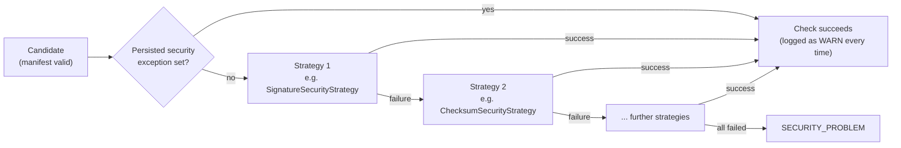
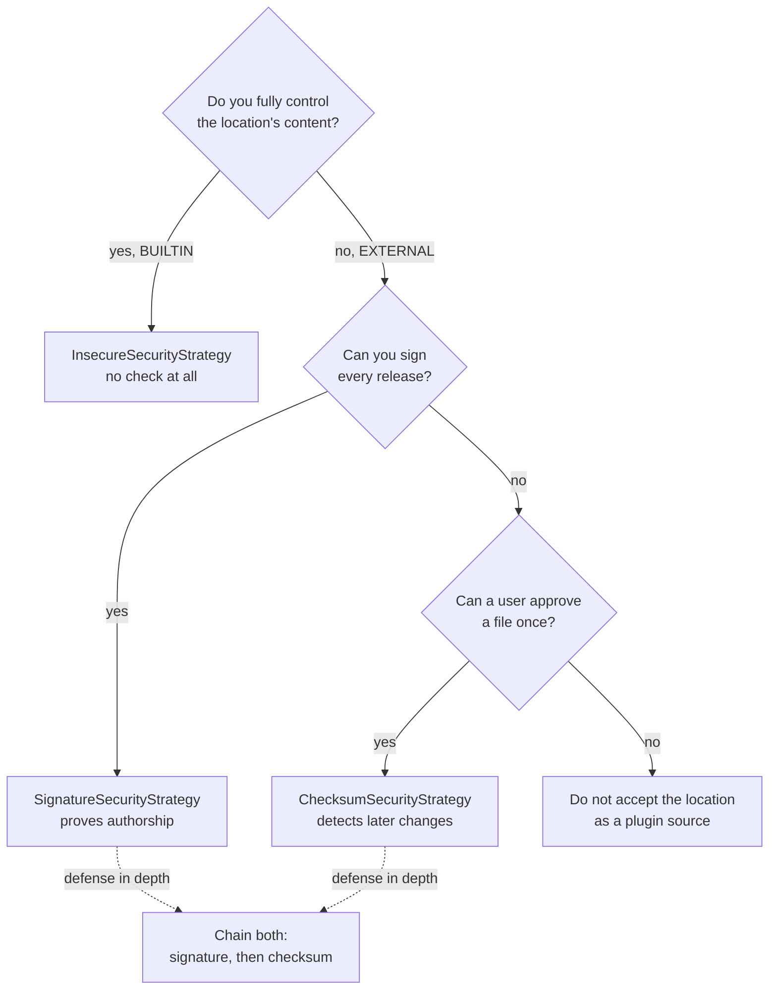
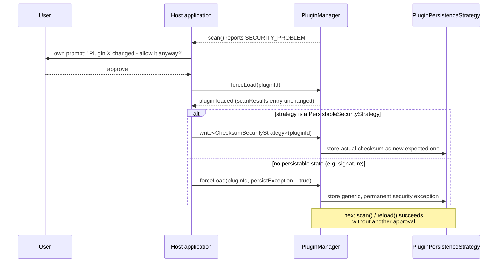

# Security

Every `PluginLocation` is protected by an ordered, freely extensible fallback chain of
`PluginSecurityStrategy` implementations. Each scanned candidate (once its manifest is valid) is
checked against the chain: the first strategy that succeeds ends the check positively; a
`SECURITY_PROBLEM` is only reported once **every** strategy in the chain has failed.



!!! tip "Security recommendations"

    * Never leave an `EXTERNAL` location on `InsecureSecurityStrategy` in production - it accepts
      every candidate unconditionally.
    * Prefer `SignatureSecurityStrategy` over `ChecksumSecurityStrategy` wherever you control the
      signing key: it proves authorship, a checksum alone only detects a later change to a file
      that was already trusted once.
    * Use a checksum algorithm with at least 256-bit output (`SHA-256`/`SHA-512`, the default);
      avoid `MD5`.
    * Treat every `forceLoad(pluginId, persistException = true)` as a permanent, audited exception
      (log who approved it and why) - it skips the entire chain, including any custom strategy, for
      that plugin id forever until the host clears it itself.
    * Passing the security chain only vouches for a plugin's origin/integrity before it runs - combine
      it with the [runtime sandbox](sandbox.md) to also limit what the code does once loaded.

## Which strategy should I use?



* **No protection needed** (e.g. a `BUILTIN` location you fully control) - `InsecureSecurityStrategy`.
* **You control the signing key and can re-sign on every release** - `SignatureSecurityStrategy`.
  Strongest guarantee: verifies the candidate was produced by whoever holds the private key, not
  just that it is unchanged.
* **You cannot sign releases, but want to detect unexpected changes to an otherwise trusted file**
  (e.g. a plugin a user manually approved once) - `ChecksumSecurityStrategy`.
* **Defense in depth** - chain several strategies for the same location; the first to succeed wins,
  so e.g. `SignatureSecurityStrategy` then `ChecksumSecurityStrategy` accepts either a properly
  signed candidate or one whose checksum was previously approved.

## No implicit default

There is no implicit "no check" default. A location's effective chain is:

1. Its own `securityOverride`, if non-empty.
2. Otherwise, the `PluginScanner`'s `defaultSecurityChains` entry for the location's `type`.

If both are empty, `PluginScanner.scan` throws an `IllegalStateException` - some chain must always
be configured, explicitly including `InsecureSecurityStrategy` if no check is actually wanted for a
given location type:

```kotlin
val scanner = PluginScanner(
    defaultSecurityChains = mapOf(
        PluginLocationType.BUILTIN to listOf(InsecureSecurityStrategy()),
        PluginLocationType.EXTERNAL to listOf(
            SignatureSecurityStrategy(myPublicKeyProviderStrategy),
            ChecksumSecurityStrategy(myPersistenceStrategy),
        ),
    ),
)
```

## Checksum algorithms

Both `SignatureSecurityStrategy`'s checksum list (for `MultiJarWithOwnFolderScanStrategy`, see
below) and `ChecksumSecurityStrategy` compute checksums via a pluggable
`org.pcsoft.framework.pluggiat.security.checksum.ChecksumAlgorithm`:

```kotlin
interface ChecksumAlgorithm {
    val id: String
    fun digest(bytes: ByteArray): String // hex-encoded
}
```

The shipped implementation, `MessageDigestChecksumAlgorithm`, wraps any `java.security.MessageDigest`
algorithm name understood by the JVM (e.g. `"MD5"`, `"SHA-256"`, `"SHA-512"`, ...). Both strategies
default to `MessageDigestChecksumAlgorithm("SHA-512")` unless configured otherwise:

```kotlin
val strategy = ChecksumSecurityStrategy(myPersistenceStrategy, algorithm = MessageDigestChecksumAlgorithm("SHA-256"))
```

A custom algorithm - e.g. a non-JCA one, or one backed by external hardware - can be plugged in the
same way as a custom `PluginSecurityStrategy`, without any framework changes: just implement
`ChecksumAlgorithm` yourself and pass it to the strategy's constructor.

## Shipped strategies

### `InsecureSecurityStrategy`

Performs no check at all; always succeeds. Naming it "insecure" is deliberate - opting into no
protection for a location must be an explicit, visible choice.

### `SignatureSecurityStrategy`

Requires the candidate to be signed with a key resolved via an injected
`org.pcsoft.framework.pluggiat.security.publickey.PublicKeyProviderStrategy` (see
[Public key providers](public-key-providers.md) for the shipped implementations), looked up by
the plugin's manifest `id`. Verification uses the JDK's standard JAR code-signing mechanism
(`jarsigner`/`JarFile(verify = true)`):

* `SingleJarScanStrategy`/`ZipJarScanStrategy` candidates: the candidate file itself (the `.jar` or
  the `.zip`) must be signed. Signing a `.zip` uses the exact same mechanism as signing a `.jar` -
  a signed JAR structurally *is* a specially structured ZIP, so the file extension makes no
  difference to signature verification.
* `MultiJarWithOwnFolderScanStrategy` candidates: the manifest JAR inside the candidate folder must
  be signed, and must additionally contain a `META-INF/plugin-checksums.txt` entry listing a
  checksum (via the strategy's configured [`ChecksumAlgorithm`](#checksum-algorithms), SHA-512 by
  default) for every other JAR in the folder (one `<hex-digest>  <file-name>` line each, two
  spaces, matching e.g. `sha512sum`'s output format); every listed checksum must match the actual
  sibling file.

#### Creating a valid signature per scan strategy

Signing is done entirely with the JDK's own `keytool`/`jarsigner` command line tools (shipped with
every JDK) - no plugin-specific tooling is required. The public key handed to `keytool -genkeypair`
is the one a `PublicKeyProviderStrategy` implementation must later resolve for the plugin's id (see
[Public key providers](public-key-providers.md)).

**`SingleJarScanStrategy`** - sign the plugin's single JAR directly:

```shell
jarsigner -keystore my-signing.jks -storepass <password> plugin-a.jar my-signing-alias
```

**`ZipJarScanStrategy`** - build the `.zip` exactly like a `MultiJarWithOwnFolderScanStrategy`
folder (manifest JAR + any other JARs directly inside it, see below), then sign the finished `.zip`
file itself with the very same command, just pointed at the `.zip` instead of a `.jar`:

```shell
jarsigner -keystore my-signing.jks -storepass <password> plugin-a.zip my-signing-alias
```

This works because `jarsigner` only cares about the ZIP container format, not the file extension -
a signed JAR *is* a ZIP with an added `META-INF/MANIFEST.MF` plus signature entries.

**`MultiJarWithOwnFolderScanStrategy`** - only the manifest JAR (the one containing
`META-INF/plugin.yml`/`plugin.yaml`) gets signed, not the other JARs in the folder. Before signing
it, add a `META-INF/plugin-checksums.txt` entry to it listing the checksum of every other JAR in the
folder for whichever `ChecksumAlgorithm` the host configures the strategy with (SHA-512 by default,
shown here with `sha512sum`):

```shell
# from inside the plugin's folder, next to plugin-a-manifest.jar and plugin-a-lib.jar
sha512sum plugin-a-lib.jar > plugin-checksums.txt
mkdir -p META-INF && mv plugin-checksums.txt META-INF/
jar uf plugin-a-manifest.jar META-INF/plugin-checksums.txt
jarsigner -keystore my-signing.jks -storepass <password> plugin-a-manifest.jar my-signing-alias
```

If the host configures `SignatureSecurityStrategy` with a different `ChecksumAlgorithm`, use the
matching command instead (e.g. `sha256sum`/`md5sum`) - the algorithm used to produce the checksum
list must match the one the strategy is configured with, or every checksum will simply mismatch.

The checksum list must be added **before** signing, since `jarsigner` needs to cover it with the
signature; if any other JAR in the folder changes afterwards without re-running this whole sequence,
`SignatureSecurityStrategy` reports a checksum mismatch even though the manifest JAR's own signature
is still technically valid.

### `ChecksumSecurityStrategy`

Compares a candidate's actual checksum (SHA-512 by default, see
[Checksum algorithms](#checksum-algorithms)) against the value stored under the plugin's manifest
`id` and the `"checksum"` key in the configured [`PluginPersistenceStrategy`](persistence.md):

```kotlin
val strategy = ChecksumSecurityStrategy(persistenceStrategy = myPersistenceStrategy)
```

Both an unresolved expected checksum (`null`, e.g. never seen before) and a mismatch (e.g. the
plugin file changed) are treated identically as a **failed** check - the framework has no separate
"pending" state.

!!! note "Migration note (breaking change)"

    Prior to IP-06, `ChecksumSecurityStrategy` took a separate `ExpectedChecksumCallback`, and an
    approved checksum was recorded through a dedicated `ChecksumPersistenceCallback`. Both were
    removed in favor of the single, generic [`PluginPersistenceStrategy`](persistence.md) (key
    `"checksum"`), which now also backs the plugin enabled/disabled status.

## Host approval flow after a `SECURITY_PROBLEM`

There is no `PENDING_APPROVAL` status in the framework. Whether and how to react to a
`PluginScanStatus.SECURITY_PROBLEM` result is entirely up to the host application, typically:



1. The scan reports a candidate as `SECURITY_PROBLEM` (all chain strategies failed).
2. The host application shows its own prompt/dialog to the user, e.g. "Plugin X's checksum
   changed - allow it anyway?".
3. If the user approves, the host application explicitly force-loads the plugin via
   `PluginManager.forceLoad(pluginId)` (see [PluginManager](plugin-manager.md)), independent of the
   failed security result.
4. Optionally, the host makes that decision stick so subsequent scans succeed on their own without
   requiring another approval - see the next two sections.

None of this blocks the scan path: resolving an expected checksum, persisting an approved one, and
prompting the user are all synchronous calls the host application controls the timing of.

## Making a force-load stick: `PersistableSecurityStrategy`

A strategy that knows how to persist its own accepted state can implement
`PersistableSecurityStrategy` in addition to `PluginSecurityStrategy`:

```kotlin
interface PersistableSecurityStrategy : PluginSecurityStrategy {
    fun persist(pluginId: String, result: PluginScanResult)
}
```

`ChecksumSecurityStrategy` implements it: `persist` computes the candidate's actual checksum and
writes it as the new expected checksum. A host does not need to know the strategy's persistence key
or how to recompute its value itself - `PluginManager.write` looks up the configured strategy
instance of the given type for the plugin and delegates to it:

```kotlin
manager.forceLoad(pluginId)
manager.write<ChecksumSecurityStrategy>(pluginId) // persists the actual checksum as the new expected one
```

A later `reload`/`scan` then succeeds through the regular chain, without requiring another
force-load. `write<T>` throws if the plugin's effective chain contains no strategy of type `T`.

## Making a force-load stick: the generic security exception

Not every strategy has meaningful state to persist (e.g. a signature strategy - there is no "new
expected signature" to record). For these, `forceLoad` accepts a `persistException` flag instead:

```kotlin
manager.forceLoad(pluginId, persistException = true)
```

This persists a generic, permanent exception (`PluginSecurity.SECURITY_EXCEPTION_KEY`) for the
plugin id. `PluginSecurity.evaluate` checks this flag **before** evaluating the chain at all - if
set, the entire chain is skipped and the check succeeds, logged as a WARN every single time this
happens (since it silently bypasses every configured strategy, including any custom ones). The host
is responsible for clearing the persisted key itself if the exception should ever be revoked.

Prefer `write<T>` over `persistException` whenever the strategy is a `PersistableSecurityStrategy` -
it records the strategy's actual accepted state instead of unconditionally skipping every future
check for that plugin.

## Hardening of the check itself

Beyond choosing and chaining strategies, the security chain has several hardening properties that
apply regardless of which strategy or strategies a location uses:

* **Byte-pinning closes the check-to-load gap (TOCTOU).** A candidate's bytes are read from disk
  exactly once, during the scan's security check, into a `PinnedPluginContent`; the same pinned
  bytes - not a second, fresh read of the file - are what actually gets loaded afterwards. A
  candidate swapped on disk between the check and the load can therefore no longer slip past the
  chain: whatever content the check verified is exactly what runs. Both the security check and the
  loader resolve ZIP/JAR entries through the same shared resolution logic, so a JAR with duplicate
  entry names cannot be verified as one entry and loaded as another.
* **Checksum comparison is constant-time.** `ChecksumSecurityStrategy` (and `SignatureSecurityStrategy`'s
  per-file checksum list) compares digests via `MessageDigest.isEqual` instead of `String.equals`,
  avoiding a timing side channel on the comparison itself.
* **An expired or not-yet-valid signing certificate fails the check.** `SignatureSecurityStrategy`
  additionally calls `X509Certificate.checkValidity()` on the signer's certificate; a key that used
  to be valid but has since expired is no longer silently accepted just because the public key still
  matches. Certificate revocation (CRL/OCSP) is deliberately **not** checked - see
  [Restrictions](#restrictions) below.
* **Collision resolution only lets verified candidates compete.** `IdCollisionResolver` groups
  colliding plugin ids only among candidates that already passed the security chain
  (`PluginScanStatus.LOADED`); a candidate that failed its check keeps its own status and can no
  longer win a colliding id away from an already-verified candidate by simply declaring a higher
  manifest `version`.

### Restrictions

* **No certificate revocation checking.** A real CRL/OCSP check would require operating PKI
  infrastructure that typically does not exist for the self-signed certificates a
  `PublicKeyProviderStrategy` usually pins. A compromised-but-still-valid key therefore stays
  trusted until its certificate's own expiry - a deliberate, accepted limit.
* **Pinned bytes stay in memory for the loaded plugin's whole lifetime**, since classes may still be
  loaded lazily from them; this trades a small amount of extra memory for closing the TOCTOU gap
  above.

## Adding a custom strategy

Any class implementing `PluginSecurityStrategy` can be added to a chain, without changing framework
code:

```kotlin
class MyCustomSecurityStrategy : PluginSecurityStrategy {
    override fun check(result: PluginScanResult): PluginSecurityCheckResult =
        if (myOwnRules.allow(result)) PluginSecurityCheckResult.Success
        else PluginSecurityCheckResult.Failure("rejected by myOwnRules")
}
```
