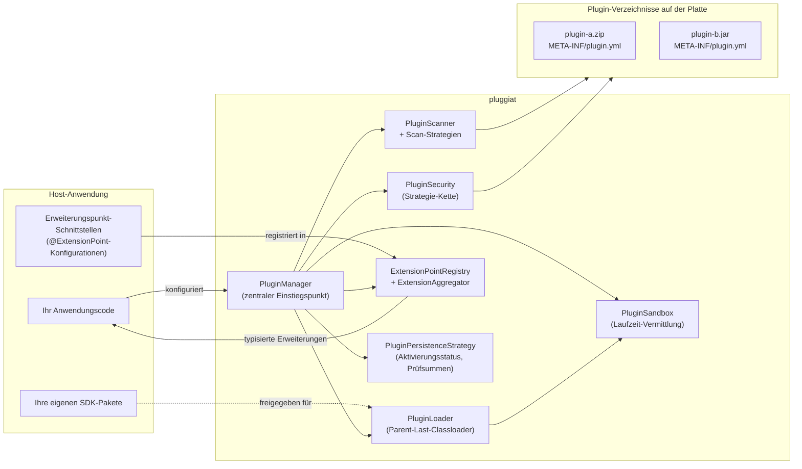

# pluggiat

**pluggiat ist ein in Kotlin geschriebenes Plugin-Manager-System für die JVM.** Es entdeckt, lädt
und verwaltet Plugins für eine Host-Anwendung, sodass der Host selbst weder Plugin-Erkennung noch
Isolation oder Lifecycle-Handling implementieren muss. Es ist so konzipiert, dass es sich in jede
JVM-Anwendung einbetten lässt.

## Keine Garantie für absolute Sicherheit

!!! danger "pluggiat kann keine 100-prozentige Sicherheit garantieren"

    Die Sicherheitsmechanismen von pluggiat (Signaturprüfungen, Checksummen-Freigabe, die
    Laufzeit-Sandbox und die API-Whitelist) verringern das Risiko, können vollständige Sicherheit
    aber nicht garantieren. Insbesondere:

    * Der `SecurityManager` der JVM wurde vom JDK zur Entfernung als veraltet markiert und steht
      nicht mehr als durchsetzender Mechanismus zur Verfügung; die Laufzeit-Sandbox von pluggiat
      vermittelt Zugriffe über Bytecode-Instrumentierung, was aber nicht gleichwertig zu einer von
      der JVM durchgesetzten Sicherheits-Sandbox ist.
    * Wie jede Software können pluggiat und seine Sicherheitsmechanismen unentdeckte Fehler oder
      Umgehungsmöglichkeiten enthalten.

    Eine Host-Anwendung, die nicht vertrauenswürdige oder fremde Plugins lädt, darf sich nicht
    allein auf pluggiat als Verteidigungslinie verlassen. Für jeden sicherheitskritischen Einsatz
    werden zusätzliche Maßnahmen (Prozessisolation, Containerisierung, Sandboxing auf
    Betriebssystemebene, Code-Review von Plugins vor der Freigabe) nachdrücklich empfohlen.

## Hinweis zur KI-Transparenz

!!! note "Teile dieser Software wurden mit KI erstellt"

    Teile des Quellcodes, der Tests und dieser Dokumentation wurden mithilfe von KI-Coding-
    Assistenten erstellt. Jeder generierte Beitrag wird vor der Veröffentlichung von einem
    menschlichen Maintainer geprüft, angepasst und abgenommen; die Maintainer bleiben für die
    veröffentlichte Software verantwortlich.

    Dieser Hinweis wird im Sinne der Transparenzanforderungen des KI-Gesetzes der Europäischen
    Union (Verordnung (EU) 2024/1689) veröffentlicht.

!!! warning "Laufzeit-Sandbox benötigt den JVM-Start-Parameter `-javaagent`"

    Sobald ein Host eine `PluginSandboxPolicy` konfiguriert, die mindestens eine API-Kategorie
    einschränkt, muss die Host-JVM mit dem eigenen JAR dieses Moduls als Java-Agent gestartet werden
    (`java -javaagent:pluggiat-<version>.jar ...`), sonst bricht der Host beim Start ab. Details siehe
    [Laufzeit-Sandbox](host-integration/sandbox.de.md).

## Kernkonzepte



* **Plugin-Manifest** - jedes Plugin liefert eine Datei `META-INF/plugin.yml` (oder `.yaml`) mit,
  die seine Identität, Version, seinen Autor und die von ihm bereitgestellten Erweiterungspunkte
  beschreibt.
* **Erweiterungspunkte** - Plugins registrieren Implementierungen unter einem frei gewählten
  Schlüssel (`extensions.<key>`). Jede Implementierung wird aufgelöst, gegen eine annotierte
  Konfigurationsklasse typgeprüft und als Factory/Singleton instanziiert.
* **Plugin-Verzeichnisse und Lademodi** - der Host konfiguriert ein oder mehrere zu scannende
  Verzeichnisse, jeweils mit einer Scan-Strategie (`SingleJarScanStrategy`,
  `MultiJarWithOwnFolderScanStrategy` oder `ZipJarScanStrategy`, letztere als Standard) und einer
  Builtin-/External-Klassifizierung.
* **Sicherheitskonzepte** - jedes Verzeichnis ist durch eine geordnete Fallback-Kette von
  `PluginSecurityStrategy`-Implementierungen geschützt, z. B. `InsecureSecurityStrategy` (keine
  Prüfung), `SignatureSecurityStrategy` (Signaturprüfung gegen einen host-seitig bereitgestellten
  Public Key) oder `ChecksumSecurityStrategy` (host-verwaltete Freigabe unbekannter oder
  geänderter Plugins); es gibt keinen impliziten Standard - eine Kette muss immer explizit
  konfiguriert werden.
* **Isolation** - Plugins laufen in eigenen Parent-Last-Classloadern und sehen nur den Teil der
  Host-API, den der Host explizit auf die Whitelist setzt.
* **Lifecycle** - Plugins können aktiviert, deaktiviert oder entladen werden; ein unbehandelter
  Laufzeitfehler in einer Plugin-Erweiterung deaktiviert nur dieses eine Plugin.

## Nutzung der Artefakte

pluggiat wird auf GitHub Packages unter `org.pcsoft.framework:pluggiat` veröffentlicht. Für die
Nutzung wird ein GitHub-Konto mit einem Personal Access Token mit dem Scope `read:packages`
benötigt, da GitHub Packages auch für öffentliche Repositories eine Authentifizierung verlangt.

### Gradle

```kotlin
repositories {
    maven {
        url = uri("https://maven.pkg.github.com/KleinerHacker/pluggiat")
        credentials {
            username = providers.gradleProperty("gpr.user").orNull ?: System.getenv("GITHUB_ACTOR")
            password = providers.gradleProperty("gpr.key").orNull ?: System.getenv("GITHUB_TOKEN")
        }
    }
}

dependencies {
    implementation("org.pcsoft.framework:pluggiat:0.1.0")
}
```

`gpr.user`/`gpr.key` können in `~/.gradle/gradle.properties` gesetzt werden, alternativ als
Umgebungsvariablen `GITHUB_ACTOR`/`GITHUB_TOKEN`.

### Maven

```xml
<repositories>
    <repository>
        <id>github</id>
        <url>https://maven.pkg.github.com/KleinerHacker/pluggiat</url>
    </repository>
</repositories>

<dependencies>
    <dependency>
        <groupId>org.pcsoft.framework</groupId>
        <artifactId>pluggiat</artifactId>
        <version>0.1.0</version>
    </dependency>
</dependencies>
```

Die Zugangsdaten des Servers `github` (Benutzername plus Personal Access Token mit
`read:packages`) müssen in `~/.m2/settings.xml` konfiguriert werden:

```xml
<servers>
    <server>
        <id>github</id>
        <username>IHR_GITHUB_BENUTZERNAME</username>
        <password>IHR_GITHUB_TOKEN</password>
    </server>
</servers>
```

## Wer sollte was lesen

Diese Dokumentation ist nach Zielgruppe aufgeteilt:

* **Plugin-Entwicklung** - für Autoren, die ein Plugin schreiben, das von einem
  pluggiat-basierten Host geladen wird: Manifestformat, Erweiterungspunkte,
  Plugin-Abhängigkeiten und Lifecycle-Hooks.
* **Host-Integration** - für Entwickler, die pluggiat in ihre eigene Anwendung einbetten:
  Plugin-Verzeichnisse und Lademodi, Sicherheitskonfiguration, SDK-Whitelist und
  Plugin-Lifecycle-Verwaltung aus Sicht des Hosts.
* **[Fehlersuche](host-integration/troubleshooting.de.md)** - Übersicht der Log-Level und Erklärungen
  zu den Fehler- und Konfliktfällen, die das Framework melden kann.

## Wie geht es weiter

* [Schnellstart](quick-start.de.md) - der kleinstmögliche Host, Ende zu Ende
* [Host-Integration: PluginManager](host-integration/plugin-manager.de.md) - der zentrale
  Einstiegspunkt zum Einbetten von pluggiat in Ihre Anwendung
* [Laufzeit-Sandbox](host-integration/sandbox.de.md) - API-Zugriffskontrolle für ein geladenes Plugin
  und der benötigte JVM-Start-Parameter `-javaagent`
* [Fehlersuche](host-integration/troubleshooting.de.md) - Log-Level, Fehler- und Konfliktfälle
* [API-Dokumentation](dokka/html/index.html) - die generierte Dokka-API-Dokumentation
* [Lizenzen](licences/index.html) - der Lizenzbericht der Abhängigkeiten
