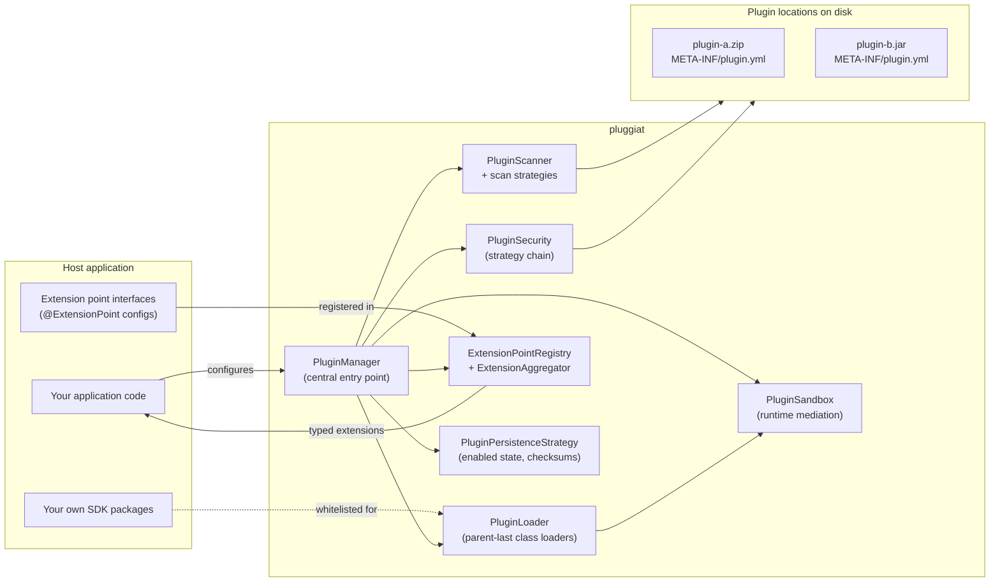

# pluggiat

**pluggiat is a plugin manager system for the JVM, written in Kotlin.** It discovers, loads and
manages plugins for a host application, so the host itself does not have to implement plugin
discovery, isolation or lifecycle handling. It is designed to be embedded into any JVM
application.

## No guarantee of absolute security

!!! danger "pluggiat cannot guarantee 100% security"

    pluggiat's security mechanisms (signature checks, checksum approval, the runtime sandbox and
    the API whitelist) reduce risk but cannot guarantee complete security. In particular:

    * The JVM's own `SecurityManager` was deprecated for removal by the JDK and is no longer
      available as an enforcement mechanism; pluggiat's runtime sandbox mediates access via
      bytecode instrumentation, but this is not equivalent to a JVM-enforced security sandbox.
    * Like any software, pluggiat and its security mechanisms may contain undiscovered bugs or
      bypasses.

    A host application that loads untrusted or third-party plugins must not rely on pluggiat as
    the sole line of defense. Additional measures (process isolation, containerization, OS-level
    sandboxing, code review of plugins before approval) are strongly recommended for any
    security-sensitive deployment.

## AI transparency notice

!!! note "Parts of this software were created with AI"

    Parts of the source code, the tests and this documentation were generated with the help of AI
    coding assistants. Every generated contribution is reviewed, adapted and accepted by a human
    maintainer before it is released; the maintainers remain responsible for the published software.

    This notice is published in the spirit of the transparency requirements of the European Union's
    Artificial Intelligence Act (Regulation (EU) 2024/1689).

!!! warning "Runtime sandbox requires a `-javaagent` JVM start parameter"

    As soon as a host configures a `PluginSandboxPolicy` that restricts at least one API category,
    the host JVM must be started with this module's own JAR as a Java agent
    (`java -javaagent:pluggiat-<version>.jar ...`), or the host aborts at startup. See
    [Runtime sandbox](host-integration/sandbox.md) for details.

## Core concepts



* **Plugin manifest** - every plugin ships a `META-INF/plugin.yml` (or `.yaml`) file describing
  its identity, version, author and the extension points it contributes.
* **Extension points** - plugins register implementations under a freely chosen key
  (`extensions.<key>`). Each implementation is resolved, type-checked against an annotated
  configuration class and instantiated as a factory/singleton.
* **Plugin locations and load modes** - the host configures one or more locations to scan, each
  with a scan strategy (`SingleJarScanStrategy`, `MultiJarWithOwnFolderScanStrategy` or
  `ZipJarScanStrategy`, the default) and a builtin/external classification.
* **Security concepts** - each location is protected by an ordered fallback chain of
  `PluginSecurityStrategy` implementations, e.g. `InsecureSecurityStrategy` (no check),
  `SignatureSecurityStrategy` (signature against a host-provided public key) or
  `ChecksumSecurityStrategy` (host-managed approval of unknown or changed plugins); no implicit
  default, a chain must always be configured explicitly.
* **Isolation** - plugins run in their own parent-last classloaders and can only see the part of
  the host's API that the host explicitly whitelists.
* **Lifecycle** - plugins can be enabled, disabled or unloaded; an unhandled runtime error in a
  plugin's extension deactivates only that plugin.

## Consuming the artifacts

pluggiat is published to GitHub Packages under `org.pcsoft.framework:pluggiat`. Consuming it
requires a GitHub account with a personal access token that has the `read:packages` scope, since
GitHub Packages requires authentication even for public repositories.

### Gradle

```kotlin
repositories {
    maven {
        url = uri("https://maven.pkg.github.com/KleinerHacker/pluggiat")
        credentials {
            username = providers.gradleProperty("gpr.user").orNull ?: System.getenv("GITHUB_ACTOR")
            password = providers.gradleProperty("gpr.key").orNull ?: System.getenv("GITHUB_TOKEN")
        }
    }
}

dependencies {
    implementation("org.pcsoft.framework:pluggiat:0.1.0")
}
```

`gpr.user`/`gpr.key` can be set in `~/.gradle/gradle.properties`, or `GITHUB_ACTOR`/`GITHUB_TOKEN`
as environment variables.

### Maven

```xml
<repositories>
    <repository>
        <id>github</id>
        <url>https://maven.pkg.github.com/KleinerHacker/pluggiat</url>
    </repository>
</repositories>

<dependencies>
    <dependency>
        <groupId>org.pcsoft.framework</groupId>
        <artifactId>pluggiat</artifactId>
        <version>0.1.0</version>
    </dependency>
</dependencies>
```

The `github` server's credentials (username plus a personal access token with `read:packages`) must
be configured in `~/.m2/settings.xml`:

```xml
<servers>
    <server>
        <id>github</id>
        <username>YOUR_GITHUB_USERNAME</username>
        <password>YOUR_GITHUB_TOKEN</password>
    </server>
</servers>
```

## Who should read what

This documentation is split by audience:

* **Plugin development** - for authors writing a plugin that is loaded by a pluggiat-based host:
  manifest format, extension points, plugin dependencies and lifecycle hooks.
* **Host integration** - for developers embedding pluggiat into their own application: plugin
  locations and load modes, security configuration, the SDK whitelist and plugin lifecycle
  management from the host's perspective.
* **[Troubleshooting](host-integration/troubleshooting.md)** - log level overview and explanations
  for the error and conflict cases the framework can report.

## Where to go next

* [Quick start](quick-start.md) - the smallest possible host, end to end
* [Host integration: PluginManager](host-integration/plugin-manager.md) - the central entry point
  for embedding pluggiat into your application
* [Runtime sandbox](host-integration/sandbox.md) - mediating a loaded plugin's API access, and the
  required `-javaagent` JVM start parameter
* [Troubleshooting](host-integration/troubleshooting.md) - log levels, error and conflict cases
* [API Docs](dokka/html/index.html) - the generated Dokka API documentation
* [Licences](licences/index.html) - the dependency licence report
