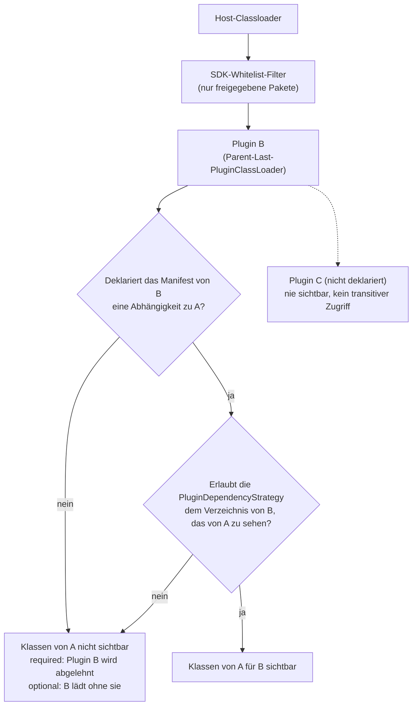

# Abhängigkeiten

Ein Plugin deklariert Abhängigkeiten zu anderen Plugins anhand ihrer Manifest-`id` unter
`dependencies` (siehe [Manifest](manifest.de.md)):

```yaml
dependencies:
  - id: some-other-plugin
    required: true
  - id: yet-another-plugin
    required: false
```

## Required vs. optional

* `required: true` - kann die Abhängigkeit nicht aufgelöst werden (nicht gescannt, ungültig oder
  gemäß der effektiven `PluginDependencyStrategy` nicht sichtbar, siehe unten), wird dieses Plugin
  als ungültig gemeldet und überhaupt nicht geladen.
* `required: false` - kann die Abhängigkeit nicht aufgelöst werden, wird dieses Plugin trotzdem
  geladen, lediglich ohne dass die Klassen dieser Abhängigkeit für es sichtbar sind.

Ein Abhängigkeitszyklus (sowohl über `required`- als auch über `optional`-Kanten) wird immer
abgelehnt, unabhängig davon, ob jede Kante im Zyklus optional ist. Die Zyklusprüfung umfasst alle
Kandidaten eines `scan()` auf einmal: sobald ein Zyklus gefunden wird, wird kein Kandidat dieses
Scans geladen. Jeder Kandidat, der zu diesem Zeitpunkt noch ladbar war - nicht nur die Mitglieder
des Zyklus -, wird als `LOAD_FAILED` mit der Meldung `Cyclic plugin dependency: a -> b -> a`
gemeldet. Entfernen Sie den Zyklus und scannen Sie erneut, um sie zu laden.

## Sichtbarkeit



Ein Plugin sieht immer nur die Klassen einer explizit deklarierten Abhängigkeit - es gibt keine
implizite oder transitive Sichtbarkeit auf ein anderes geladenes Plugin. Zwei unabhängige
Bedingungen müssen beide erfüllt sein, damit Plugin B die Klassen von Plugin A sehen kann:

1. Das Manifest von B deklariert eine Abhängigkeit zur ID von A.
2. Die effektive `PluginDependencyStrategy` des Plugin-Verzeichnisses von B erlaubt Sichtbarkeit auf
   das Plugin-Verzeichnis von A (siehe unten) - standardmäßig kann jedes Verzeichnis jedes andere
   Verzeichnis sehen, ein Host kann dies aber einschränken.

### `PluginDependencyStrategy`

Global konfiguriert, optional pro `PluginLocation` über `dependencyStrategyOverride`
überschreibbar, analog zur Konfiguration von [Sicherheitsstrategien](../host-integration/security.de.md):

```kotlin
interface PluginDependencyStrategy {
    fun isVisible(from: Path, to: Path): Boolean
}
```

Ein Verzeichnis kann Plugins innerhalb seiner selbst immer sehen, unabhängig von der konfigurierten
Strategie - die einzige Ausnahme ist `DisallowPluginDependencyStrategy`, die Abhängigkeiten
vollständig unterdrückt, selbst zwischen Plugins desselben Verzeichnisses.

| Strategie | Verhalten |
|---|---|
| `UnrestrictedPluginDependencyStrategy` | Standard. Jedes Verzeichnis kann jedes andere Verzeichnis sehen. |
| `LocationPluginDependencyStrategy(allowedLocations)` | Ein Verzeichnis sieht sich selbst sowie die explizit konfigurierten `allowedLocations`. |
| `DisallowPluginDependencyStrategy` | Keine Plugin-Abhängigkeiten überhaupt, nicht einmal innerhalb desselben Verzeichnisses. |

## Helferklassen-Muster für optionale Abhängigkeiten

Eine einfache `if`-Absicherung um die Typen einer fehlenden optionalen Abhängigkeit reicht nicht
aus: Ein nicht erreichter Zweig löst zwar in der Regel kein Klassenladen aus, das gilt aber nur,
solange der fehlende Typ nicht auch als Oberklasse/Interface, Feldtyp oder Methodensignaturtyp der
*eigenen* Klasse des Plugins verwendet wird - in diesen Fällen benötigt die JVM den fehlenden Typ
bereits, um die eigene Klasse des Plugins zu laden und zu verifizieren, unabhängig davon, ob der
abgesicherte Zweig jemals ausgeführt wird, was zu einem `NoClassDefFoundError` führt, noch bevor das
`if` überhaupt ausgewertet wird.

Die Lösung besteht darin, jede direkte Verwendung der Typen einer optionalen Abhängigkeit in eine
eigene Helferklasse auszulagern, die nur innerhalb des abgesicherten Zweigs geladen wird:

```kotlin
// BAD: references the optional dependency's type directly in this class's own field and method signature
class MyExtension {
    private var other: OtherPluginApi? = null // OtherPluginApi is needed as soon as MyExtension itself is loaded and verified

    fun onLoad() {
        if (isOtherPluginPresent()) {
            other = OtherPluginApiImpl()
            useOther(other!!)
        }
    }

    private fun useOther(api: OtherPluginApi) { // OtherPluginApi in a method signature has the same effect
        api.doSomething()
    }
}

// GOOD: the optional dependency's type never appears in MyExtension's own signature
class MyExtension {
    fun onLoad() {
        if (isOtherPluginPresent()) {
            OptionalIntegrationHelper.doSomething() // OtherPluginApi is only resolved once this line runs
        }
    }
}

// only this small class references OtherPluginApi - it is only loaded when actually called
internal object OptionalIntegrationHelper {
    fun doSomething() {
        val other: OtherPluginApi = OtherPluginApiImpl()
        other.doSomething()
    }
}
```

`isOtherPluginPresent()` ist typischerweise eine einfache Boolean-Prüfung, z. B. gegen eine
Registry, die die Host-Anwendung pflegt, und muss selbst nie die Typen der optionalen Abhängigkeit
referenzieren.
