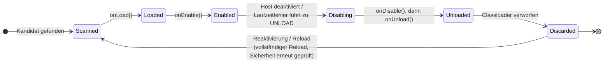

# Lifecycle-Hooks

Jede Klasse, die Sie als Erweiterungsimplementierung registrieren, kann optional
`org.pcsoft.framework.pluggiat.PluginLifecycle` implementieren, um auf die
Load-/Enable-/Disable-/Unload-Übergänge ihres Plugins zu reagieren:

```kotlin
interface PluginLifecycle {
    fun onLoad() {}
    fun onEnable() {}
    fun onDisable() {}
    fun onUnload() {}
}
```

Alle vier Methoden haben eine leere Standardimplementierung - implementieren Sie nur die, die Sie
tatsächlich benötigen.

## Aufrufreihenfolge



* `onLoad` läuft immer vor `onEnable`.
* `onDisable` läuft immer vor `onUnload`.
* Auf `onUnload` folgt unmittelbar, dass der Host den isolierten Classloader Ihres Plugins verwirft
  - eine erneute Aktivierung danach erfordert einen vollständigen Reload Ihres Plugins, nicht nur
  das Zurücksetzen eines Flags.

Die Zweiphasenaufteilung (`onLoad`/`onEnable` vs. `onDisable`/`onUnload`) trennt beim Hochfahren
die günstige Einrichtung von der eigentlichen Arbeit und beim Herunterfahren das Beenden der Arbeit
von der Freigabe der Ressourcen. Für die von einem `scan()` geladenen Plugins läuft die Aktivierung
in Abhängigkeitsreihenfolge, Abhängigkeiten zuerst: für jede Erweiterungsimplementierung folgt auf
`onLoad` unmittelbar `onEnable`, sodass jede Abhängigkeit beide Hooks abgeschlossen hat, bevor ein
davon abhängiges Plugin sein eigenes `onLoad` erhält. Der Abbau ist *nicht* über Plugins hinweg
geordnet: das Entladen eines Plugins führt nur die Hooks dieses einen Plugins aus und entlädt nicht
zuvor die davon abhängigen Plugins. Die Aufteilung ist keine Möglichkeit, "aktiviert" von
"deaktiviert" selbst zu unterscheiden - verwenden Sie dafür den
[aktiviert/deaktiviert-Status](../host-integration/plugin-lifecycle-management.de.md).

## Mehrere Implementierungen pro Plugin

Implementieren mehr als eine Klasse Ihres Plugins `PluginLifecycle`, ist die Aufrufreihenfolge
ihrer Hooks **relativ zueinander nicht deterministisch**. Verlassen Sie sich nicht darauf, dass der
Hook einer Implementierung vor oder nach dem einer anderen Implementierung innerhalb desselben
Plugins läuft.

## Wann onDisable und onUnload laufen

`onDisable`, gefolgt von `onUnload`, läuft:

* wenn der Host Ihr Plugin explizit über `PluginManager.unload(pluginId)` entlädt, was es zugleich
  als deaktiviert persistiert,
* wenn ein Laufzeitfehler in einem Ihrer Erweiterungsaufrufe gemäß der konfigurierten
  [Fehlerbehandlungsstrategie](error-handling.de.md) des Hosts zu `UNLOAD` führt, und
* im Rahmen jeder erneuten Aggregation der Erweiterungen, für die Instanzen, die ersetzt werden
  (siehe unten).

Ihre `onDisable`/`onUnload`-Implementierungen sollten daher auch in einer "etwas ist
schiefgelaufen"-Situation sicher ausführbar sein, nicht nur bei einem sauberen, beabsichtigten
Herunterfahren.

In diesen Fällen werden keine Hooks aufgerufen:

* Das Plugin wird nach einem Sandbox-Verstoß zwangsweise entladen (markiert als
  `POTENTIAL_ATTACK`, einschließlich des Zeitlimits der Sandbox): es wird sofort geschlossen, ohne
  `onDisable`/`onUnload`.
* Ihr `onLoad` oder `onEnable` selbst überschreitet das Sandbox-Zeitlimit: das Plugin wird von der
  Aggregation ausgeschlossen und als deaktiviert persistiert, ohne `onDisable`/`onUnload`.
* Die Host-Anwendung wird beendet: pluggiat registriert keinen JVM-Shutdown-Hook, daher laufen die
  Hooks beim Beenden der Anwendung nur, wenn der Host selbst `PluginManager.unload(pluginId)` für
  Ihr Plugin aufruft.

## Hooks laufen erneut, wenn der Host neu aggregiert

Nach jedem `scan()`, `reload(pluginId)`, `unload(pluginId)` und `forceLoad(pluginId)` aggregiert
der Host die Erweiterungen aller aktuell geladenen Plugins neu. Zuerst werden `onDisable` und dann
`onUnload` auf den bisherigen Instanzen aufgerufen, anschließend werden die
Erweiterungsimplementierungen jedes aktiven Plugins neu instanziiert und erhalten `onLoad`, gefolgt
von `onEnable`. Dies betrifft jedes aktive Plugin, nicht nur dasjenige, das den Aufruf ausgelöst
hat. Ihre Hooks müssen daher wiederholt sicher ausführbar sein, und es darf nicht angenommen werden,
dass eine Implementierungsinstanz so lange lebt wie der Classloader ihres Plugins. Die Reihenfolge,
in der verschiedene Plugins während einer erneuten Aggregation abgebaut werden, ist nicht
festgelegt.
