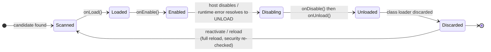

# Lifecycle hooks

Any class you register as an extension implementation may optionally implement
`org.pcsoft.framework.pluggiat.PluginLifecycle` to react to its plugin's load/enable/disable/unload
transitions:

```kotlin
interface PluginLifecycle {
    fun onLoad() {}
    fun onEnable() {}
    fun onDisable() {}
    fun onUnload() {}
}
```

All four methods have an empty default implementation - implement only the ones you actually need.

## Call order



* `onLoad` always runs before `onEnable`.
* `onDisable` always runs before `onUnload`.
* `onUnload` is immediately followed by the host discarding your plugin's isolated class loader -
  reactivation afterward requires a full reload of your plugin, not just a flag being flipped back
  on.

The two-phase split (`onLoad`/`onEnable` vs. `onDisable`/`onUnload`) separates cheap setup from real
work on the way up, and stopping work from releasing resources on the way down. For the plugins
loaded by one `scan()`, activation runs in dependency order, dependencies first: for each extension
implementation `onLoad` is immediately followed by `onEnable`, so every dependency has completed
both hooks before a plugin depending on it gets its own `onLoad`. Teardown is *not* ordered across
plugins: unloading a plugin runs the hooks of that one plugin only and does not unload the plugins
that depend on it first. The split is not a way to distinguish "enabled" from "disabled" by itself -
use [enabled/disabled status](../host-integration/plugin-lifecycle-management.md) for that.

## Multiple implementations per plugin

If more than one of your plugin's classes implements `PluginLifecycle`, the call order of their
hooks **relative to each other is not deterministic**. Do not rely on one implementation's hook
running before or after another implementation's hook within the same plugin.

## When onDisable and onUnload run

`onDisable`, followed by `onUnload`, runs:

* when the host explicitly unloads your plugin via `PluginManager.unload(pluginId)`, which also
  persists it as disabled,
* when a runtime error in one of your extension calls resolves to `UNLOAD` under the host's
  configured [error handling strategy](error-handling.md), and
* as part of every re-aggregation of the extensions, for the instances that are being replaced (see
  below).

Your `onDisable`/`onUnload` implementations should therefore be safe to run in a "something went
wrong" situation, not just on a clean, intentional shutdown.

No hooks are invoked in these cases:

* The plugin is forcibly unloaded after a sandbox violation (marked `POTENTIAL_ATTACK`, including
  the timeout limit of the sandbox): it is closed immediately, without `onDisable`/`onUnload`.
* Your `onLoad` or `onEnable` itself exceeds the sandbox timeout: the plugin is excluded from the
  aggregation and persisted as disabled, without `onDisable`/`onUnload`.
* The host application exits: pluggiat registers no JVM shutdown hook, so the hooks only run at
  application exit if the host calls `PluginManager.unload(pluginId)` for your plugin itself.

## Hooks run again when the host re-aggregates

After every `scan()`, `reload(pluginId)`, `unload(pluginId)` and `forceLoad(pluginId)`, the host
re-aggregates the extensions of all currently loaded plugins. First `onDisable` and then
`onUnload` are invoked on the previous instances, then the extension implementations of every
active plugin are instantiated anew and get `onLoad` followed by `onEnable`. This affects every
active plugin, not only the one that triggered the call. Your hooks must therefore be safe to run
repeatedly, and an implementation instance must not be assumed to live as long as its plugin's
class loader. The order in which different plugins are torn down during a re-aggregation is not
specified.
